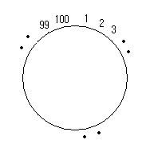

# 문제 설명
칼로 자르려고 하는 부분은 2개의 정수로 표현한다. 칼로 자르려는 부분이 2군데 주어질 때 칼로 잘리는 부분이 교차하는지 유무를 판단하는 프로그램을 작성하시오.

케이크의 둘레에 시계방향으로 1~100까지 일정한 간격으로 번호가 부여되어 있다.



**아래 예는 12 53과 99 45를 자른 예를 나타낸다.**


## 문제

```c
#include <stdio.h>

int Solve(int A, int B, int C, int D)
{
	// 여기서부터 작성
}
int main(void)
{
	int a, b, c, d, cross;
	// 입력받는 부분
	scanf("%d %d", &a, &b);
	scanf("%d %d", &c, &d);

	cross = Solve(a, b, c, d);

	// 출력하는 부분
	if (cross == 1) printf("cross");
	else printf("not cross");

	return 0;
}
```

## 입력 예시
```
12 53 
99 45 
```
##  출력 예시
```
cross
```

## 정답
```c
#include <stdio.h>

int Solve(int A, int B, int C, int D)
{
	// 만약 A > B 또는 C > D로 주어졌을 때, 순서를 맞춰주어야 한다.

	if (A > B) {
		int temp = A;
		A = B;
		B = temp;
	}

	if (C > D) {
		int temp = C;
		C = D;
		D = temp;
	}

	// 첫 번째 선분 A-B와 두 번째 선분 C-D가 교차하려면
	// A<C<B<D OR C<A<D<B
	if ((A < C && C < B && B < D) || (C < A && A < D && D < B)) {
		return 1; 
	}
	return 0; 
}
int main(void)
{
	int a, b, c, d, cross;

	scanf("%d %d", &a, &b);
	scanf("%d %d", &c, &d);
	cross = Solve(a, b, c, d);

	if (cross == 1) printf("cross");
	else printf("not cross");

	return 0;
}
```

