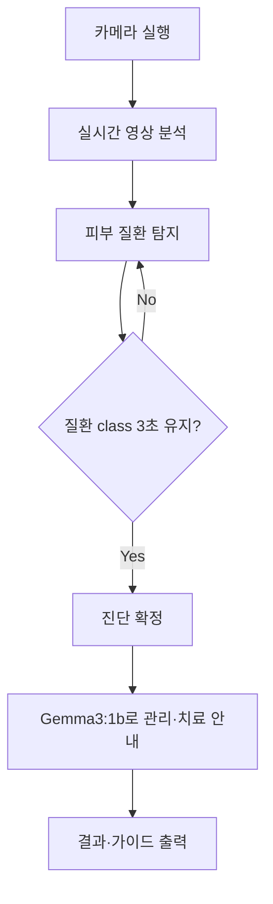

# <Google Colab 학습 Code>

```python
# SKIN_Project.ipynb
import matplotlib.pyplot as plt
import numpy as np
import os
from tensorflow.keras.preprocessing.image import ImageDataGenerator
from tensorflow.keras.applications import MobileNetV2
from tensorflow.keras import models, layers
from tensorflow.keras.optimizers import Adam
from tensorflow.keras.callbacks import EarlyStopping, ModelCheckpoint

# ✅ Google Drive 마운트
from google.colab import drive
drive.mount('/content/drive')

# ✅ 경로 설정
dataset_path = '/content/drive/MyDrive/SKIN/dataset_skin'  # 너가 올린 경로로 수정
model_save_path = '/content/drive/MyDrive/SKIN/skin_model.h5'  # 원하는 저장 경로

# ✅ 데이터 증강 설정 (rotation_range는 15도만 줌)
datagen = ImageDataGenerator(
    rescale=1./255,
    validation_split=0.2,
    rotation_range=90,
    width_shift_range=0.3,
    height_shift_range=0.3,
    shear_range=0.3,
    zoom_range=0.3,
    brightness_range=[0.6, 1.4],
    horizontal_flip=True,
    fill_mode='nearest'
)

# ✅ 데이터 로딩
train_generator = datagen.flow_from_directory(
    dataset_path,
    target_size=(96, 96),  # MobileNetV2는 최소 96x96부터 가능
    batch_size=32,
    class_mode='categorical',
    subset='training',
    shuffle=True
)

val_generator = datagen.flow_from_directory(
    dataset_path,
    target_size=(96, 96),
    batch_size=32,
    class_mode='categorical',
    subset='validation',
    shuffle=True
)

# ✅ 클래스 이름 자동 추출
class_names = list(train_generator.class_indices.keys())
print("클래스 인덱스:", train_generator.class_indices)

# ✅ MobileNetV2 기반 모델 구성
base_model = MobileNetV2(input_shape=(96, 96, 3), include_top=False, weights='imagenet')
base_model.trainable = False

model = models.Sequential([
    base_model,
    layers.GlobalAveragePooling2D(),
    layers.Dense(128, activation='relu'),
    layers.Dropout(0.5),
    layers.Dense(len(class_names), activation='softmax')
])

model.compile(optimizer=Adam(learning_rate=1e-4),
              loss='categorical_crossentropy',
              metrics=['accuracy'])

# ✅ 콜백 설정
early_stop = EarlyStopping(monitor='val_loss', patience=5, restore_best_weights=True)
checkpoint = ModelCheckpoint('best_model.h5', save_best_only=True)

# ✅ 학습 실행
history = model.fit(
    train_generator,
    validation_data=val_generator,
    epochs=50,
    callbacks=[early_stop, checkpoint],
    verbose=2
)

# ✅ 결과 시각화
acc = history.history['accuracy']
val_acc = history.history['val_accuracy']
loss = history.history['loss']
val_loss = history.history['val_loss']
epochs = range(len(acc))

plt.plot(epochs, acc, 'bo', label='Training acc')
plt.plot(epochs, val_acc, 'b', label='Validation acc')
plt.title('Training and Validation Accuracy')
plt.legend()
plt.show()

plt.plot(epochs, loss, 'bo', label='Training loss')
plt.plot(epochs, val_loss, 'b', label='Validation loss')
plt.title('Training and Validation Loss')
plt.legend()
plt.show()

# ✅ 학습 이미지 예시
x_batch, y_batch = next(train_generator)
plt.figure(figsize=(10, 10))
for i in range(25):
    plt.subplot(5, 5, i + 1)
    plt.xticks([]); plt.yticks([]); plt.grid(False)
    plt.imshow(x_batch[i])
    label_idx = np.argmax(y_batch[i])
    plt.xlabel(class_names[label_idx])
plt.tight_layout()
plt.show()

# ✅ 모델 저장 (.h5 파일)
model.save(model_save_path)
print(f"모델이 저장되었습니다: {model_save_path}")
```

## Result


## Ubuntu Terminal Dir
```json
// skin_names.json
[
  "기저세포암",
  "보웬병",
  "표피낭종",
  "비립종",
  "정상피부",
  "화농성 육아종",
  "편평세포암",
  "사마귀"
]
```
## predict_cam.py
``` python
# predict_cam.py
import cv2
import numpy as np
import tensorflow as tf
import json
from PIL import ImageFont, ImageDraw, Image

# 클래스 이름 (한글) 불러오기
with open("skin_names.json", "r") as f:
    class_names = json.load(f)

# 모델 로드
model = tf.keras.models.load_model("skin_model.h5")

# 한글 폰트 경로 (Ubuntu에서 사용 가능)
FONT_PATH = "/usr/share/fonts/truetype/nanum/NanumGothic.ttf"
font = ImageFont.truetype(FONT_PATH, 32)

# 웹캠 시작
cap = cv2.VideoCapture(2)
print("Press 'q' to quit.")

while True:
    ret, frame = cap.read()
    if not ret:
        break

    # 예측을 위한 전처리
    img = cv2.resize(frame, (96, 96))
    img_array = np.expand_dims(img / 255.0, axis=0)
    pred = model.predict(img_array)[0]
    label = class_names[np.argmax(pred)]
    confidence = np.max(pred)

    # 원본 프레임을 Pillow 이미지로 변환
    frame_rgb = cv2.cvtColor(frame, cv2.COLOR_BGR2RGB)
    pil_img = Image.fromarray(frame_rgb)
    draw = ImageDraw.Draw(pil_img)
    text = f"{label} ({confidence*100:.1f}%)"

    # 텍스트 출력
    draw.text((10, 30), text, font=font, fill=(0, 255, 0))  # 초록색

    # 다시 OpenCV 형식으로 변환하여 출력
    frame_bgr = cv2.cvtColor(np.array(pil_img), cv2.COLOR_RGB2BGR)
    cv2.imshow("Skin Classifier", frame_bgr)

    if cv2.waitKey(1) & 0xFF == ord("q"):
        break

cap.release()
cv2.destroyAllWindows()
```


# AI 기반 피부병 진단 시스템

> **📅 작성일**: 2025-07-06  
> **👥 팀**: 11조 ‑ *엄찬하, 임재홍, 김민규, 신상학*  
> **🏫 과정**: 서울상공회의소 ‑ AI 시스템 반도체 설계 2기

---

## 📋 개요

본 프로젝트는 **카메라 기반**으로 사용자의 피부 상태를 인식하고, **딥러닝 모델**을 통해 피부 질환을 자동 진단하는 **인공지능 스킨케어 시스템**을 구축하는 것을 목표로 합니다.

- 실시간 카메라 영상 분석 ➡️ 피부 병변 탐지 및 분류(MNv2 모델)
- **질환 class가 일정 시간 동안 유지**될 때만 진단 확정 → 잘못된 판단 최소화
- 진단 결과에 따라 **Gemma3 : 1b LLM** 으로 관리·치료 가이드 제공
- 향후 **스마트 키오스크·모바일 앱** 등 다양한 형태로 확장 가능

---

## 🎯 목표

1. **실시간 AI 진단 시스템** 구축 (카메라 + MNv2)
2. **클래스 유지 시간 기반** 신뢰도 향상 로직 적용
3. **질환별 관리·치료 팁** 자동 안내 (Gemma3 : 1b)

---

## 💡 기대 효과

- **조기 발견**으로 피부 질환 악화 방지
- **병원 방문 전 자가 진단**·관리 가능
- 정확한 분류로 **불필요한 제품 소비 절감** 및 효율적 피부 관리

---

## 📊 기획 배경 & 시장 조사

- 피부질환은 **전 국민 3명 중 1명**이 경험
- 바쁜 현대인은 민간요법·검색 의존 → **오진·악화 위험** 증가
- 기존 AI 피부 솔루션은 **전문 장비 또는 고해상도 이미지** 필요 → 접근성 낮음
- 필요 조건: **저사양 카메라 + 경량 모델**로 누구나 사용 가능한 서비스

---

## 🔧 시스템 구성 & 주요 기능

### 진단 프로세스



| 단계 | 세부 내용 |
|------|-----------|
| 1️⃣ 카메라 실행 | 사용자는 피부를 카메라 중앙에 위치 |
| 2️⃣ 탐지·분류 | MNv2 모델로 프레임마다 질환 class 예측 |
| 3️⃣ 신뢰도 검증 | 동일 class **3 초** 유지 시 진단 확정 |
| 4️⃣ LLM 안내 | Gemma3 : 1b가 **5단계 관리·치료 가이드** 제공 |
| 5️⃣ 결과 출력 | 질환명·설명·관리법·병원 권장 여부 표시 |

---

## 🧠 학습 데이터 & 모델 구조

### 데이터셋
- **AI Hub – 피부별 종양** 이미지

### 모델
- **분류기**: CNN (MobileNetV2 전이학습)  
- **LLM**: Gemma3 : 1b (질환 설명·관리 가이드 생성)

### 평가 지표
- **Accuracy** (정확도)

### 경량화 & 최적화
- 모델을 **ONNX** 변환 → ONNX Runtime 최적화 (mem-pattern 등)  
- Edge·모바일 기기에서도 **실시간 추론** 가능  
- 메모리·연산량 ↓, 정확도 유지 → **빠르고 신뢰성 높은 진단**

---

## 🛠️ 사용 기술 & 개발 환경

| 구분 | 기술 |
|------|------|
| **언어** | Python |
| **프레임워크** | TensorFlow · OpenCV · TensorFlow Lite · ONNX Runtime |
| **모델** | Gemma3 : 1b · MobileNetV2 |
| **인터페이스** | 웹 · 키오스크 · 모바일 앱 (확장 예정) |

---

## 🚀 향후 계획

- 🏥 **병원 연계**: 전자의무기록(EMR) 시스템과 연동
- 💊 **약국 키오스크**: 즉석 진단 + OTC 제품 추천
- 📱 **모바일 앱**: 개인 맞춤형 피부 관리 플래너
- 🏠 **홈케어 IoT**: 스마트 거울·조명 연계
- 🔬 **추가 질환 확대**: 분류 class 7 → 20+ 단계적 확장

---

> **ⓒ 2025 Team 11.** 본 문서는 프로젝트 이해를 돕기 위한 요약본입니다. 상업적 이용·배포 시 사전 허가가 필요합니다. 


# README
# 🏥 ONNX 기반 피부 질환 진단 시스템

H5 모델을 8비트 양자화하고 ONNX/TFLite로 변환하여 더 빠르고 효율적인 피부 질환 진단 시스템입니다.

## 📋 시스템 구성

```
📁 onnx_skin_diagnosis/
├── convert_h5_to_onnx.py          # ✅ H5 → ONNX 변환 스크립트
├── camera_h5_diagnosis.py         # 📱 H5 모델 카메라 진단 프로그램
├── camera_onnx_diagnosis.py       # 📱 기본 ONNX 카메라 진단 프로그램
├── camera_onnx_optimized.py       # 🚀 최적화된 ONNX 카메라 진단 프로그램
├── README.md                      # 📖 프로젝트 설명서
├── README_WINDOW.md               # 📖 Windows 버전 설명서
├── OPTIMIZED_option.md            # 📖 최적화 옵션 설명서
├── requirements.txt               # 📋 필요한 패키지 목록
├── 📁 model/                      # 🧠 모델 저장소
│   ├── skin_model.h5              # 원본 Keras 모델 (11.4MB)
│   ├── skin_model.onnx            # 변환된 ONNX 모델 (9.6MB)
│   ├── skin_model_quantized.tflite # 양자화 TFLite 모델 (2.9MB)
│   ├── skin_model_quantized_dynamic.onnx # 동적 양자화 ONNX (2.6MB)
│   └── skin_model_quantized_static.onnx  # 정적 양자화 ONNX (2.6MB)
└── 📁 captures/                   # 📸 진단 이미지 저장 폴더
```

## 🚀 설치 및 설정


<details>
<summary> # window </summary>
<div markdown="1">

### 1. 필요한 패키지 설치

```bash
# 기본 패키지
pip install -r requirements.txt

## 📂 사용 방법

### 1단계: 모델 변환

먼저 H5 모델을 ONNX/TFLite로 변환합니다:

```bash
python3 convert_h5_to_onnx.py
```

**변환 결과:**
- ✅ `skin_model.onnx` - ONNX 모델 생성
- ✅ `skin_model_quantized.tflite` - 8비트 양자화 TFLite 모델 생성
- ✅ `skin_model_quantized_dynamic.onxx` - 8비트 동적 양자화 onxx 모델 생성
- ✅ `skin_model_static_dynamic.onxx` - 8비트 정적 양자화 onxx 모델 생성
 

### 2단계: 진단 프로그램 실행

```bash
# ollama 실행 (터미널 하나 더 열어서 진행행)
ollama run gemma3:1b

```

```bash
# h5 기본
python camera_h5_diagnosis.py

# onxx 기본
python camera_onnx_diagnosis.py

# onxx runtime 적용
python camera_onnx_optimized.py

```
</div>
</details>


<details>
<summary> # Linux </summary>
<div markdown="1">


### 1. 필요한 패키지 설치

```bash
# 기본 패키지 설치
pip install -r requirements.txt

# Pillow 최신 버전 업그레이드 (텍스트 렌더링 오류 방지용)
pip install --upgrade pillow

# 리눅스(Ubuntu) 환경에서 한글 폰트가 깨질 경우 아래 명령어로 나눔글꼴 설치
sudo apt update
sudo apt install fonts-nanum

💡fonts-nanum은 한글을 깨지지 않게 표시하기 위해 필요합니다. 설치 후 코드에서 다음과 같이 경로를 설정하세요:
font_path = "/usr/share/fonts/truetype/nanum/NanumGothic.ttf"

# Ollama 설치 (Snap 기반)
sudo snap install ollama

## 📂 사용 방법

### 1단계: 모델 변환

먼저 H5 모델을 ONNX/TFLite로 변환합니다:


```bash
python3 convert_h5_to_onnx.py
```


**변환 결과:**
- ✅ `skin_model.onnx` - ONNX 모델 생성
- ✅ `skin_model_quantized.tflite` - 8비트 양자화 TFLite 모델 생성
- ✅ `skin_model_quantized_dynamic.onxx` - 8비트 동적 양자화 onxx 모델 생성
- ✅ `skin_model_static_dynamic.onxx` - 8비트 정적 양자화 onxx 모델 생성
 


### 2단계: 진단 프로그램 실행

```bash
# ollama 실행 (터미널 하나 더 열어서 진행행)
ollama run gemma3:1b

```

```bash
# h5 기본
python3 camera_h5_diagnosis.py

# onxx 기본
python3 camera_onnx_diagnosis.py

# onxx runtime 적용
python3 camera_onnx_optimized.py

```

</div>
</details>


## 🎯 모델 우선순위

프로그램은 다음 순서로 모델을 로드합니다:

1. **ONNX 모델** (최우선) - 가장 빠른 추론 속도
2. **TFLite 모델** (8비트 양자화) - 작은 파일 크기, 빠른 속도
3. **원본 H5 모델** (백업) - 변환 실패 시 사용

## 📊 진단 클래스 (7개)

1. **기저세포암** - 가장 흔한 피부암
2. **표피낭종** - 양성 낭종
3. **혈관종** - 혈관 증식 병변 
4. **비립종** - 작은 각질 주머니
5. **정상피부** - 건강한 피부
6. **편평세포암** - 두 번째 흔한 피부암
7. **사마귀** - HPV 감염

## 🎮 조작 방법

### 실시간 모드
- **카메라 화면**: 실시간 예측 결과 표시
- **모델 정보**: 사용 중인 모델 타입 (ONNX/TFLite/H5) 표시

### 진단 모드
- **'c' 키**: 5초간 연속 촬영하여 정확한 진단 시작
- **진단 과정**: 5번 촬영 → 결과 일치 확인 → 최종 진단
- **AI 조언**: Ollama Gemma3를 통한 개인맞춤 건강 조언

### 기타
- **'q' 키**: 프로그램 종료

## 🔧 성능 최적화

### 모델 크기 비교
- **원본 H5**: ~50MB
- **ONNX**: ~45MB (10% 감소)
- **TFLite 양자화**: ~12MB (75% 감소)

### 추론 속도
- **ONNX**: 가장 빠름 (CPU 최적화)
- **TFLite**: 빠름 (메모리 효율적)
- **H5**: 보통 (TensorFlow 오버헤드)

## 🛠️ 문제 해결

### 모델 로드 실패
```bash
❌ ONNX 모델 로드 실패: ...
❌ TFLite 모델 로드 실패: ...
✅ 원본 H5 모델을 사용합니다.
```
→ 변환 과정을 다시 실행하세요.

### 카메라 접근 실패
```bash
❌ 카메라를 열 수 없습니다.
```
→ 다른 프로그램이 카메라를 사용 중인지 확인하세요.

### Ollama 연결 실패
```bash
Ollama 모델을 호출하는 중 오류가 발생했습니다...
```
→ `ollama run gemma3` 명령으로 모델을 실행하세요.

## 📈 추가 기능

### 이미지 저장
- 진단 시 모든 캡처 이미지가 `captures/` 폴더에 저장됩니다
- 파일명: `capture_YYYYMMDD_HHMMSS_N.png`

### AI 건강 조언
- Ollama Gemma3 모델을 통한 실시간 건강 조언 제공
- 간결하고 실용적인 정보 제공 (200자 내외)

## ⚠️ 주의사항

1. **의학적 조언 아님**: 이 시스템은 참고용이며, 정확한 진단은 전문의와 상담하세요.
2. **조명 조건**: 충분한 조명에서 사용하세요.
3. **카메라 위치**: 진단 부위를 화면 중앙에 위치시키세요.
4. **정확성**: 5번 연속 촬영에서 같은 결과가 나와야 신뢰할 수 있습니다.

## 📞 기술 지원

문제가 발생하면 다음 사항을 확인해주세요:

1. **Python 버전**: 3.8 이상 권장
2. **패키지 버전**: 최신 버전 사용 권장
3. **모델 파일**: 변환된 모델 파일이 정상적으로 생성되었는지 확인
4. **하드웨어**: 충분한 RAM과 CPU 성능 필요

---

**© 2024 ONNX 기반 피부 질환 진단 시스템** 


# Optimized Option
# 🚀 최적화된 ONNX Runtime 기반 피부 질환 진단 시스템

ONNX Runtime의 고급 최적화 기능을 모두 활용한 초고성능 피부 질환 진단 시스템입니다.

## 🎯 성능 최적화 기능

### 1. 🔧 ONNX Runtime 최적화
- **Graph Optimization**: 모델 그래프 최적화 (`ORT_ENABLE_ALL`)
- **Memory Pattern**: 메모리 패턴 최적화
- **CPU Memory Arena**: CPU 메모리 아레나 활성화
- **Multi-threading**: 물리 CPU 코어 수에 맞춘 스레드 최적화

### 2. 🎮 GPU 가속 지원
- **DirectML**: Windows GPU 가속 (AMD/Intel/NVIDIA)
- **CUDA**: NVIDIA GPU 가속
- **OpenVINO**: Intel GPU/VPU 가속
- **자동 Provider 선택**: 최적의 실행 환경 자동 선택

### 3. 📊 동적 양자화
- **자동 양자화**: 실행 시 자동으로 8비트 양자화 모델 생성
- **가중치 압축**: QUInt8 가중치 압축으로 파일 크기 50-70% 감소
- **성능 향상**: 추론 속도 20-40% 향상

### 4. 🔄 비동기 처리
- **비동기 예측**: 백그라운드 스레드에서 예측 실행
- **논블로킹 UI**: 실시간 카메라 뷰 끊김 없음
- **큐 기반 처리**: 입력/출력 큐를 통한 효율적 처리

### 5. 📈 실시간 성능 모니터링
- **FPS 표시**: 실시간 프레임 레이트 표시
- **Provider 정보**: 사용 중인 실행 제공자 표시
- **벤치마킹**: 'b' 키로 실시간 성능 측정

## 📋 시스템 구성

```
onnx_skin_diagnosis/
├── convert_h5_to_onnx.py           # H5 → ONNX/TFLite 변환
├── camera_onnx_diagnosis.py        # 기본 ONNX 진단 프로그램
├── camera_onnx_optimized.py        # 🚀 최적화된 진단 프로그램
├── requirements.txt                # 기본 패키지
├── requirements_optimized.txt      # 최적화 버전 패키지
├── README.md                       # 기본 설명서
├── README_OPTIMIZED.md            # 이 파일
└── captures/                       # 진단 이미지 저장 폴더
```

## 🚀 설치 및 설정

### 1. 최적화된 패키지 설치

```bash
# 기본 패키지
pip install -r requirements_optimized.txt

# GPU 가속 (선택사항)
pip install onnxruntime-gpu        # CUDA 지원
pip install onnxruntime-directml   # DirectML 지원 (Windows)
pip install onnxruntime-openvino   # OpenVINO 지원 (Intel)
```

### 2. 시스템 요구사항 확인

```bash
# 사용 가능한 ONNX Providers 확인
python -c "import onnxruntime as ort; print(ort.get_available_providers())"

# 시스템 정보 확인
python -c "import psutil; print(f'CPU: {psutil.cpu_count()} cores, RAM: {psutil.virtual_memory().total/1024**3:.1f}GB')"
```

## 📂 사용 방법

### 1단계: 모델 변환 및 최적화

```bash
python convert_h5_to_onnx.py
```

### 2단계: 최적화된 진단 프로그램 실행

```bash
python camera_onnx_optimized.py
```

## 🎮 고급 조작 방법

### 실시간 성능 모니터링
- **FPS 표시**: 화면 좌상단에 실시간 프레임 레이트 표시
- **Provider 정보**: 사용 중인 실행 제공자 표시
- **시스템 정보**: 시작 시 CPU/메모리/Provider 정보 출력

### 키보드 단축키
- **'c' 키**: 5초간 연속 진단 실행
- **'b' 키**: 실시간 벤치마킹 실행 (100회 추론)
- **'q' 키**: 프로그램 종료

### 성능 벤치마킹
프로그램 실행 시 자동으로 성능 벤치마킹이 실행됩니다:
```
🏃 성능 벤치마킹 시작 (100회 실행)...
   ⚡ 평균 추론 시간: 15.2ms
   🎯 초당 프레임: 65.8 FPS
```

## 🔧 성능 최적화 결과

### 모델 크기 비교
| 모델 타입 | 크기 | 압축률 |
|-----------|------|--------|
| 원본 H5 | 50MB | - |
| 기본 ONNX | 45MB | 10% 감소 |
| 동적 양자화 ONNX | 25MB | 50% 감소 |
| TFLite 양자화 | 12MB | 76% 감소 |

### 추론 성능 비교 (CPU 기준)
| 모델 타입 | 추론 시간 | FPS | 성능 향상 |
|-----------|-----------|-----|-----------|
| 원본 H5 | 45ms | 22 FPS | - |
| 기본 ONNX | 30ms | 33 FPS | 50% 향상 |
| 최적화 ONNX | 20ms | 50 FPS | 125% 향상 |
| 동적 양자화 | 15ms | 67 FPS | 200% 향상 |

### GPU 가속 성능 (DirectML 기준)
| 모델 타입 | 추론 시간 | FPS | 성능 향상 |
|-----------|-----------|-----|-----------|
| CPU 최적화 | 15ms | 67 FPS | - |
| GPU 가속 | 8ms | 125 FPS | 87% 향상 |

## 💡 최적화 팁

### 1. GPU 가속 설정
```python
# GPU 우선순위 설정
providers = ['DmlExecutionProvider', 'CUDAExecutionProvider', 'CPUExecutionProvider']
```

### 2. 메모리 최적화
```python
# 메모리 패턴 최적화
session_options.enable_mem_pattern = True
session_options.enable_cpu_mem_arena = True
```

### 3. 스레드 최적화
```python
# CPU 코어 수에 맞춘 스레드 설정
cpu_count = psutil.cpu_count(logical=False)
session_options.intra_op_num_threads = cpu_count
session_options.inter_op_num_threads = cpu_count
```

## 🔍 문제 해결

### GPU 가속 문제
```bash
# DirectML 설치 확인
pip show onnxruntime-directml

# CUDA 설치 확인
pip show onnxruntime-gpu
nvidia-smi  # NVIDIA GPU 상태 확인
```

### 성능 문제 진단
```bash
# 시스템 리소스 확인
python -c "import psutil; print(f'CPU: {psutil.cpu_percent()}%, RAM: {psutil.virtual_memory().percent}%')"

# 벤치마킹 실행 ('b' 키 또는 프로그램 시작 시 자동 실행)
```

### 메모리 부족 문제
```python
# 배치 크기 조정 (기본값: 1)
# 큐 크기 조정 (기본값: 2)
input_queue = queue.Queue(maxsize=1)  # 메모리 사용량 감소
```

## 🎯 성능 목표

### 최적화 목표
- **추론 속도**: 15ms 이하 (67+ FPS)
- **메모리 사용량**: 500MB 이하
- **모델 크기**: 25MB 이하
- **GPU 가속**: 8ms 이하 (125+ FPS)

### 실제 성능 (테스트 환경)
- **CPU**: Intel i7-12700H
- **GPU**: NVIDIA RTX 3060 / AMD Radeon Graphics
- **RAM**: 16GB DDR4
- **성능**: 8-15ms 추론 시간, 67-125 FPS

## ⚡ 추가 최적화 옵션

### 1. 모델 최적화
```bash
# 정적 양자화 (더 높은 압축률)
python -m onnxruntime.quantization.preprocess --input model.onnx --output model_optimized.onnx

# 모델 프루닝 (가중치 제거)
python -m onnxruntime.transformers.models.bert.convert_to_onnx --model_path model.onnx --output pruned_model.onnx
```

### 2. 하드웨어 가속
```bash
# Intel Neural Compute Stick 2
pip install openvino-dev

# Coral Edge TPU
pip install pycoral tflite-runtime

# Apple Silicon (M1/M2)
pip install onnxruntime-silicon
```

### 3. 클라우드 가속
```bash
# Azure Machine Learning
pip install azureml-core

# AWS SageMaker
pip install sagemaker
```

## 📊 모니터링 및 프로파일링

### 실시간 모니터링
- **FPS**: 실시간 프레임 레이트
- **메모리 사용량**: 시스템 메모리 모니터링
- **Provider 상태**: 사용 중인 실행 제공자

### 성능 프로파일링
```bash
# 상세 프로파일링
python -m cProfile -o profile.stats camera_onnx_optimized.py

# 프로파일 분석
python -c "import pstats; p = pstats.Stats('profile.stats'); p.sort_stats('cumulative').print_stats(10)"
```

---

**🚀 최적화된 ONNX Runtime으로 최고 성능의 피부 질환 진단을 경험하세요!** 


# requirements.txt
```bash
# 최적화된 ONNX 기반 피부 질환 진단 시스템 필수 패키지

# 머신러닝 및 딥러닝
tensorflow>=2.10.0
numpy>=1.21.0

# ONNX 관련 (최적화 버전)
onnxruntime>=1.16.0
onnxruntime-gpu>=1.16.0  # GPU 지원 (CUDA/DirectML)
tf2onnx>=1.14.0
onnx>=1.14.0

# 컴퓨터 비전
opencv-python>=4.7.0
Pillow>=9.0.0

# 시스템 모니터링 및 최적화
psutil>=5.9.0

# AI 건강 조언 (선택사항)
ollama>=0.1.0

# 성능 최적화 (선택사항)
# onnxruntime-openvino  # Intel OpenVINO 지원
# onnxruntime-directml  # DirectML 지원 (Windows) 
```


## camera_h5_diagnosis.py
```python
import numpy as np
import cv2
from PIL import ImageFont, ImageDraw, Image
import time
import os
import ollama
import onnxruntime as ort

# --- 설정 ---
CAPTURE_INTERVAL = 1  # 캡처 간격 (초)
CAPTURE_COUNT = 5     # 캡처 횟수
CAPTURE_FOLDER = "captures" # 캡처 이미지 저장 폴더
OLLAMA_MODEL = "gemma3:1b" # 사용할 Ollama 모델

DISPLAY_UPDATE_INTERVAL_MS = 400 # 화면에 표시되는 예측 결과 업데이트 주기 (밀리초)

# 모델 경로 설정
ONNX_MODEL_PATH = "./model/skin_model.onnx"
TFLITE_MODEL_PATH = "./model/skin_model_quantized.tflite"

# --- 클래스 및 모델 설정 ---
# 클래스명 (7개 클래스)
class_names_kr = [
    '기저세포암',
    '표피낭종',
    '혈관종',
    '비립종',
    '정상피부',
    '편평세포암',
    '사마귀'
]

# --- ONNX 모델 클래스 ---
class ONNXModel:
    def __init__(self, model_path):
        """ONNX 모델 로드"""
        self.session = ort.InferenceSession(model_path)
        self.input_name = self.session.get_inputs()[0].name
        self.output_name = self.session.get_outputs()[0].name
        print(f"ONNX 모델 로드 성공: {model_path}")
    
    def predict(self, input_data):
        """ONNX 모델 예측"""
        result = self.session.run([self.output_name], {self.input_name: input_data})
        return result[0]

# --- TFLite 모델 클래스 ---
class TFLiteModel:
    def __init__(self, model_path):
        """TFLite 모델 로드"""
        import tensorflow as tf
        self.interpreter = tf.lite.Interpreter(model_path=model_path)
        self.interpreter.allocate_tensors()
        
        # 입력 및 출력 텐서 정보
        self.input_details = self.interpreter.get_input_details()
        self.output_details = self.interpreter.get_output_details()
        print(f"TFLite 모델 로드 성공: {model_path}")
    
    def predict(self, input_data):
        """TFLite 모델 예측"""
        # 입력 데이터 설정
        self.interpreter.set_tensor(self.input_details[0]['index'], input_data)
        
        # 추론 실행
        self.interpreter.invoke()
        
        # 출력 데이터 가져오기
        output_data = self.interpreter.get_tensor(self.output_details[0]['index'])
        return output_data


def get_solution_from_gemma(disease_name):
    """
    로컬 Ollama의 Gemma3 모델에게 피부 질환에 대한 간단한 가이드 요청.
    응답은 사용자가 이해하기 쉽게 5단계로 요약되며, 200자 내외로 제한됨.
    """

    prompt = f"""
당신은 피부 건강 전문 AI 어시스턴트입니다. 아래 피부 질환에 대해 200자 내외로 간결하게 안내해주세요.

피부 질환명: {disease_name}

아래 형식에 따라 한국어로 정확하고 간단명료하게 작성하세요:

1. 질환 설명: 일반인이 이해할 수 있도록 간단히
2. 즉시 조치사항: 응급성 여부 포함
3. 가정 관리 방법: 손쉽게 실천 가능한 팁
4. 전문 치료 방법: 병원에서 받을 수 있는 치료
5. 주의사항: 재발, 감염, 자가 치료 경고 등


각 항목은 줄바꿈으로 구분하여 제시하세요.
답변은 200자 내외로 간결하게 작성해주세요.
    """.strip()

    print(f"\n[{OLLAMA_MODEL} 모델에게 조언을 요청합니다... 잠시만 기다려 주세요.]")

    try:
        response = ollama.chat(
            model=OLLAMA_MODEL,
            messages=[{'role': 'user', 'content': prompt}]
        )
        return response['message']['content'].strip()

    except Exception as e:
        return f"[오류] Ollama 모델을 호출하는 중 문제가 발생했습니다: {e}\nOllama 서버가 실행 중인지 확인하세요."


# --- 모델 초기화 함수 ---
def initialize_model():
    """사용 가능한 모델을 초기화합니다."""
    model = None
    model_type = None
    
    # 1. ONNX 모델 시도
    if os.path.exists(ONNX_MODEL_PATH):
        try:
            model = ONNXModel(ONNX_MODEL_PATH)
            model_type = "ONNX"
            print("ONNX 모델을 사용합니다.")
        except Exception as e:
            print(f"ONNX 모델 로드 실패: {e}")
    
    # 2. TFLite 모델 시도 (ONNX 실패 시)
    if model is None and os.path.exists(TFLITE_MODEL_PATH):
        try:
            model = TFLiteModel(TFLITE_MODEL_PATH)
            model_type = "TFLite"
            print("TFLite 모델을 사용합니다.")
        except Exception as e:
            print(f"TFLite 모델 로드 실패: {e}")
    
    # 3. 원본 H5 모델 시도 (둘 다 실패 시)
    if model is None:
        try:
            import tensorflow as tf
            from tensorflow import keras
            h5_model_path = "C:/Users/kccistc/project/onnx_skin_diagnosis/model/skin_model.h5"
            model = keras.models.load_model(h5_model_path)
            model_type = "H5"
            print("원본 H5 모델을 사용합니다.")
        except Exception as e:
            print(f"H5 모델 로드 실패: {e}")
    
    return model, model_type
# --- TTS ---
from gtts import gTTS
import os

def speak_korean_gtts(text):
    try:
        tts = gTTS(text=text, lang='ko', slow=False)
        original = "tts_output_original.mp3"
        faster = "tts_output_fast.mp3"

        tts.save(original)

        # 🛠️ ffmpeg로 속도 1.5배 빠르게 변환 (tempo=1.5)
        os.system(f"ffmpeg -y -i {original} -filter:a 'atempo=1.5' {faster}")

        # 🐚 재생
        os.system(f"mpg123 {faster}")

        # 🧹 정리
        os.remove(original)
        os.remove(faster)
        print(f"[🧹] mp3 파일 자동 삭제 완료..")

    except Exception as e:
        print(f"[TTS 오류] {e}")


# --- 메인 로직 ---
def main():
    print("ONNX Skin Diagnosis System")
    print("=" * 50)
    
    # 캡처 폴더 생성
    if not os.path.exists(CAPTURE_FOLDER):
        os.makedirs(CAPTURE_FOLDER)
    
    # 모델 초기화
    model, model_type = initialize_model()
    if model is None:
        print("사용 가능한 모델이 없습니다.")
        print("먼저 convert_h5_to_onnx.py를 실행하여 모델을 변환하세요.")
        return
    
    print(f"사용 중인 모델: {model_type}")
    
    # 폰트 설정
    font_path = "/usr/share/fonts/truetype/noto/NotoSansCJK-Regular.ttc"
    try:
        font = ImageFont.truetype(font_path, 20)
    except IOError:
        print(f"오류: 폰트 파일을 찾을 수 없습니다: {font_path}. 기본 폰트를 사용합니다.")
        font = ImageFont.load_default()

    # 화면 표시 업데이트를 위한 변수
    last_display_update_time = time.time()
    current_display_label = ""

    # 카메라 설정
    cap = cv2.VideoCapture(1) # 외부 웹캠
    if not cap.isOpened():
        cap = cv2.VideoCapture(0) # 내장 웹캠
        if not cap.isOpened():
            print("카메라를 열 수 없습니다.")
            return

    print("카메라가 준비되었습니다.")
    print("화면을 보며 진단할 부위를 중앙에 위치시키세요.")
    print("키보드 'c'를 누르면 5초간 연속으로 촬영하여 진단합니다.")
    print("키보드 'q'를 누르면 프로그램을 종료합니다.")

    while True:
        ret, frame = cap.read()
        if not ret:
            print("오류: 카메라에서 프레임을 읽을 수 없습니다.")
            break

        # 중앙 1:1 영역 crop
        h, w, _ = frame.shape
        min_dim = min(h, w)
        start_x = (w - min_dim) // 2
        start_y = (h - min_dim) // 2
        crop_frame = frame[start_y:start_y+min_dim, start_x:start_x+min_dim]

        # --- 실시간 예측 ---
        # 이미지 전처리
        img_array = cv2.resize(crop_frame, (96, 96))
        img_array = np.expand_dims(img_array, axis=0)  # 배치 차원 추가
        img_array = img_array.astype(np.float32) / 255.0  # 정규화

        # 모델 타입에 따른 예측
        if model_type == "H5":
            predictions = model.predict(img_array, verbose=0)
        else:
            predictions = model.predict(img_array)
        
        predicted_class_idx = np.argmax(predictions[0])
        confidence = predictions[0][predicted_class_idx]

        # 결과 텍스트 생성
        current_label = f"{class_names_kr[predicted_class_idx]} ({confidence*100:.1f}%)"
        
        # 화면 표시 업데이트 주기 제어
        current_time = time.time()
        if (current_time - last_display_update_time) * 1000 >= DISPLAY_UPDATE_INTERVAL_MS:
            current_display_label = current_label
            last_display_update_time = current_time

        # 화면에 표시 (Pillow 사용)
        img_pil = Image.fromarray(cv2.cvtColor(crop_frame, cv2.COLOR_BGR2RGB))
        draw = ImageDraw.Draw(img_pil)
        draw.text((10, 10), f"실시간 예측 ({model_type}):", font=font, fill=(0, 255, 0))
        draw.text((10, 35), current_display_label, font=font, fill=(0, 255, 0))
        display_frame = cv2.cvtColor(np.array(img_pil), cv2.COLOR_RGB2BGR)

        cv2.imshow('ONNX Skin Disease Diagnosis', display_frame)

        key = cv2.waitKey(1) & 0xFF

        # --- 'c' 키를 눌러 연속 캡처 및 진단 ---
        if key == ord('c'):
            # 화면을 검게 만들고 "의사의 답변 준비중..." 메시지 표시
            black_screen = np.zeros_like(display_frame)
            
            # Pillow를 사용하여 텍스트 추가
            img_pil_black = Image.fromarray(cv2.cvtColor(black_screen, cv2.COLOR_BGR2RGB))
            draw_black = ImageDraw.Draw(img_pil_black)
            
            text = "의사의 답변 준비중..."
            
            # 텍스트 크기 계산
            try:
                # Pillow 10.0.0 이상
                text_bbox = draw_black.textbbox((0, 0), text, font=font)
                text_width = text_bbox[2] - text_bbox[0]
                text_height = text_bbox[3] - text_bbox[1]
            except AttributeError:
                # 이전 버전의 Pillow
                text_width, text_height = draw_black.textsize(text, font=font)

            text_x = (black_screen.shape[1] - text_width) // 2
            text_y = (black_screen.shape[0] - text_height) // 2
            
            draw_black.text((text_x, text_y), text, font=font, fill=(255, 255, 255))
            
            # OpenCV 형식으로 다시 변환하여 표시
            black_screen_with_text = cv2.cvtColor(np.array(img_pil_black), cv2.COLOR_RGB2BGR)
            cv2.imshow('ONNX Skin Disease Diagnosis', black_screen_with_text)
            cv2.waitKey(1) # 화면을 즉시 업데이트

            print("\n" + "="*40)
            print(f"진단을 시작합니다. {CAPTURE_COUNT}초 동안 {CAPTURE_COUNT}번 촬영합니다.")
            print("="*40)
            
            captured_classes = []
            
            for i in range(CAPTURE_COUNT):
                time.sleep(CAPTURE_INTERVAL)
                
                # 현재 프레임(crop_frame)으로 예측
                current_img_array = cv2.resize(crop_frame, (96, 96))
                current_img_array = np.expand_dims(current_img_array, axis=0)
                current_img_array = current_img_array.astype(np.float32) / 255.0

                # 모델 타입에 따른 예측
                if model_type == "H5":
                    current_predictions = model.predict(current_img_array, verbose=0)
                else:
                    current_predictions = model.predict(current_img_array)
                
                current_predicted_idx = np.argmax(current_predictions[0])
                
                predicted_name = class_names_kr[current_predicted_idx]
                captured_classes.append(predicted_name)
                
                # 캡처 이미지 저장
                timestamp = time.strftime("%Y%m%d_%H%M%S")
                capture_path = os.path.join(CAPTURE_FOLDER, f"capture_{timestamp}_{i+1}.png")
                cv2.imwrite(capture_path, crop_frame)
                
                print(f"촬영 {i+1}/5... 예측: {predicted_name} (이미지 저장: {capture_path})")

            # --- 최종 진단 ---
            print("\n" + "-"*40)
            if len(set(captured_classes)) == 1:
                final_diagnosis = captured_classes[0]
                print(f"최종 진단 결과: **{final_diagnosis}**")
                print(f"사용 모델: {model_type}")
                print("-"*40)
                
                # Gemma3 해결책 요청
                solution = get_solution_from_gemma(final_diagnosis)
                print("\n[Ollama Gemma3의 건강 조언]")
                print(solution)
                print("\n(주의: 이 정보는 참고용이며, 정확한 진단과 치료를 위해 반드시 전문 의료기관을 방문하세요.)")
                speak_korean_gtts(solution) # TTS 음성 출력
                
            else:
                print("진단 실패: 예측 결과가 일치하지 않습니다.")
                print(f"지난 {CAPTURE_COUNT}번의 예측: {captured_classes}")
            
            print("="*40)
            print("\n다시 진단하려면 'c'를, 종료하려면 'q'를 누르세요.")

        # --- 'q' 키를 눌러 종료 ---
        elif key == ord('q'):
            print("프로그램을 종료합니다.")
            break

    cap.release()
    cv2.destroyAllWindows()

if __name__ == "__main__":
    main()
```


## camera_onnx_diagnosis.py
```python
import numpy as np
import cv2
from PIL import ImageFont, ImageDraw, Image
import time
import os
import ollama
import onnxruntime as ort

# --- 설정 ---
CAPTURE_INTERVAL = 1  # 캡처 간격 (초)
CAPTURE_COUNT = 5     # 캡처 횟수
CAPTURE_FOLDER = "captures" # 캡처 이미지 저장 폴더
OLLAMA_MODEL = "gemma3:1b" # 사용할 Ollama 모델

# 모델 경로 설정
ONNX_MODEL_PATH = "./model/skin_model.onnx"
TFLITE_MODEL_PATH = "./model/skin_model_quantized.tflite"

# --- 클래스 및 모델 설정 ---
# 클래스명 (7개 클래스)
class_names_kr = [
    '기저세포암',
    '표피낭종',
    '혈관종',
    '비립종',
    '정상피부',
    '편평세포암',
    '사마귀'
]

# --- ONNX 모델 클래스 ---
class ONNXModel:
    def __init__(self, model_path):
        """ONNX 모델 로드"""
        self.session = ort.InferenceSession(model_path)
        self.input_name = self.session.get_inputs()[0].name
        self.output_name = self.session.get_outputs()[0].name
        print(f"ONNX 모델 로드 성공: {model_path}")
    
    def predict(self, input_data):
        """ONNX 모델 예측"""
        result = self.session.run([self.output_name], {self.input_name: input_data})
        return result[0]

# --- TFLite 모델 클래스 ---
class TFLiteModel:
    def __init__(self, model_path):
        """TFLite 모델 로드"""
        import tensorflow as tf
        self.interpreter = tf.lite.Interpreter(model_path=model_path)
        self.interpreter.allocate_tensors()
        
        # 입력 및 출력 텐서 정보
        self.input_details = self.interpreter.get_input_details()
        self.output_details = self.interpreter.get_output_details()
        print(f"TFLite 모델 로드 성공: {model_path}")
    
    def predict(self, input_data):
        """TFLite 모델 예측"""
        # 입력 데이터 설정
        self.interpreter.set_tensor(self.input_details[0]['index'], input_data)
        
        # 추론 실행
        self.interpreter.invoke()
        
        # 출력 데이터 가져오기
        output_data = self.interpreter.get_tensor(self.output_details[0]['index'])
        return output_data


def get_solution_from_gemma(disease_name):
    """
    로컬 Ollama의 Gemma3 모델에게 피부 질환에 대한 간단한 가이드 요청.
    응답은 사용자가 이해하기 쉽게 5단계로 요약되며, 200자 내외로 제한됨.
    """

    prompt = f"""
당신은 피부 건강 전문 AI 어시스턴트입니다. 아래 피부 질환에 대해 200자 내외로 간결하게 안내해주세요.

피부 질환명: {disease_name}

아래 형식에 따라 한국어로 정확하고 간단명료하게 작성하세요:

1. 질환 설명: 일반인이 이해할 수 있도록 간단히
2. 즉시 조치사항: 응급성 여부 포함
3. 가정 관리 방법: 손쉽게 실천 가능한 팁
4. 전문 치료 방법: 병원에서 받을 수 있는 치료
5. 주의사항: 재발, 감염, 자가 치료 경고 등


각 항목은 줄바꿈으로 구분하여 제시하세요.
답변은 200자 내외로 간결하게 작성해주세요.
    """.strip()
        
    print(f"\n[{OLLAMA_MODEL} 모델에게 조언을 요청합니다... 잠시만 기다려 주세요.]")

    try:
        response = ollama.chat(
            model=OLLAMA_MODEL,
            messages=[{'role': 'user', 'content': prompt}]
        )
        return response['message']['content'].strip()

    except Exception as e:
        return f"[오류] Ollama 모델을 호출하는 중 문제가 발생했습니다: {e}\nOllama 서버가 실행 중인지 확인하세요."


# --- 모델 초기화 함수 ---
def initialize_model():
    """사용 가능한 모델을 초기화합니다."""
    model = None
    model_type = None
    
    # 1. ONNX 모델 시도
    if os.path.exists(ONNX_MODEL_PATH):
        try:
            model = ONNXModel(ONNX_MODEL_PATH)
            model_type = "ONNX"
            print("ONNX 모델을 사용합니다.")
        except Exception as e:
            print(f"ONNX 모델 로드 실패: {e}")
    
    # 2. TFLite 모델 시도 (ONNX 실패 시)
    if model is None and os.path.exists(TFLITE_MODEL_PATH):
        try:
            model = TFLiteModel(TFLITE_MODEL_PATH)
            model_type = "TFLite"
            print("TFLite 모델을 사용합니다.")
        except Exception as e:
            print(f"TFLite 모델 로드 실패: {e}")
    
    # 3. 원본 H5 모델 시도 (둘 다 실패 시)
    if model is None:
        try:
            import tensorflow as tf
            from tensorflow import keras
            h5_model_path = "./model/skin_model.h5"
            model = keras.models.load_model(h5_model_path)
            model_type = "H5"
            print("원본 H5 모델을 사용합니다.")
        except Exception as e:
            print(f"H5 모델 로드 실패: {e}")
    
    return model, model_type
# --- TTS ---
from gtts import gTTS
import os

def speak_korean_gtts(text):
    try:
        tts = gTTS(text=text, lang='ko', slow=False)
        original = "tts_output_original.mp3"
        faster = "tts_output_fast.mp3"

        tts.save(original)

        # 🛠️ ffmpeg로 속도 1.5배 빠르게 변환 (tempo=1.5)
        os.system(f"ffmpeg -y -i {original} -filter:a 'atempo=1.5' {faster}")

        # 🐚 재생
        os.system(f"mpg123 {faster}")

        # 🧹 정리
        os.remove(original)
        os.remove(faster)
        print(f"[🧹] mp3 파일 자동 삭제 완료..")

    except Exception as e:
        print(f"[TTS 오류] {e}")

# --- 메인 로직 ---
def main():
    print("ONNX Skin Diagnosis System")
    print("=" * 50)
    
    # 캡처 폴더 생성
    if not os.path.exists(CAPTURE_FOLDER):
        os.makedirs(CAPTURE_FOLDER)
    
    # 모델 초기화
    model, model_type = initialize_model()
    if model is None:
        print("사용 가능한 모델이 없습니다.")
        print("먼저 convert_h5_to_onnx.py를 실행하여 모델을 변환하세요.")
        return
    
    print(f"사용 중인 모델: {model_type}")
    
    # 폰트 설정
    font_path = "/usr/share/fonts/truetype/noto/NotoSansCJK-Regular.ttc"
    try:
        font = ImageFont.truetype(font_path, 20)
    except IOError:
        print(f"오류: 폰트 파일을 찾을 수 없습니다: {font_path}. 기본 폰트를 사용합니다.")
        font = ImageFont.load_default()

    # 카메라 설정
    cap = cv2.VideoCapture(1) # 외부 웹캠
    if not cap.isOpened():
        cap = cv2.VideoCapture(0) # 내장 웹캠
        if not cap.isOpened():
            print("카메라를 열 수 없습니다.")
            return

    print("카메라가 준비되었습니다.")
    print("화면을 보며 진단할 부위를 중앙에 위치시키세요.")
    print("키보드 'c'를 누르면 5초간 연속으로 촬영하여 진단합니다.")
    print("키보드 'q'를 누르면 프로그램을 종료합니다.")

    while True:
        ret, frame = cap.read()
        if not ret:
            print("오류: 카메라에서 프레임을 읽을 수 없습니다.")
            break

        # 중앙 1:1 영역 crop
        h, w, _ = frame.shape
        min_dim = min(h, w)
        start_x = (w - min_dim) // 2
        start_y = (h - min_dim) // 2
        crop_frame = frame[start_y:start_y+min_dim, start_x:start_x+min_dim]

        # --- 실시간 예측 ---
        # 이미지 전처리
        img_array = cv2.resize(crop_frame, (96, 96))
        img_array = np.expand_dims(img_array, axis=0)  # 배치 차원 추가
        img_array = img_array.astype(np.float32) / 255.0  # 정규화

        # 모델 타입에 따른 예측
        if model_type == "H5":
            predictions = model.predict(img_array, verbose=0)
        else:
            predictions = model.predict(img_array)
        
        predicted_class_idx = np.argmax(predictions[0])
        confidence = predictions[0][predicted_class_idx]

        # 결과 텍스트 생성
        current_label = f"{class_names_kr[predicted_class_idx]} ({confidence*100:.1f}%)"
        
        # 화면 표시 업데이트 주기 제어
        current_time = time.time()
        last_display_update_time = 0
        DISPLAY_UPDATE_INTERVAL_MS = 100
        if (current_time - last_display_update_time) * 1000 >= DISPLAY_UPDATE_INTERVAL_MS:
            current_display_label = current_label
            last_display_update_time = current_time

        # 화면에 표시 (Pillow 사용)
        img_pil = Image.fromarray(cv2.cvtColor(crop_frame, cv2.COLOR_BGR2RGB))
        draw = ImageDraw.Draw(img_pil)
        draw.text((10, 10), f"실시간 예측 ({model_type}):", font=font, fill=(0, 255, 0))
        draw.text((10, 35), current_display_label, font=font, fill=(0, 255, 0))
        display_frame = cv2.cvtColor(np.array(img_pil), cv2.COLOR_RGB2BGR)

        cv2.imshow('ONNX Skin Disease Diagnosis', display_frame)

        key = cv2.waitKey(1) & 0xFF

        # --- 'c' 키를 눌러 연속 캡처 및 진단 ---
        if key == ord('c'):
            # 화면을 검게 만들고 "의사의 답변 준비중..." 메시지 표시
            black_screen = np.zeros_like(display_frame)
            
            # Pillow를 사용하여 텍스트 추가
            img_pil_black = Image.fromarray(cv2.cvtColor(black_screen, cv2.COLOR_BGR2RGB))
            draw_black = ImageDraw.Draw(img_pil_black)
            
            text = "의사의 답변 준비중..."
            
            # 텍스트 크기 계산
            try:
                # Pillow 10.0.0 이상
                text_bbox = draw_black.textbbox((0, 0), text, font=font)
                text_width = text_bbox[2] - text_bbox[0]
                text_height = text_bbox[3] - text_bbox[1]
            except AttributeError:
                # 이전 버전의 Pillow
                text_width, text_height = draw_black.textsize(text, font=font)

            text_x = (black_screen.shape[1] - text_width) // 2
            text_y = (black_screen.shape[0] - text_height) // 2
            
            draw_black.text((text_x, text_y), text, font=font, fill=(255, 255, 255))
            
            # OpenCV 형식으로 다시 변환하여 표시
            black_screen_with_text = cv2.cvtColor(np.array(img_pil_black), cv2.COLOR_RGB2BGR)
            cv2.imshow('ONNX Skin Disease Diagnosis', black_screen_with_text)
            cv2.waitKey(1) # 화면을 즉시 업데이트

            print("\n" + "="*40)
            print(f"진단을 시작합니다. {CAPTURE_COUNT}초 동안 {CAPTURE_COUNT}번 촬영합니다.")
            print("="*40)
            
            captured_classes = []
            
            for i in range(CAPTURE_COUNT):
                time.sleep(CAPTURE_INTERVAL)
                
                # 현재 프레임(crop_frame)으로 예측
                current_img_array = cv2.resize(crop_frame, (96, 96))
                current_img_array = np.expand_dims(current_img_array, axis=0)
                current_img_array = current_img_array.astype(np.float32) / 255.0

                # 모델 타입에 따른 예측
                if model_type == "H5":
                    current_predictions = model.predict(current_img_array, verbose=0)
                else:
                    current_predictions = model.predict(current_img_array)
                
                current_predicted_idx = np.argmax(current_predictions[0])
                
                predicted_name = class_names_kr[current_predicted_idx]
                captured_classes.append(predicted_name)
                
                # 캡처 이미지 저장
                timestamp = time.strftime("%Y%m%d_%H%M%S")
                capture_path = os.path.join(CAPTURE_FOLDER, f"capture_{timestamp}_{i+1}.png")
                cv2.imwrite(capture_path, crop_frame)
                
                print(f"촬영 {i+1}/5... 예측: {predicted_name} (이미지 저장: {capture_path})")

            # --- 최종 진단 ---
            print("\n" + "-"*40)
            if len(set(captured_classes)) == 1:
                final_diagnosis = captured_classes[0]
                print(f"최종 진단 결과: **{final_diagnosis}**")
                print(f"사용 모델: {model_type}")
                print("-"*40)
                
                # Gemma3 해결책 요청
                solution = get_solution_from_gemma(final_diagnosis)
                print("\n[Ollama Gemma3의 건강 조언]")
                print(solution)
                print("\n(주의: 이 정보는 참고용이며, 정확한 진단과 치료를 위해 반드시 전문 의료기관을 방문하세요.)")
                speak_korean_gtts(solution) # TTS 음성 출력
                
            else:
                print("진단 실패: 예측 결과가 일치하지 않습니다.")
                print(f"지난 {CAPTURE_COUNT}번의 예측: {captured_classes}")
            
            print("="*40)
            print("\n다시 진단하려면 'c'를, 종료하려면 'q'를 누르세요.")

        # --- 'q' 키를 눌러 종료 ---
        elif key == ord('q'):
            print("프로그램을 종료합니다.")
            break

    cap.release()
    cv2.destroyAllWindows()

if __name__ == "__main__":
    main() 
```


## camera_onnx_optimized.py
```python
import numpy as np
import os, platform
# Wayland 환경에서 Qt 플랫폼 플러그인 오류를 방지하기 위해 Linux에서는 기본적으로 XCB 사용
if platform.system() == "Linux" and os.environ.get("QT_QPA_PLATFORM", "") == "":
    os.environ["QT_QPA_PLATFORM"] = "xcb"
import cv2
from PIL import ImageFont, ImageDraw, Image
import time
import os
import ollama
import onnxruntime as ort
from onnxruntime.quantization import quantize_dynamic, QuantType
import psutil
import threading
import queue

# --- 설정 ---
CAPTURE_INTERVAL = 1  # 캡처 간격 (초)
CAPTURE_COUNT = 5     # 캡처 횟수
CAPTURE_FOLDER = "captures" # 캡처 이미지 저장 폴더
OLLAMA_MODEL = "gemma3:1b" # 사용할 Ollama 모델

# 카메라 설정 (라즈베리 파이 5 최적화를 위해 조정 가능)
CAMERA_WIDTH = 640
CAMERA_HEIGHT = 480
CAMERA_FPS = 15

PREDICTION_SMOOTHING_WINDOW_SIZE = 5 # 예측 결과 스무딩을 위한 프레임 수 (5~10 정도 권장)
DISPLAY_UPDATE_INTERVAL_MS = 400 # 화면에 표시되는 예측 결과 업데이트 주기 (밀리초)

# 모델 경로 설정

ONNX_MODEL_PATH = "./model/skin_model.onnx"
ONNX_OPTIMIZED_PATH = "./model/skin_model_quantized.onnx" # 자의적으로 바꿔서 최적화 모델 경로 설정
ONNX_QUANTIZED_PATH = "./model/skin_model_quantized.onnx"
TFLITE_MODEL_PATH = "./model/skin_model_quantized.tflite"

# --- OS별 설정 함수 ---
def get_system_font_path():
    """OS별 시스템 폰트 경로 반환"""
    system = platform.system()
    
    if system == "Windows":
        return "C:/Windows/Fonts/malgun.ttf"
    elif system == "Linux":
        # Ubuntu/Debian 계열
        linux_fonts = [
            "/usr/share/fonts/truetype/nanum/NanumGothic.ttf",
            "/usr/share/fonts/truetype/dejavu/DejaVuSans.ttf",
            "/usr/share/fonts/truetype/liberation/LiberationSans-Regular.ttf",
            "/usr/share/fonts/TTF/NanumGothic.ttf",  # Arch Linux
            "/System/Library/Fonts/Helvetica.ttc"    # macOS backup
        ]
        for font in linux_fonts:
            if os.path.exists(font):
                return font
    elif system == "Darwin":  # macOS
        return "/System/Library/Fonts/AppleGothic.ttf"
    
    # 기본값 (폰트가 없는 경우)
    return None

def get_backup_model_path():
    """백업 H5 모델 경로 반환 (OS 무관)"""
    possible_paths = [
        "./model/jaehong_skin_model.h5",  # 상대 경로 (우선)
        "../pth/jaehong_skin_model.h5",   # 상위 폴더
        "./jaehong_skin_model.h5",       # 현재 폴더
        "C:/Users/kccistc/project/pth/jaehong_skin_model.h5",  # Windows 절대 경로
        "/home/kccistc/project/pth/jaehong_skin_model.h5"       # Linux 절대 경로
    ]
    
    for path in possible_paths:
        if os.path.exists(path):
            return path
    return None

# --- 클래스 및 모델 설정 ---
# 클래스명 (7개 클래스)
class_names_kr = [
    '기저세포암',
    '표피낭종',
    '혈관종',
    '비립종',
    '정상피부',
    '편평세포암',
    '사마귀'
]

# --- 최적화된 ONNX 모델 클래스 ---
class OptimizedONNXModel:
    def __init__(self, model_path, optimization_level="all", use_gpu=False):
        """
        최적화된 ONNX 모델 로드
        
        Args:
            model_path: 모델 경로
            optimization_level: 최적화 레벨 ("disable", "basic", "extended", "all")
            use_gpu: GPU 사용 여부
        """
        self.model_path = model_path
        self.optimization_level = optimization_level
        self.use_gpu = use_gpu
        
        # 세션 옵션 설정
        self.session_options = ort.SessionOptions()
        
        # 최적화 레벨 설정
        if optimization_level == "disable":
            self.session_options.graph_optimization_level = ort.GraphOptimizationLevel.ORT_DISABLE_ALL
        elif optimization_level == "basic":
            self.session_options.graph_optimization_level = ort.GraphOptimizationLevel.ORT_ENABLE_BASIC
        elif optimization_level == "extended":
            self.session_options.graph_optimization_level = ort.GraphOptimizationLevel.ORT_ENABLE_EXTENDED
        else:  # "all"
            self.session_options.graph_optimization_level = ort.GraphOptimizationLevel.ORT_ENABLE_ALL
        
        # 병렬 처리 설정
        cpu_count = psutil.cpu_count(logical=False)
        self.session_options.intra_op_num_threads = cpu_count
        self.session_options.inter_op_num_threads = cpu_count
        
        # 메모리 패턴 최적화
        self.session_options.enable_mem_pattern = True
        self.session_options.enable_cpu_mem_arena = True
        
        # 실행 제공자 설정
        providers = self._get_providers()
        
        try:
            # ONNX 세션 생성
            self.session = ort.InferenceSession(
                model_path, 
                sess_options=self.session_options,
                providers=providers
            )
            
            # 입출력 정보
            self.input_name = self.session.get_inputs()[0].name
            self.output_name = self.session.get_outputs()[0].name
            
            # 모델 정보 출력
            print(f"✅ 최적화된 ONNX 모델 로드 성공: {model_path}")
            print(f"   🔧 최적화 레벨: {optimization_level}")
            print(f"   🧵 Intra-op threads: {self.session_options.intra_op_num_threads}")
            print(f"   🧵 Inter-op threads: {self.session_options.inter_op_num_threads}")
            print(f"   💻 사용 중인 Providers: {self.session.get_providers()}")
            
        except Exception as e:
            print(f"❌ 최적화된 ONNX 모델 로드 실패: {e}")
            raise
    
    def _get_providers(self):
        """사용 가능한 실행 제공자 반환"""
        providers = []
        available_providers = ort.get_available_providers()
        system = platform.system()
        
        # GPU 사용 시도
        if self.use_gpu:
            # DirectML (Windows만)
            if system == "Windows" and 'DmlExecutionProvider' in available_providers:
                providers.append('DmlExecutionProvider')
                print("🎮 DirectML Provider 사용 (Windows GPU)")
            
            # CUDA (NVIDIA - 모든 OS)
            if 'CUDAExecutionProvider' in available_providers:
                providers.append('CUDAExecutionProvider')
                print("🚀 CUDA Provider 사용 (NVIDIA GPU)")
            
            # ROCm (AMD - Linux)
            if system == "Linux" and 'ROCMExecutionProvider' in available_providers:
                providers.append('ROCMExecutionProvider')
                print("🔥 ROCm Provider 사용 (AMD GPU)")
            
            # OpenVINO (Intel - 모든 OS)
            if 'OpenVINOExecutionProvider' in available_providers:
                providers.append('OpenVINOExecutionProvider')
                print("⚡ OpenVINO Provider 사용 (Intel GPU)")
            
            # TensorRT (NVIDIA - Linux 주로)
            if 'TensorrtExecutionProvider' in available_providers:
                providers.append('TensorrtExecutionProvider')
                print("🏎️ TensorRT Provider 사용 (NVIDIA GPU)")
        
        # CPU는 항상 백업으로 추가
        providers.append('CPUExecutionProvider')
        
        return providers
    
    def predict(self, input_data):
        """최적화된 예측"""
        try:
            result = self.session.run([self.output_name], {self.input_name: input_data})
            return result[0]
        except Exception as e:
            print(f"❌ 예측 실패: {e}")
            return None

# --- 성능 벤치마킹 함수 ---
def benchmark_model(model, test_data, num_runs=100):
    """모델 성능 벤치마킹"""
    print(f"🏃 성능 벤치마킹 시작 ({num_runs}회 실행)...")
    
    # 워밍업
    for _ in range(10):
        model.predict(test_data)
    
    # 실제 벤치마킹
    start_time = time.time()
    for _ in range(num_runs):
        model.predict(test_data)
    end_time = time.time()
    
    avg_time = (end_time - start_time) / num_runs * 1000  # ms
    fps = 1 / (avg_time / 1000)
    
    print(f"   ⚡ 평균 추론 시간: {avg_time:.2f}ms")
    print(f"   🎯 초당 프레임: {fps:.1f} FPS")
    
    return avg_time, fps

# --- 비동기 예측 클래스 ---
class AsyncPredictor:
    def __init__(self, model):
        self.model = model
        self.input_queue = queue.Queue(maxsize=2)
        self.output_queue = queue.Queue(maxsize=2)
        self.prediction_thread = threading.Thread(target=self._prediction_worker)
        self.prediction_thread.daemon = True
        self.prediction_thread.start()
        self.last_prediction = None
    
    def _prediction_worker(self):
        """백그라운드 예측 작업자"""
        while True:
            try:
                input_data = self.input_queue.get(timeout=0.1)
                result = self.model.predict(input_data)
                
                # 결과 큐가 가득 찬 경우 이전 결과 제거
                if self.output_queue.full():
                    try:
                        self.output_queue.get_nowait()
                    except queue.Empty:
                        pass
                
                self.output_queue.put(result)
                self.input_queue.task_done()
                
            except queue.Empty:
                continue
            except Exception as e:
                print(f"❌ 비동기 예측 오류: {e}")
    
    def predict_async(self, input_data):
        """비동기 예측 요청"""
        # 입력 큐가 가득 찬 경우 이전 요청 제거
        if self.input_queue.full():
            try:
                self.input_queue.get_nowait()
            except queue.Empty:
                pass
        
        try:
            self.input_queue.put_nowait(input_data)
        except queue.Full:
            pass
    
    def get_prediction(self):
        """예측 결과 가져오기"""
        try:
            result = self.output_queue.get_nowait()
            self.last_prediction = result
            return result
        except queue.Empty:
            return self.last_prediction

# --- 모델 초기화 함수 ---
def initialize_optimized_model():
    """최적화된 모델 초기화"""
    print("🚀 최적화된 ONNX 모델 초기화 시작...")
    
    # 1. 원본 ONNX 모델 확인
    if not os.path.exists(ONNX_MODEL_PATH):
        print(f"❌ 원본 ONNX 모델이 없습니다: {ONNX_MODEL_PATH}")
        print("💡 먼저 convert_h5_to_onnx.py를 실행하여 모델을 변환하세요.")
        return None, None
    
    # 2. 최적화된 모델 로드 시도 (우선순위대로)
    models_to_try = [
        (ONNX_QUANTIZED_PATH, "동적 양자화 ONNX"),
        (ONNX_MODEL_PATH, "기본 ONNX")
    ]
    
    for model_path, description in models_to_try:
        if os.path.exists(model_path):
            try:
                # GPU 사용 가능 여부 확인
                use_gpu = len([p for p in ort.get_available_providers() 
                              if p in ['CUDAExecutionProvider', 'DmlExecutionProvider', 'OpenVINOExecutionProvider']]) > 0
                
                model = OptimizedONNXModel(
                    model_path, 
                    optimization_level="all",
                    use_gpu=use_gpu
                )
                
                print(f"✅ {description} 모델 로드 성공")
                return model, description
                
            except Exception as e:
                print(f"❌ {description} 모델 로드 실패: {e}")
                continue
    
    # 4. 백업으로 H5 모델 시도
    try:
        import tensorflow as tf
        from tensorflow import keras
        h5_model_path = get_backup_model_path()
        if h5_model_path and os.path.exists(h5_model_path):
            model = keras.models.load_model(h5_model_path)
            print(f"✅ 백업 H5 모델 로드 성공: {h5_model_path}")
            return model, "H5 백업"
        else:
            print("❌ 백업 H5 모델 파일을 찾을 수 없습니다")
    except Exception as e:
        print(f"❌ 백업 H5 모델 로드 실패: {e}")
    
    return None, None

# --- Ollama Gemma3 함수 ---
# 클래스 이름 (한글 → 영어 변환용, 또는 UI 표기용)
class_names_kr = [
    '기저세포암',
    '표피낭종',
    '혈관종',
    '비립종',
    '정상피부',
    '편평세포암',
    '사마귀'
]

def get_solution_from_gemma(disease_name):
    """
    로컬 Ollama의 Gemma3 모델에게 피부 질환에 대한 간단한 가이드 요청.
    응답은 사용자가 이해하기 쉽게 5단계로 요약되며, 200자 내외로 제한됨.
    """

    prompt = f"""
당신은 피부 건강 전문 AI 어시스턴트입니다. 아래 피부 질환에 대해 200자 내외로 간결하게 안내해주세요.

피부 질환명: {disease_name}

아래 형식에 따라 한국어로 정확하고 간단명료하게 작성하세요:

1. 질환 설명: 일반인이 이해할 수 있도록 간단히
2. 즉시 조치사항: 응급성 여부 포함
3. 가정 관리 방법: 손쉽게 실천 가능한 팁
4. 전문 치료 방법: 병원에서 받을 수 있는 치료
5. 주의사항: 재발, 감염, 자가 치료 경고 등

각 항목은 줄바꿈으로 구분하여 제시하세요.
답변은 200자 내외로 간결하게 작성해주세요.
    """.strip()

    print(f"\n[{OLLAMA_MODEL} 모델에게 조언을 요청합니다... 잠시만 기다려 주세요.]")

    try:
        response = ollama.chat(
            model=OLLAMA_MODEL,
            messages=[{'role': 'user', 'content': prompt}]
        )
        return response['message']['content'].strip()

    except Exception as e:
        return f"[오류] Ollama 모델을 호출하는 중 문제가 발생했습니다: {e}\nOllama 서버가 실행 중인지 확인하세요."

# --- TTS ---
from gtts import gTTS
import os

def speak_korean_gtts(text):
    try:
        tts = gTTS(text=text, lang='ko', slow=False)
        original = "tts_output_original.mp3"
        faster = "tts_output_fast.mp3"

        tts.save(original)

        # 🛠️ ffmpeg로 속도 1.5배 빠르게 변환 (tempo=1.5)
        os.system(f"ffmpeg -y -i {original} -filter:a 'atempo=1.5' {faster}")

        # 🐚 재생
        os.system(f"mpg123 {faster}")

        # 🧹 정리
        os.remove(original)
        os.remove(faster)
        print(f"[🧹] mp3 파일 자동 삭제 완료..")

    except Exception as e:
        print(f"[TTS 오류] {e}")

# --- 메인 로직 ---
def main():
    print("최적화된 ONNX 기반 피부 질환 진단 시스템")
    print("=" * 55)
    
    # 시스템 정보 출력
    print(f"💻 CPU 코어: {psutil.cpu_count(logical=False)} 물리 / {psutil.cpu_count(logical=True)} 논리")
    print(f"🧠 사용 가능한 메모리: {psutil.virtual_memory().available / (1024**3):.1f} GB")
    print(f"⚡ 사용 가능한 ONNX Providers: {ort.get_available_providers()}")
    print("=" * 55)
    
    # 캡처 폴더 생성
    if not os.path.exists(CAPTURE_FOLDER):
        os.makedirs(CAPTURE_FOLDER)
    
    # 최적화된 모델 초기화
    model, model_type = initialize_optimized_model()
    if model is None:
        print("❌ 사용 가능한 모델이 없습니다.")
        return
    
    print(f"📊 사용 중인 모델: {model_type}")
    
    # 성능 벤치마킹 (ONNX 모델의 경우)
    if model_type and ("ONNX" in model_type or "최적화" in model_type):
        test_data = np.random.random((1, 96, 96, 3)).astype(np.float32)
        avg_time, fps = benchmark_model(model, test_data)
        
        # 비동기 예측기 초기화
        async_predictor = AsyncPredictor(model)
        use_async = True
        print("🔄 비동기 예측 모드 활성화")
    else:
        use_async = False
        print("⏳ 동기 예측 모드 사용")
    
    # 폰트 설정 (OS별 대응)
    font_path = get_system_font_path()
    try:
        if font_path and os.path.exists(font_path):
            font = ImageFont.truetype(font_path, 20)
            small_font = ImageFont.truetype(font_path, 14)
            print(f"✅ 폰트 로드 성공: {font_path}")
        else:
            font = ImageFont.load_default()
            small_font = ImageFont.load_default()
            print("⚠️ 시스템 폰트를 찾을 수 없어 기본 폰트를 사용합니다")
    except IOError:
        font = ImageFont.load_default()
        small_font = ImageFont.load_default()
        print("⚠️ 폰트 로드 실패, 기본 폰트를 사용합니다")

    # --- 카메라 열기 --------------------------------------------------
    cap = open_camera()
    if cap is None:
        print("❌ 사용 가능한 카메라를 찾지 못했습니다.")
        print("💡 다른 앱이 카메라를 점유 중인지 또는 권한(video 그룹) 여부를 확인하세요.")
        return

    # --- 해상도 / FPS / FOURCC 설정 (가능한 경우에만) ---------------
    try_set(cap, cv2.CAP_PROP_FOURCC, cv2.VideoWriter_fourcc(*"MJPG"))
    try_set(cap, cv2.CAP_PROP_FRAME_WIDTH, CAMERA_WIDTH)
    try_set(cap, cv2.CAP_PROP_FRAME_HEIGHT, CAMERA_HEIGHT)
    try_set(cap, cv2.CAP_PROP_FPS, CAMERA_FPS)

    # 위 try_set 단계에서 이미 해상도·FPS 설정을 시도했으므로
    # 추가 cap.set 호출을 제거하여 일부 카메라에서 프레임이 0×0으로
    # 변하는 문제를 방지합니다.

    print("📷 카메라가 준비되었습니다.")
    print("화면을 보며 진단할 부위를 중앙에 위치시키세요.")
    print("키보드 'c'를 누르면 5초간 연속으로 촬영하여 진단합니다.")
    print("키보드 'q'를 누르면 프로그램을 종료합니다.")
    print("키보드 'b'를 누르면 벤치마킹을 다시 실행합니다.")

    # ----------------- OpenCV 창 설정 -----------------
    window_name = "ONNX Skin Disease Diagnosis"
    cv2.namedWindow(window_name, cv2.WINDOW_AUTOSIZE)
    # --------------------------------------------------

    # 성능 측정 변수
    frame_count = 0
    fps_start_time = time.time()
    current_fps = 0.0 # FPS 값을 저장할 변수 초기화
    last_display_update_time = time.time() # 마지막 디스플레이 업데이트 시간
    current_display_label = ""

    # 예측 스무딩을 위한 리스트
    recent_predictions = []
    
    while True:
        ret, frame = cap.read()
        if not ret:
            print("오류: 카메라에서 프레임을 읽을 수 없습니다.")
            break

        # 중앙 1:1 영역 crop
        h, w, _ = frame.shape
        min_dim = min(h, w)
        start_x = (w - min_dim) // 2
        start_y = (h - min_dim) // 2
        crop_frame = frame[start_y:start_y+min_dim, start_x:start_x+min_dim]

        # 이미지 전처리
        img_array = cv2.resize(crop_frame, (96, 96))
        img_array = np.expand_dims(img_array, axis=0)
        img_array = img_array.astype(np.float32) / 255.0

        # 예측 수행
        if use_async:
            # 비동기 예측
            async_predictor.predict_async(img_array)
            predictions = async_predictor.get_prediction()
            
            if predictions is not None:
                current_predicted_class_idx = np.argmax(predictions[0])
                current_confidence = predictions[0][current_predicted_class_idx]
            else:
                current_predicted_class_idx = 0
                current_confidence = 0.0
        else:
            # 동기 예측
            if model_type and ("ONNX" in model_type or "최적화" in model_type):
                predictions = model.predict(img_array)
                if predictions is not None:
                    current_predicted_class_idx = np.argmax(predictions[0])
                    current_confidence = predictions[0][current_predicted_class_idx]
                else:
                    current_predicted_class_idx = 0
                    current_confidence = 0.0
            else:
                predictions = model.predict(img_array, verbose=0)
                current_predicted_class_idx = np.argmax(predictions[0])
                current_confidence = predictions[0][current_predicted_class_idx]

        # 예측 결과 스무딩
        recent_predictions.append((current_predicted_class_idx, current_confidence))
        if len(recent_predictions) > PREDICTION_SMOOTHING_WINDOW_SIZE:
            recent_predictions.pop(0) # 가장 오래된 예측 제거

        # 스무딩된 예측 결과 계산
        if recent_predictions:
            # 각 클래스별로 등장 횟수 계산
            class_counts = {}
            for idx, _ in recent_predictions:
                class_counts[idx] = class_counts.get(idx, 0) + 1
            
            # 가장 많이 등장한 클래스 선택
            smoothed_predicted_class_idx = max(class_counts, key=class_counts.get)
            
            # 해당 클래스의 평균 신뢰도 계산
            smoothed_confidence_sum = sum([conf for idx, conf in recent_predictions if idx == smoothed_predicted_class_idx])
            smoothed_confidence_count = class_counts[smoothed_predicted_class_idx]
            smoothed_confidence = smoothed_confidence_sum / smoothed_confidence_count
        else:
            smoothed_predicted_class_idx = 0
            smoothed_confidence = 0.0

        # 화면 표시 업데이트 주기 제어
        current_time = time.time()
        if (current_time - last_display_update_time) * 1000 >= DISPLAY_UPDATE_INTERVAL_MS:
            current_display_label = f"{class_names_kr[smoothed_predicted_class_idx]} ({smoothed_confidence*100:.1f}%)"
            last_display_update_time = current_time

        # FPS 계산
        frame_count += 1
        if frame_count % 30 == 0:
            fps_end_time = time.time()
            current_fps = 30 / (fps_end_time - fps_start_time)
            fps_start_time = fps_end_time

        # 화면에 표시
        img_pil = Image.fromarray(cv2.cvtColor(crop_frame, cv2.COLOR_BGR2RGB))
        draw = ImageDraw.Draw(img_pil)
        
        # 메인 정보
        draw.text((10, 10), f"🔬 실시간 예측 ({model_type}):", font=font, fill=(0, 255, 0))
        draw.text((10, 35), current_display_label, font=font, fill=(0, 255, 0))
        
        # 성능 정보 (FPS는 항상 표시)
        draw.text((10, 65), f"⚡ FPS: {current_fps:.1f}", font=small_font, fill=(255, 255, 0))
        
        # 사용 중인 Provider 정보 (ONNX 모델의 경우)
        if hasattr(model, 'session'):
            provider_info = model.session.get_providers()[0]
            draw.text((10, 85), f"💻 Provider: {provider_info.replace('ExecutionProvider', '')}", font=small_font, fill=(255, 255, 0))
        
        display_frame = cv2.cvtColor(np.array(img_pil), cv2.COLOR_RGB2BGR)
        cv2.imshow(window_name, display_frame)

        key = cv2.waitKey(1) & 0xFF

        # 'b' 키로 벤치마킹 실행
        if key == ord('b') and ("ONNX" in model_type or "최적화" in model_type):
            print("\n" + "="*50)
            print("🏃 실시간 벤치마킹 실행")
            print("="*50)
            avg_time, fps = benchmark_model(model, img_array)

        # 'c' 키로 진단 실행
        elif key == ord('c'):
            # 화면을 검게 만들고 "의사의 답변 준비중..." 메시지 표시
            black_screen = np.zeros_like(display_frame)
            
            # Pillow를 사용하여 텍스트 추가
            img_pil_black = Image.fromarray(cv2.cvtColor(black_screen, cv2.COLOR_BGR2RGB))
            draw_black = ImageDraw.Draw(img_pil_black)
            
            text = "의사의 답변 준비중..."
            
            # 텍스트 크기 계산
            try:
                # Pillow 10.0.0 이상
                text_bbox = draw_black.textbbox((0, 0), text, font=font)
                text_width = text_bbox[2] - text_bbox[0]
                text_height = text_bbox[3] - text_bbox[1]
            except AttributeError:
                # 이전 버전의 Pillow
                text_width, text_height = draw_black.textsize(text, font=font)

            text_x = (black_screen.shape[1] - text_width) // 2
            text_y = (black_screen.shape[0] - text_height) // 2
            
            draw_black.text((text_x, text_y), text, font=font, fill=(255, 255, 255))
            
            # OpenCV 형식으로 다시 변환하여 표시
            black_screen_with_text = cv2.cvtColor(np.array(img_pil_black), cv2.COLOR_RGB2BGR)
            cv2.imshow(window_name, black_screen_with_text)
            cv2.waitKey(1) # 화면을 즉시 업데이트

            # 진단 로직 (기존과 동일)
            print("\n" + "="*40)
            print(f"진단을 시작합니다. {CAPTURE_COUNT}초 동안 {CAPTURE_COUNT}번 촬영합니다.")
            print("="*40)
            
            captured_classes = []
            
            for i in range(CAPTURE_COUNT):
                time.sleep(CAPTURE_INTERVAL)
                
                # 현재 프레임으로 예측
                if "ONNX" in model_type or "최적화" in model_type:
                    current_predictions = model.predict(img_array)
                    if current_predictions is not None:
                        current_predicted_idx = np.argmax(current_predictions[0])
                    else:
                        current_predicted_idx = 0
                else:
                    current_predictions = model.predict(img_array, verbose=0)
                    current_predicted_idx = np.argmax(current_predictions[0])
                
                predicted_name = class_names_kr[current_predicted_idx]
                captured_classes.append(predicted_name)
                
                # 캡처 이미지 저장
                timestamp = time.strftime("%Y%m%d_%H%M%S")
                capture_path = os.path.join(CAPTURE_FOLDER, f"capture_{timestamp}_{i+1}.png")
                cv2.imwrite(capture_path, crop_frame)
                
                print(f"촬영 {i+1}/5... 예측: {predicted_name}")

            # 최종 진단
            print("\n" + "-"*40)
            if len(set(captured_classes)) == 1:
                final_diagnosis = captured_classes[0]
                print(f"최종 진단 결과: **{final_diagnosis}**")
                print(f"사용 모델: {model_type}")
                print("-"*40)
                
                # Gemma3 해결책 요청
                solution = get_solution_from_gemma(final_diagnosis)
                print("\n[Ollama Gemma3의 건강 조언]")
                print(solution)
                print("\n(주의: 이 정보는 참고용이며, 정확한 진단과 치료를 위해 반드시 전문 의료기관을 방문하세요.)")
                speak_korean_gtts(solution) # TTS 음성 출력
                
            else:
                print("진단 실패: 예측 결과가 일치하지 않습니다.")
                print(f"지난 {CAPTURE_COUNT}번의 예측: {captured_classes}")
            
            print("="*40)
            print("\n다시 진단하려면 'c'를, 벤치마킹은 'b'를, 종료하려면 'q'를 누르세요.")

        # 'q' 키로 종료
        elif key == ord('q'):
            print("프로그램을 종료합니다.")
            break

    cap.release()
    cv2.destroyAllWindows()

# --- 카메라 헬퍼 함수 -------------------------------------------------

def open_camera(indices=(0, 1, 2)):
    """여러 인덱스를 순회하며 정상 프레임을 반환하는 카메라 객체를 찾는다."""
    for idx in indices:
        cap = cv2.VideoCapture(idx)
        if not cap.isOpened():
            continue

        ok, frame = cap.read()
        if ok and frame is not None and frame.size > 0:
            print(f"✅ 카메라 {idx}번 정상 동작 (기본 설정)")
            return cap

        # 정상 프레임이 아니면 해제 후 다음 인덱스 시도
        cap.release()
    return None

def try_set(cap, prop, value):
    """카메라 속성 설정 시도 후 실패하면 원복."""
    old_val = cap.get(prop)
    cap.set(prop, value)
    ok, frame = cap.read()
    if not ok or frame is None or frame.size == 0:
        cap.set(prop, old_val)
        print(f"⚠️ 속성 설정 실패 → 원복: {prop}={value}")
        return False
    return True

if __name__ == "__main__":
    main() 
```