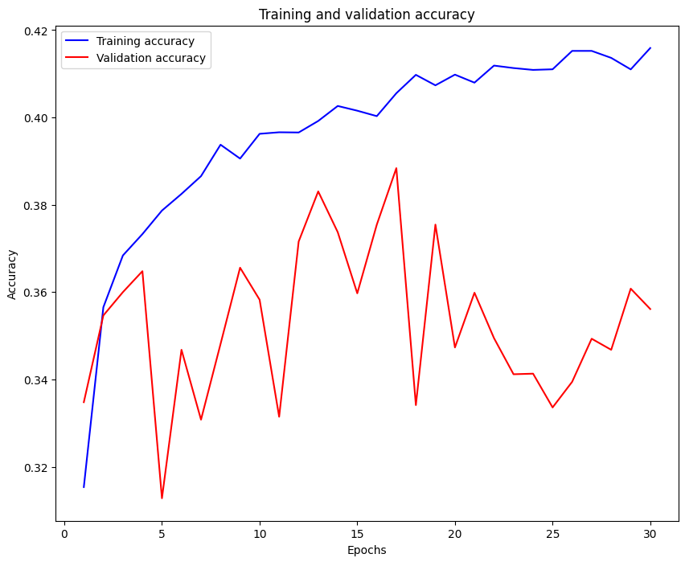

# 선형 모델 학습

## 선형 모델 학습 과정


## 벡터화 
- 선형 모델에서는 입력 데이터는 벡터 형태로 정리
- 2차원 또는 3차원 이미지 데이터를 1차원 벡터로 변환
- 선형 모델에서는 입력이 반드시 1차원 벡터, 따라서 벡터화 필수이다.
- 다음은 4X4 픽셀 이미지 예시이다


## 벡터화 코드

```python
import numpy as np

# 0~255 사이의 임의의 정수로 구성된 4x4 행렬 생성
a = np.random.randint(0, 255, (4, 4))
print("원본 4x4 행렬:")
print(a)

# flatten을 사용해 1차원 배열(벡터)로 변환
b = a.flatten()
print("\nFlatten된 1차원 배열:")
print(b)

# reshape을 사용해 행렬 크기를 변경
# -1은 자동 계산되며, 이 경우 총 원소 수가 16이므로 reshape(-1)은 (16,)과 동일
# 예: (2, 8)로 바꾸고 싶다면 reshape(2, -1) 또는 reshape(2, 8) 모두 가능
c = a.reshape(-1)
print("\nReshape(-1) 결과:")
print(c)
```
## 선형 분류기 - Score 함수

**score = W·x + b**

- x: 입력 벡터 (flatten된 이미지)

- W: 가중치 행렬 (클래스 수 × 입력 특성 수)

- b: 바이어스 벡터

- score: 각 클래스에 대한 점수 (score vector)


**병렬처리**

+ X: m개의 입력 샘플 (m, n), W: 가중치 (k, n)

+ 결과 S: score (m, k)

+ S = np.dot(X, W.T) + b


## Sofemax 분류기
Softmax는 각 클래스의 점수를 확률로 변환합니다:


s_j: 클래스 j의 점수 (score)

전체 클래스의 score를 softmax에 통과시켜 확률 분포로 만듭니다.


**진행 과정**
  


**ross Entropy Loss 과정**

Softmax의 출력 결과와 실제 정답 간의 차이를 측정하는 손실 함수:


y_true 위치의 softmax 확률에 -log를 취한 값

정답 클래스의 확률이 높을수록 loss가 낮아짐


**최적화: SGD**

학습은 경사 하강법을 기반으로 최적화됩니다:

    Full Gradient Descent는 전체 데이터를 사용하지만 연산량이 많음

    대신 **Stochastic Gradient Descent (SGD)**는 일부 배치만 사용:

작은 배치(mini-batch) 단위로 파라미터를 조금씩 업데이트하면서 전체적으로 손실을 줄여나가는 방식


## 🔍 전체 학습 흐름 요약

    이미지 → 벡터화

    벡터 → Score 계산 (Wx + b)

    Score → Softmax → 확률 분포

    예측 확률과 실제 라벨로 Cross Entropy Loss 계산

    Loss에 따라 SGD로 파라미터 업데이트


# 활성화 함수 
## Sigmoid
**자연어 처리등의 특별한 경우를 제외하고 잘 사용되지 않음 (컴퓨터 자원을 많이 소모함)**


## tanh
**원점 대칭 특징으로 인하여 sigmoid보다 나아졌지만, 여전히 학습이 되지 않는 구간이 많다.**


## ReLU
**성능이 우수하며 음수인 경우는 제외된다**


# 학습 분석

## 과적합


## 학습곡선


# Mnist 실습
```python
import numpy as np
import pandas as pd

from tensorflow.keras.datasets.mnist import load_data
(train_x, train_y), (test_x, test_y) = load_data()

train_x.shape, train_y.shape, # Train 데이터 크기 확인
test_x.shape, test_y.shape # Test 데이터 크기 확인
```
> 결과 : ((10000, 28, 28), (10000,))
```python
# 이미지 확인하기
from PIL import Image
img=train_x[0]

import matplotlib.pyplot as plt
img1 = Image.fromarray(img, mode = 'L')
plt.imshow(img1)

train_y[0]
```
> 결과:
```python
# 데이터 전처리

## 입력 형태 변환: 3-> 2 차원
### 데이터를 2차원 형태로 변환: 입력 데이터가 선형 모델에서는 벡터 형태
train_x1 = train_x.reshape(60000, -1)
test_x1 = test_x.reshape(10000, -1)

### 데이터 값의 크기 조절: 0~1 사이 값으로 변환
train_x2 = train_x1 / 255
test_x2 = test_x1 / 255
```
```python
# 모델 설정

## 라이브러리 불러오기
from tensorflow.keras.models import Sequential
from tensorflow.keras.layers import Dense

## 모델 설정
md = Sequential()
md.add(Dense(10, activation='softmax', input_shape=(28*28,)))
md.summary()  # 모델 요약
```
> 결과:

```python
# 모델 학습 진행
## 모델 complile: 손실 함수, 최적화 함수, 측정 함수 설정
md.compile(loss='sparse_categorical_crossentropy', optimizer='sgd', metrics=['acc'])

## 모델 학습: 학습 횟수. batch_size, 검증용 데이터 설정
hist = md.fit(train_x2, train_y, epochs=30, batch_size=64, validation_split=0.2)
```
> 결과 :
 
```python
acc = hist.history['acc']
val_acc = hist.history['val_acc']
epoch = np.arange(1, len(acc)+1)

# 학습 결과 분석: 학습 곡선 그리기
plt.figure(figsize=(10, 8))
plt.plot(epoch, acc, 'b', label='Training accuracy')
plt.plot(epoch, val_acc, 'r', label='Validation accuracy')
plt.title('Training and validation accuracy')
plt.xlabel('Epochs')
plt.ylabel('Accuracy')
plt.legend()
plt.show()
```
> 결과: 

```python
# 테스트용 데이터 평가
md.evaluate(test_x2, test_y)

# 가중치 저장
weight = md.get_weights()
weight
```
> 결과: 


```python
# Model Loss 시각화
plt.plot(hist.history['loss'], label='loss')
plt.plot(hist.history['val_loss'], label='val_loss')
plt.title('model loss')
plt.ylabel('loss')
plt.xlabel('epoch')
plt.legend(['train', 'test'], loc='upper left')
plt.show()
```
> 결과:

# CIFAR10 데이터셋 이용

## sqd
```python
import numpy as np
import pandas as pd
import matplotlib.pyplot as plt
from PIL import Image

# 1. CIFAR-10 데이터 불러오기
from tensorflow.keras.datasets import cifar10
(train_x, train_y), (test_x, test_y) = cifar10.load_data()

print(train_x.shape, train_y.shape)  # (50000, 32, 32, 3)
print(test_x.shape, test_y.shape)    # (10000, 32, 32, 3)

# 2. 이미지 확인
img = train_x[0]
img1 = Image.fromarray(img)
plt.imshow(img1)
plt.title(f'Class: {train_y[0][0]}')
plt.show()

# 3. 데이터 전처리

## 3-1: 4차원 → 2차원 (벡터화: 32x32x3 = 3072)
train_x1 = train_x.reshape(50000, -1)
test_x1 = test_x.reshape(10000, -1)

## 3-2: 픽셀 정규화 (0~1)
train_x2 = train_x1 / 255.0
test_x2 = test_x1 / 255.0

# 4. 모델 설정
from tensorflow.keras.models import Sequential
from tensorflow.keras.layers import Dense

md = Sequential()
md.add(Dense(10, activation='softmax', input_shape=(32 * 32 * 3,)))  # CIFAR-10에 맞는 입력 크기
md.summary()

# 5. 모델 컴파일
md.compile(loss='sparse_categorical_crossentropy', optimizer='sgd', metrics=['accuracy'])

# 6. 모델 학습
hist = md.fit(train_x2, train_y, epochs=30, batch_size=128, validation_split=0.1)

# 7. 학습 결과 시각화

## 정확도 시각화
acc = hist.history['accuracy']
val_acc = hist.history['val_accuracy']
epoch = np.arange(1, len(acc) + 1)

plt.figure(figsize=(10, 8))
plt.plot(epoch, acc, 'b', label='Training accuracy')
plt.plot(epoch, val_acc, 'r', label='Validation accuracy')
plt.title('Training and validation accuracy')
plt.xlabel('Epochs')
plt.ylabel('Accuracy')
plt.legend()
plt.show()

# 8. 테스트 데이터 평가
test_loss, test_acc = md.evaluate(test_x2, test_y)
print(f'Test Accuracy: {test_acc:.4f}, Test Loss: {test_loss:.4f}')

# 9. 가중치 저장
weights = md.get_weights()
print("Model weights:", weights)

# 10. 손실 시각화
plt.plot(hist.history['loss'], label='loss')
plt.plot(hist.history['val_loss'], label='val_loss')
plt.title('Model Loss')
plt.ylabel('Loss')
plt.xlabel('Epoch')
plt.legend(['train', 'test'], loc='upper left')
plt.show()
```
### sgd (epoch = 30, Batch_size = 64, validation_split = 0.2)
**Test Accuracy: 0.4045, Test Loss: 1.7288**


### Sgd(epoch = 30, Batch_size = 128, validation_split = 0.2)
**Test Accuracy: 0.3945, Test Loss: 1.7484**


### Sgd(epoch = 30, Batch_size = 64, validation_split = 0.1)
**Test Accuracy: 0.3430, Test Loss: 1.8638**


### Sgd(epoch = 30, Batch_size = 128, validation_split = 0.1)
**Test Accuracy: 0.4017, Test Loss: 1.7334**


### Sgd(epoch = 30, Batch_size = 64, validation_split = 0.3)
**Test Accuracy: 0.3939, Test Loss: 1.7393**


### Sgd(epoch = 30, Batch_size = 128, validation_split = 0.3)
**Test Accuracy: 0.3965, Test Loss: 1.7414**

## Adam

```python
import numpy as np
import pandas as pd
import matplotlib.pyplot as plt
from PIL import Image

# 1. CIFAR-10 데이터 불러오기
from tensorflow.keras.datasets import cifar10
(train_x, train_y), (test_x, test_y) = cifar10.load_data()

print(train_x.shape, train_y.shape)  # (50000, 32, 32, 3)
print(test_x.shape, test_y.shape)    # (10000, 32, 32, 3)

# 2. 이미지 확인
img = train_x[0]
img1 = Image.fromarray(img)
plt.imshow(img1)
plt.title(f'Class: {train_y[0][0]}')
plt.show()

# 3. 데이터 전처리

## 3-1: 4차원 → 2차원 (벡터화: 32x32x3 = 3072)
train_x1 = train_x.reshape(50000, -1)
test_x1 = test_x.reshape(10000, -1)

## 3-2: 픽셀 정규화 (0~1)
train_x2 = train_x1 / 255.0
test_x2 = test_x1 / 255.0

# 4. 모델 설정

## 4-1 라이브러리 불러오기
from tensorflow.keras.models import Sequential
from tensorflow.keras.layers import Dense, Input
from tensorflow.keras.optimizers import Adam


## 4-2. 모델 설정
md = Sequential()
md.add(Input(shape=(32*32*3,)))         # CIFAR10은 32x32x3 = 3072
md.add(Dense(10, activation='softmax')) # 단일 출력층
md.summary()  # 모델 요약

# 5. 모델 학습 진행
## 모델 complile: 손실 함수, 최적화 함수, 측정 함수 설정
md.compile(loss='sparse_categorical_crossentropy', optimizer=Adam(learning_rate=0.001), metrics=['accuracy'])

# 6. 모델 학습: 학습 횟수. batch_size, 검증용 데이터 설정
hist = md.fit(train_x2, train_y, epochs=30, batch_size=128, validation_split=0.05)

# 7. 학습 결과 시각화

## 정확도 시각화
acc = hist.history['accuracy']
val_acc = hist.history['val_accuracy']
epoch = np.arange(1, len(acc) + 1)

plt.figure(figsize=(10, 8))
plt.plot(epoch, acc, 'b', label='Training accuracy')
plt.plot(epoch, val_acc, 'r', label='Validation accuracy')
plt.title('Training and validation accuracy')
plt.xlabel('Epochs')
plt.ylabel('Accuracy')
plt.legend()
plt.show()

# 8. 테스트 데이터 평가
test_loss, test_acc = md.evaluate(test_x2, test_y)
print(f'Test Accuracy: {test_acc:.4f}, Test Loss: {test_loss:.4f}')

# 9. 가중치 저장
weights = md.get_weights()
print("Model weights:", weights)

# 10. 손실 시각화
plt.plot(hist.history['loss'], label='loss')
plt.plot(hist.history['val_loss'], label='val_loss')
plt.title('Model Loss')
plt.ylabel('Loss')
plt.xlabel('Epoch')
plt.legend(['train', 'test'], loc='upper left')
plt.show()
```

### Adam(epoch = 30, Batch_size = 64, validation_split = 0.15)
**Test Accuracy: 0.3892, Test Loss: 1.7702**



### Adam(epoch = 30, Batch_size= 128, validation_split=0.15)
**Test Accuracy: 0.3517, Test Loss: 1.8472**


### Adam(epoch = 30, Batch_size = 64, validation_split = 0.05)
**Test Accuracy: 0.3892, Test Loss: 1.7702**


### Adam(epoch = 30, Batch_size = 128, validation_split = 0.05)
**Test Accuracy: 0.3737, Test Loss: 1.8149**


### Adam(epoch = 30, Batch_size = 64, validation_split = 0.25)
**Test Accuracy: 0.3822, Test Loss: 1.7803**


### Adam(epoch = 30, Batch_size = 128, validation_split = 0.25)
**Test Accuracy: 0.3738, Test Loss: 1.7920**


## 🔍 결론 및 고찰

### ✅ 결론

이번 실험에서는 CIFAR-10 데이터셋을 기반으로 단일 레이어를 사용하는 선형 모델을 구성하고, 두 가지 대표적인 옵티마이저인 **SGD (Stochastic Gradient Descent)** 와 **Adam**의 성능을 비교하였다.  
그 결과, 다음과 같은 차이점이 나타났다:

- **SGD**: 학습률이 고정되어 있어 수렴 속도는 느리지만, **훈련 정확도와 손실이 점진적으로 안정적으로 향상**되었다.
- **Adam**: 모멘텀과 적응적 학습률을 활용하여 **초기 학습 속도가 빠르지만**, **검증 정확도(val_accuracy)는 오히려 하락**하거나 불안정한 모습을 보였다.

이는 Adam이 더 복잡한 모델 구조나 정규화 기법과 함께 사용될 때 강점을 보이지만, 단층 선형 모델에서는 **과적합(overfitting)** 또는 **overshooting 현상**이 나타날 수 있다는 점을 시사한다.

---

### ⚙ 하이퍼파라미터 인자의 영향

- `batch_size = 64`:  
  한 번에 처리되는 샘플 수가 작을수록 모델이 자주 업데이트되며,  
  - **Adam**: 빠른 반응 → 과적합 가능성 증가  
  - **SGD**: 안정적이고 완만한 수렴 경향

- `validation_split = 0.05`:  
  전체 데이터 중 5%만을 검증에 사용 → 검증 정확도(val_accuracy)의 **변동성이 큼**.  
  Adam처럼 **초기 과적합 경향이 큰 옵티마이저의 단점이 더 도드라짐**.

---

### 💡 고찰

Adam은 빠른 초기 수렴이 가능하다는 장점이 있으나, **단일 레이어 모델 구조에서는 과적합 및 학습 불안정성**이 발생할 수 있다. 반면, SGD는 느리지만 **결국 더 안정적으로 학습**이 진행되었으며, **일반화 성능에서도 더 나은 결과**를 보였다.

이번 실험을 통해 다음과 같은 시사점을 얻을 수 있다:

- **단순 모델에서는 SGD가 더 안정적**일 수 있다.
- **Adam 사용 시 learning_rate 조정**, 또는 **Dropout 등의 정규화 기법 도입**이 필요하다.
- 옵티마이저의 성능은 모델 구조 및 하이퍼파라미터 설정에 따라 민감하게 달라질 수 있으므로, **모델 복잡도에 맞춘 옵티마이저 선택**이 중요하다.


# ANN 모델 실습

## 접근 
>mkdir F_MNIST
>
>cd F_MNIST
>
>python3 -m venv .fmnist
>
>source .fmnist/bin/activate
>
>pip install tensorflow matplotlib PyQt5 scikit-learn
>
>export QT_QPA_PLATFORM=wayland -> 터미널 오픈시 실행
>
>python fs_mnist.py

## fs_mnist.py

```python
import tensorflow as tf
from tensorflow import keras

import numpy as np
import matplotlib
import matplotlib.pyplot as plt

# dataset load
fashion_mnist = keras.datasets.fashion_mnist

# spilt data (train / test)
(train_images, train_labels), (test_images, test_labels) = fashion_mnist.load_data()

print(train_images.shape)
print(train_labels.shape)
print(test_images.shape)
print(test_labels.shape)

class_names = ['T-shirt/top', 'Trouser', 'Pullover', 'Dress', 'Coat',
               'Sandal', 'Shirt', 'Sneaker', 'Bag', 'Ankle boot']
               
matplotlib.use('Qt5Agg')
NUM=20
plt.figure(figsize=(15,15))
plt.subplots_adjust(hspace=1)
for idx in range(NUM):
    sp = plt.subplot(5,5,idx+1)
    plt.imshow(train_images[idx])
    plt.title(f'{class_names[train_labels[idx]]}')
plt.show()

plt.figure()
plt.imshow(train_images[0])
plt.colorbar()
plt.grid(False)
plt.show()

# 간단한 이미지 전처리 (for ANN)
train_images = train_images / 255.0
test_images = test_images / 255.0

class_names = ['T-shirt/top', 'Trouser', 'Pullover', 'Dress', 'Coat',
               'Sandal', 'Shirt', 'Sneaker', 'Bag', 'Ankle boot']

plt.figure(figsize=(10,8))
for i in range(20):
    plt.subplot(4,5,i+1)
    plt.xticks([])
    plt.yticks([])
    plt.grid(False)
    plt.imshow(train_images[i], cmap=plt.cm.binary)
    plt.xlabel(class_names[train_labels[i]])
plt.show()

model = keras.Sequential ([
    keras.layers.Flatten(input_shape=(28,28)),
    keras.layers.Dense(128, activation='relu'),
    keras.layers.Dense(10, activation='softmax'),
])

model.summary()

model.compile(optimizer='adam',
              loss='sparse_categorical_crossentropy',
              metrics=['accuracy'])

model.fit(train_images, train_labels, epochs=20)

predictions = model.predict(test_images)

predictions[0]

np.argmax(predictions[0])

test_labels[0]

def plot_image(i, predictions_array, true_label, img):
  predictions_array, true_label, img = predictions_array[i], true_label[i], img[i]
  plt.grid(False)
  plt.xticks([])
  plt.yticks([])

  plt.imshow(img, cmap=plt.cm.binary)

  predicted_label = np.argmax(predictions_array)
  if predicted_label == true_label:
    color = 'blue'
  else:
    color = 'red'

  plt.xlabel("{} {:2.0f}% ({})".format(class_names[predicted_label],
                                100*np.max(predictions_array),
                                class_names[true_label]),
                                color=color)

def plot_value_array(i, predictions_array, true_label):
  predictions_array, true_label = predictions_array[i], true_label[i]
  plt.grid(False)
  plt.xticks([])
  plt.yticks([])
  thisplot = plt.bar(range(10), predictions_array, color="#777777")
  plt.ylim([0, 1])
  predicted_label = np.argmax(predictions_array)

  thisplot[predicted_label].set_color('red')
  thisplot[true_label].set_color('blue')

num_rows = 5
num_cols = 3
num_images = num_rows*num_cols
plt.figure(figsize=(2*2*num_cols, 2*num_rows))
for i in range(num_images):
  plt.subplot(num_rows, 2*num_cols, 2*i+1)
  plot_image(i, predictions, test_labels, test_images)
  plt.subplot(num_rows, 2*num_cols, 2*i+2)
  plot_value_array(i, predictions, test_labels)
plt.show()

from sklearn.metrics import accuracy_score
print('accuracy score : ', accuracy_score(tf.math.argmax(predictions, -1), test_labels))
```