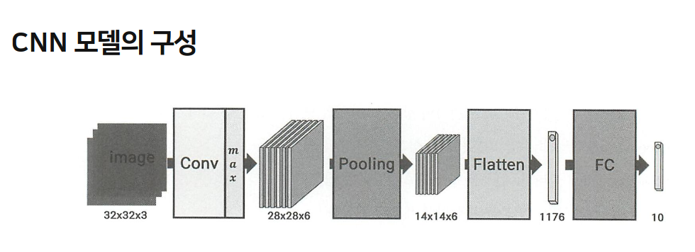

# CNN 이란?
***Convolutional Neural Network(합성곱 신경망)***
-이미지 인식, 영상 분석, 자연어 처리에 사용되는 딥러닝 모델 구조.

## 📌 CNN의 핵심 개념

| 구성 요소                              | 설명                                                     |
| ---------------------------------- | ------------------------------------------------------ |
| **Convolution Layer (합성곱층)**       | 필터(또는 커널)를 사용해 입력 이미지의 특징(Feature)을 추출함. 가장 핵심적인 층.    |
| **Activation Function (활성화 함수)**   | 주로 ReLU(Rectified Linear Unit)를 사용하여 비선형성을 추가함.        |
| **Pooling Layer (풀링층)**            | 특성 맵을 축소해 연산량 감소 및 중요한 특징 유지 (MaxPooling이 일반적).        |
| **Fully Connected Layer (완전 연결층)** | 추출된 특징을 바탕으로 분류나 예측 등을 수행. 마지막에 Softmax 또는 Sigmoid 사용. |

## 📊 CNN vs 일반 MLP (다층 퍼셉트론)

| 항목     | CNN                 | MLP       |
| ------ | ------------------- | --------- |
| 특징 추출  | 자동으로 이미지 특징 추출      | 수동 혹은 제한적 |
| 입력 구조  | 주로 이미지/2D 데이터       | 1차원 벡터    |
| 파라미터 수 | 상대적으로 적음 (공유 필터 사용) | 매우 많음     |

## CNN 모델의 구성



>처음 입력은 32×32×3의 3차원 데이터이다. 
>
>한 번의 합성곱 층을 거쳐 28×28×6인 크기의 3차원 데이터가 되었다.

>CNN Layer에는 합성곱이 6번(6개의 필터) 사용된 것을 알 수 있다. 
>
>다음으로 Pooling layer를 거쳐 14×14×6인 크기의 데이터가 되었다.

>이것을 벡터화(Flatten)함으로써 1,176 크기의 1차원 벡터가 된다.
>
>마지막으로 FC layer를 거쳐 최종적으로 class 개수에 .맞도록 10개의 값을 갖는 출력층이 만들어진다.

### CNN 구성 요소 -> Convolutuon Layer 연산


>합성곱은 텐서(tensor)와 텐서 사이에서 정의되는
연산이다.

>텐서는 차원에 따라 0차원은 scalar, 1차원은 벡터,
2차원은 행렬, 3차원은 3차원 행렬(텐서)라고
부른다.

>4차원 텐서의 경우 4차원 벡터처럼 수식으로만
표현되며, 보통 3차원 텐서(또는 이미지)가 여러 개
모여 있다는 의미가 된다.

### 합성곱 계산


>차원의 크기가 같은 두 텐서를 계산해 Scalar 값이 되는 연산

### Filter 

> 특정 사이즈의 텐서를 사용해 전체 이미지를 스캔하듯이 이동연산

> 이때 스캔하는 텐서를 필터라 한다.

### Feature Map


- 입력 데이터에 필터로 스캔한 결과로 만들어지는 출력 텐서를 feature map(특성
맵)이라 한다.

- 보통 하나의 합성곱 층에서 여러 개의 필터가 사용되며, 그 결과로 필터 수만큼의 특성 맵이 만들어진다.

- 합성곱 연산 후에 활성화 함수를 적용하는데 이것은 특성 맵이 만들어진 후에 작용한다.

- 특성 맵에 활성화 함수를 작용시켜 만들어진 결과를 activation map이라고도 한다.

- CNN의 다음 층에서는 계산된 activation map들을 모아 하나의 텐서로 만들어서 새로운 입력으로 사용한다. 

- 예를 들어 activation map의 크기가 28×28이고 작용한
필터의 개수가 5개였다면, 다음 입력 데이터는 28×28×5의 크기가 된다. 
- 여기서 activation map과 특성 맵은 같은 크기이다.

- 그림을 살펴보면, 입력 이미지가 32×32×3이고 하나의 필터를 통해 28×28×1 크기를 갖는 하나의 특성 맵이 만들어지며, 여기에 activation function(예: ReLU)이 작용해 같은 크기의 activation map이 만들어진다.

### Stride

> CNN 과정에서 합성곱 연산에 필터가 움직이는 간격

> 합성곱이 2차원(3x3) 으로 정의 따라서 Stride도 2차원(m, n)으로 정의

> 한 번 합성곱 연산을 한 후에 우측으로 m만큼씩 이동해 입력 텐서의 끝까지
이동한 후, 아래로 n만큼씩 움직여서 맨 왼쪽부터 다시 스캔하는 방식이다.

### Padding


> 합성곱 연산이 특성 맵은 기존 데이터 크기보다 작아진다.

>패딩을 덧대어 출력 크기를 입력 크기와 같게 만들며 빈도수를 동일하게 설정할 수 있다.

> 합성곱 층에서 인수 설정을 Padding = same으로 사용

### 활성화 (Activation)

- 합성곱 연산 후, 신경망처럼 활성화 함수(ReLU 등) 를 사용하여 비선형성을 부여함.
  
- 일반적으로 ReLU 또는 ReLU 변형 함수를 사용.
  
- 이러한 처리 과정은 기존 신경망과 동일함.
  
- 합성곱 층 개수는 설정에 따라 달라짐 (1개만 사용하거나 2~3개 사용할 수도 있음).
  
- 각 합성곱 층 뒤에 Pooling Layer를 붙이기도 함.
  
- 여러 유명한 신경망 구조(Architecture)를 참고하면 더 좋은 모델을 설계하는 데 도움됨. (예: VGG, ResNet 등)


### Polling Layer

Max


Average


Global Average


>합성곱 연산으로 만들어진 하나의 특성 맵에서 평균값을 출력하는 Pooling.

>이전의 Pooling 계산보다 크기를 많이 줄이게 된다.

>GoogLeNet에서 FC Layer 직전에 Flatten 대신 사용함.


# 실습

## 수동구현
```python
import numpy as np
from PIL import Image
import matplotlib.pyplot as plt

# 합성곱 함수 구현
def conv(a, b): 
    c = np.array(a) * np.array(b)
    return np.sum(c)

# MaxPolling 함수 구현
def MaxPooling(nimg): 
    ning = np.array(nimg)
    i0, j0 = ning.shape
    i1 = int((i0 + 1) / 2)
    j1 = int((j0 + 1) / 2)

    output = np.zeros((i1, j1))

    if i0 % 2 == 1:
        i0 += 1
        tmp = np.zeros((1, j0))
        ning = np.concatenate((ning, tmp), axis=0)

    if j0 % 2 == 1:
        j0 += 1
        tmp = np.zeros((i0, 1))
        ning = np.concatenate((ning, tmp), axis=1)

    for i in range(output.shape[0]):
        for j in range(output.shape[1]):
            a = ning[2 * i:2 * i + 2, 2 * j:2 * j + 2]
            output[i, j] = a.max()
    return output

# 합성곱 출력 층 (Feature Map) 함수 구현 
def featuring(nimg, filters):
    feature = np.zeros((nimg.shape[0] - 2, nimg.shape[1] - 2))
    for i in range(feature.shape[0]):
        for j in range(feature.shape[1]):
            a = nimg[i: i + 3, j: j + 3]
            feature[i, j] = conv(a, filters)
    return feature

# MaxPooling 출력 층 함수 구현 (여러 map 계산)
def Pooling(nimg):
    nimg = np.array(nimg)
    pool0 = []
    for i in range(len(nimg)):
        pool0.append(MaxPooling(nimg[i]))
    return pool0

# 배열을 그림으로 변환
def to_img(nimg):
    nimg = np.array(nimg)
    nimg = np.uint8(np.round(nimg))
    fimg = []
    for i in range(len(nimg)):
        fimg.append(Image.fromarray(nimg[i]))
    return fimg

# Feature map 생성 (여러 개의 Filter 계산)
def ConvD(nimg, filters):
    nimg = np.array(nimg)
    feat0 = []
    for i in range(len(filters)):
        feat0.append(featuring(nimg, filters[i]))
    return feat0

# ReLU 구현
def ReLU(fo):
    fo = np.array(fo)
    fo = (fo > 0) * fo
    return fo

# Conv+ReLU+MaxPooling
def ConvMax(nimg, filters):
    nimg = np.array(nimg)
    f0 = ConvD(nimg, filters)
    f0 = ReLU(f0)
    fg = Pooling(f0)
    return f0, fg

# 합성곱 후의 상태와 MaxPooling 후의 상태를 그림으로 그리기
def draw(f0, fg0, size=(12, 8), k=-1):
    plt.figure(figsize=size)
    for i in range(len(f0)):
        plt.subplot(2, len(f0), i + 1)
        plt.gca().set_title('Conv' + str(k) + '-' + str(i))
        plt.imshow(f0[i])
    for i in range(len(fg0)):
        plt.subplot(2, len(fg0), i + len(f0) + 1)
        plt.gca().set_title('MaxP' + str(k) + '-' + str(i))
        plt.imshow(fg0[i])
    if k != -1:
        plt.savefig('conv' + str(k) + '.png')
    plt.show()

# 3개의 activation map 합치기
def join(mm):
    mm = np.array(mm)
    m1 = np.zeros((mm.shape[1], mm.shape[2], mm.shape[0]))
    for i in range(mm.shape[1]):
        for j in range(mm.shape[2]):
            for k in range(mm.shape[0]):
                m1[i][j][k] = mm[k][i][j]
    return m1

# 과정을 계산하고 결과를 그림으로 출력
def ConvDraw(p0, filters, size=(12, 8), k=-1):
    f0, fg0 = ConvMax(p0, filters)
    f0_img = to_img(f0)
    fg1_img = to_img(fg0)
    draw(f0, fg0, size, k)
    p1 = join(fg0)
    return p1

# 테스트 실행
nimg31 = np.random.rand(10, 10)
filters = [np.ones((3, 3))] * 3

m0 = ConvDraw(nimg31, filters, (12, 10), 0)
```
## 결과


# 실습 CIFAR10_CNN
```python
import matplotlib.pyplot as plt
from tensorflow.keras.datasets import cifar10

(train_x, train_y), (test_x, test_y) = cifar10.load_data()

class_names = ['airplane', 'automobile', 'bird', 'cat', 'deer', 'dog', 'frog', 'horse', 'ship', 'truck']

train_x = train_x / 255.
test_x = test_x / 255.

from tensorflow.keras.utils import to_categorical

train_y = to_categorical(train_y)
test_y = to_categorical(test_y)

# CNN 모델 디자인
from tensorflow.keras import models, layers

model = models.Sequential()

# (32, 32, 3) => (30, 30, 32)
model.add(layers.Conv2D(filters=32, kernel_size=(3, 3),
                        activation='relu',
                        input_shape=(32, 32, 3)))
# (30, 30, 32) => (15, 15, 32)
model.add(layers.MaxPool2D(pool_size=(2, 2)))

# (15, 15, 32) => (13, 13, 64)
model.add(layers.Conv2D(filters=64, kernel_size=(3, 3),
                        activation='relu'))

# (13, 13, 64) => (6, 6, 64)
model.add(layers.MaxPool2D(pool_size=(2, 2)))

# (6, 6, 64) => (4, 4, 64)
model.add(layers.Conv2D(filters=64, kernel_size=(3, 3),
                        activation='relu'))

# 3D를 1D로 변환
model.add(layers.Flatten())

# Classification : Fully Connected Layer 추가
model.add(layers.Dense(units=64, activation='relu'))
model.add(layers.Dense(units=10, activation='softmax'))

# 모델의 학습 정보 설정
model.compile(optimizer='rmsprop', loss='categorical_crossentropy', metrics=['accuracy'])

# 모델 학습
history = model.fit(x=train_x, y=train_y, epochs=20, batch_size=256, verbose=2, validation_split=0.2)

acc = history.history['accuracy']
val_acc = history.history['val_accuracy']
loss = history.history['loss']
val_loss = history.history['val_loss']

epochs = range(len(acc))

plt.plot(epochs, acc, 'bo', label='Training acc')
plt.plot(epochs, val_acc, 'b', label='Validation acc')
plt.title('Training and Validation Accuracy')
plt.legend()
plt.show()

plt.plot(epochs, loss, 'bo', label='Training loss')
plt.plot(epochs, val_loss, 'b', label='Validation loss')
plt.title('Training and Validation Loss')
plt.legend()
plt.show()
```
### 결과


```python
plt.figure(figsize=(10, 10))
for i in range(25):
    plt.subplot(5, 5, i + 1)
    plt.xticks([])
    plt.yticks([])
    plt.grid(False)
    plt.imshow(train_x[i], cmap=plt.cm.binary)
    # The CIFAR labels happen to be arrays,
    # which is why you need the extra index
    plt.xlabel(class_names[train_y[i].argmax()])
plt.show()
```
### 결과


```python
print(f'훈련 데이터 수: {len(train_x)}장')
print(f'테스트 데이터 수: {len(test_x)}장')
print(f'총 데이터 수: {len(train_x) + len(test_x)}장')
```
### 결과


```python
plt.figure(figsize=(15, 15))
for i in range(100):
    plt.subplot(10, 10, i + 1)
    plt.xticks([])
    plt.yticks([])
    plt.grid(False)
    plt.imshow(train_x[i], cmap=plt.cm.binary)
    plt.xlabel(class_names[train_y[i].argmax()])
plt.show()
```
### 결과


# 하이퍼 파라미터 변경으로 설정 찾아보기

## Case 1: pool_size=(2, 2) -> (1, 1)


### 분석
1. Training and Validation Accuracy (상단 그래프)

    Training acc (파란색 점): 에포크가 진행됨에 따라 꾸준히 증가하여 1.0(100%)에 가깝게 도달합니다. 이는 모델이 훈련 데이터에 대해 매우 잘 학습하고 있음을 의미합니다.

    Validation acc (파란색 선): 처음에는 증가하다가 약 5~7 에포크 이후에는 거의 증가하지 않고, 오히려 약간 감소하거나 불규칙하게 움직이는 모습을 보입니다 (대략 0.6에서 0.65 사이). 그리고 훈련 정확도와 검증 정확도 사이의 간격이 점점 벌어집니다.

2. Training and Validation Loss (하단 그래프)

    Training loss (파란색 점): 에포크가 진행됨에 따라 꾸준히 감소하여 0에 가깝게 도달합니다. 이는 모델이 훈련 데이터에 대한 오차를 매우 잘 줄이고 있음을 의미합니다.

    Validation loss (파란색 선): 처음에는 감소하다가 약 5~7 에포크 이후에는 오히려 증가하기 시작합니다. 훈련 손실과 검증 손실 사이의 간격이 급격히 벌어지는 것을 명확히 볼 수 있습니다.

결론: 과적합 (Overfitting)

두 그래프 모두 **심각한 과적합(Overfitting)**이 발생했음을 명확히 보여줍니다.

    모델이 훈련 데이터에 대해서는 거의 완벽하게 학습했지만 (높은 훈련 정확도, 낮은 훈련 손실),

    이전에 보지 못한 검증 데이터에 대해서는 성능이 정체되거나 오히려 나빠지고 있습니다 (낮은 검증 정확도, 증가하는 검증 손실).

이는 모델이 훈련 데이터의 노이즈나 특정 패턴까지도 암기하여, 실제 일반화 능력은 떨어진다는 것을 의미합니다.

## Case2: Filters (32, 64, 64) -> (64, 64, 64)


### 분석
filters=32 vs filters=64 학습 결과 비교 분석

두 경우의 차이점 및 분석

- 성능 향상 없음: 필터 수를 32개에서 64개로 늘렸음에도 불구하고, 모델의 최종 검증 정확도나 손실이 유의미하게 개선되지 않았습니다. 
- 두 경우 모두 비슷한 수준의 과적합 징후를 보이며, 훈련과 검증 성능 간의 간격도 거의 동일하게 유지됩니다.

- 모델 복잡도 증가의 효과 미미: 필터 수를 늘리면 모델의 표현력과 학습 파라미터 수가 증가하여 더 복잡한 특징을 학습할 수 있을 것으로 기대하지만, 이 경우에는 그 효과가 나타나지 않았습니다.

이미 32개 필터로 충분한 표현을 하고 있으며, 기존 필터들이 중복되어 비 효율적으로 학습될 수 있습니다.

## Case3: optimizer 'rmsprop' -> 'Adam'
```python
############### Adam #########################

import matplotlib.pyplot as plt
from tensorflow.keras.datasets import cifar10

(train_x, train_y), (test_x, test_y) = cifar10.load_data()

class_names = ['airplane', 'automobile', 'bird', 'cat', 'deer', 'dog', 'frog', 'horse', 'ship', 'truck']

train_x = train_x / 255.
test_x = test_x / 255.

from tensorflow.keras.utils import to_categorical

train_y = to_categorical(train_y)
test_y = to_categorical(test_y)

# CNN 모델 디자인
from tensorflow.keras import models, layers
from tensorflow.keras.optimizers import Adam # Adam 옵티마이저 임포트

model = models.Sequential()

# (32, 32, 3) => (30, 30, 32)
model.add(layers.Conv2D(filters=32, kernel_size=(3, 3),
                        activation='relu',
                        input_shape=(32, 32, 3)))
# (30, 30, 32) => (15, 15, 32)
model.add(layers.MaxPool2D(pool_size=(2, 2)))

# (15, 15, 32) => (13, 13, 64)
model.add(layers.Conv2D(filters=64, kernel_size=(3, 3),
                        activation='relu'))

# (13, 13, 64) => (6, 6, 64)
model.add(layers.MaxPool2D(pool_size=(2, 2)))

# (6, 6, 64) => (4, 4, 64)
model.add(layers.Conv2D(filters=64, kernel_size=(3, 3),
                        activation='relu'))

# 3D를 1D로 변환
model.add(layers.Flatten())

# Classification : Fully Connected Layer 추가
model.add(layers.Dense(units=64, activation='relu'))
model.add(layers.Dense(units=10, activation='softmax'))

# 모델의 학습 정보 설정
# model.compile(optimizer='rmsprop', loss='categorical_crossentropy', metrics=['accuracy']) # 기존 rmsprop
model.compile(optimizer='adam', loss='categorical_crossentropy', metrics=['accuracy']) # Adam으로 변경

# 모델 학습
history = model.fit(x=train_x, y=train_y, epochs=20, batch_size=256, verbose=2, validation_split=0.2)

acc = history.history['accuracy']
val_acc = history.history['val_accuracy']
loss = history.history['loss']
val_loss = history.history['val_loss']

epochs = range(len(acc))

plt.plot(epochs, acc, 'bo', label='Training acc')
plt.plot(epochs, val_acc, 'b', label='Validation acc')
plt.title('Training and Validation Accuracy')
plt.legend()
plt.show()

plt.plot(epochs, loss, 'bo', label='Training loss')
plt.plot(epochs, val_loss, 'b', label='Validation loss')
plt.title('Training and Validation Loss')
plt.legend()
plt.show()
```


## 분석
두 옵티마이저(rmsprop과 Adam) 간의 큰 성능 차이는 보이지 않습니다.

- 최종 정확도: 훈련 및 검증 정확도 모두 rmsprop일 때와 Adam일 때 거의 동일한 수준 (훈련 약 0.79, 검증 약 0.69)에 도달했습니다.

- 손실 곡선: 훈련 손실: Adam이 rmsprop보다 약간 더 높은 최종 훈련 손실(약 0.79 vs 0.61)을 보입니다. 이는 Adam이 rmsprop만큼 훈련 데이터에 "과하게" 맞추려 하지 않는 경향이 있다,

- 검증 손실: Adam이 rmsprop보다 약간 더 낮은 최종 검증 손실(약 0.9 vs 0.95-1.0)을 보입니다. 또한 Adam의 검증 손실 곡선은 rmsprop보다 전반적으로 조금 더 안정적인 모습을 보입니다. 특히 후반부에 rmsprop의 검증 손실이 미미하게 상승하거나 정체된 반면, Adam은 약간 더 꾸준히 감소하는 경향을 보여 과적합 징후가 미세하게 완화되었을 수 있습니다.

## Case 4: Drop Out (rate 0.5) + Adam

```python
# Classification : Fully Connected Layer 추가
model.add(layers.Dense(units=64, activation='relu'))
model.add(layers.Dropout(0.5)) # <--- 여기에 Dropout 레이어 추가 (예시: rate=0.5)
model.add(layers.Dense(units=10, activation='softmax'))
```


### 분석

과소적합 (Underfitting):

- 모델이 훈련 데이터 자체도 충분히 학습하지 못하고 있다는 의미입니다. 
  
- 훈련 정확도가 0.65 수준에서 멈추고 훈련 손실이 0.95 정도에 머무는 것은 모델이 훈련 데이터를 제대로 암기하지 못했음을 보여줍니다.

-원인:

    모델의 복잡도가 너무 낮음: 현재 CNN 모델의 레이어 수나 필터 수가 데이터셋의 복잡도를 학습하기에 충분하지 않을 수 있습니다.

    학습률이 너무 작음: 학습률이 너무 작으면 가중치 업데이트가 너무 미미하여 모델이 최적점에 도달하는 데 매우 오랜 시간이 걸리거나 도달하지 못합니다.

    에포크 수가 너무 적음: 20 에포크가 이 모델이 최적점에 도달하기에 충분하지 않을 수 있습니다.
 
    정규화가 너무 강함: 드롭아웃 비율을 너무 높게 설정했거나, 다른 강력한 정규화 기법을 적용했을 경우, 모델이 훈련 데이터에 적합하는 것을 너무 강하게 막아 과소적합이 발생할 수 있습니다.


## Case5: DropOut rate = 0.5 -> 0.2


 
 


**재분석**


### 분석
- 모델의 과도한 정규화를 완하하여 훈련 능력을 개선하여 전반적인 성능(정확도)를 향상시키며 더 이상적인 학습 곡선 형태를 만들었다.
