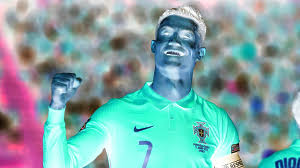
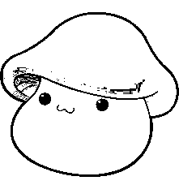
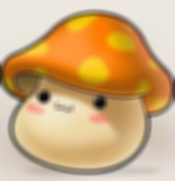
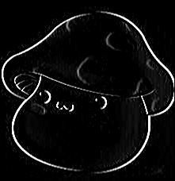
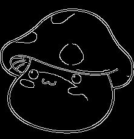
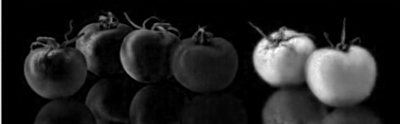
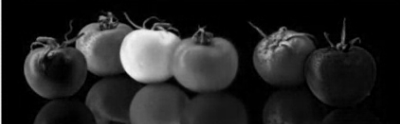
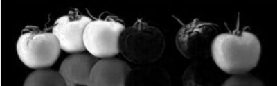

# Open-source Computer Vision

## 1. Ubuntu 설정

cd OpenCV 폴더로 이동 후

(python3 -m venv .env)

-> source .env/bin/activate 해당 코드로 가상환경 접근

**Python 가상 환경에서 설치**

pip install opencv-python
pip install opencv-contrib-python

**설치 검증**

python3
import cv2
import numpy as np
print("cv ver:", cv2.__version__, "np ver:", np.__version__)

## 2. OpenCV란?

**Stitiching** : 여러 장의 이미지를 이어 붙여서 하나의 파노라마 이미지를 만드는 기술입니다. 

**Cuda** : OpenCV에서 CUDA를 활용한 Stitching은 GPU 가속을 통해 이미지 스티칭 속도를 향상시키는 기능입니다. 특히 고해상도 이미지나 여러 장의 사진을 빠르게 파노라마로 합칠 때 유용

**Color 조작 사이트**

HSL -> 색, 명도, 채도 확인 가능
http://www.w3schools.com/colors/ 

---

## 3. 실습

해당 코드를 통해 이미지 정보를 확인할 수 있다.

img.shape는 이미지의 크기 정보를 담고 있는 속성

```python
import numpy as np
import cv2

# 이미지 파일을 Read
img = cv2.imread("my_input.jpg")

# Image 란 이름의 Display 창 생성
cv2.namedWindow("image", cv2.WINDOW_NORMAL)

# Numpy ndarray K?W?C order
print(img.shape)

# Read 한 이미지 파일을 Display
cv2.imshow("image", img)

# 별도 키 입력이 있을 때 까지 대기
key = cv2.waitKey(0)

if key == ord('s'):  # s 키를 누르면 저장
    cv2.imwrite("output.png", img)
else:
    print("저장하지 않았습니다.")

# output.png 로 읽은 이미지 파일을 저장
cv2.imwrite("output.png", img)

# Destroy all windows
cv2.distroyAllWindows()
```
---

**여기서 RGB -> HSV 색상 영역으로 변경**

*HSV color sapce의 장점:*

1. 색상 기반 필터링/추적에 탁월

2. 조명 변화에 강함 (RGB는 밝기 변화에 취약)


```python
import numpy as np
import cv2

# 이미지 파일을 Read 하고 Color space 정보 출력
color = cv2.imread("my_input.jpg", cv2.IMREAD_COLOR)
#color = cv2.imread("strawberry_dark.jpg", cv2.IMREAD_COLOR)
print(color.shape)

height,width,channels = color.shape
cv2.imshow("Original Image", color)
cv2.imwrite("Original Image Output.png", color)

# Color channel 을 B,G,R 로 분할하여 출력
b,g,r = cv2.split(color)
rgb_split = np.concatenate((b,g,r), axis=1)
cv2.imshow("BGR Channels", rgb_split)
cv2.imwrite("BGR Channels Output.png",rgb_split)

# 색공간을 BGR 에서 HSV 로 변환
hsv = cv2.cvtColor(color, cv2.COLOR_BGR2HSV)

# Channel 을 H,S,V 로 분할하여 출력
h,s,v = cv2.split(hsv)
hsv_split = np.concatenate((h,s,v), axis=1)
cv2.imshow("Split HSV", hsv_split)
cv2.imwrite("Split HSV Output.png",rgb_split)

# [퀴즈 3번] HSV → RGB로 변환해서 출력 (주의: HSV2BGR 아님)
rgb_from_hsv = cv2.cvtColor(hsv, cv2.COLOR_HSV2RGB)
cv2.imshow("HSV to RGB", rgb_from_hsv)
cv2.imwrite("HSV to RGB Output.png",rgb_split)

# [퀴즈 4번] RGB → Grayscale 변환해서 출력
gray = cv2.cvtColor(rgb_from_hsv, cv2.COLOR_RGB2GRAY)
cv2.imshow("Grayscale from RGB", gray)
cv2.imwrite("Grayscale from RGB Output.png",rgb_split)

# 종료 대기
cv2.waitKey(0)
cv2.destroyAllWindows()

```
**출력 이미지 결과**

Original image


BGR Channels


Split HSV


HSV to RGB


Grayscale


---

**이미지 Crop / Resize**

```python
import numpy as np
import cv2

# 이미지 파일을 Read
img = cv2.imread("my_input.jpg")

# Crop 200x100 from original image from (50, 25)=(x,y)
cropped = img[25:125, 50:250]

# Resize cropped image from 300x400 to 400x200
resized = cv2.resize(cropped, (400, 200))

# Display all
cv2.imshow("Original", img)
cv2.imshow("Cropped image", cropped)
cv2.imwrite("Cropped image output.png", cropped)
cv2.imshow("Resized image", resized)
cv2.imwrite("Resized image output.png", resized)

cv2.waitKey(0)
cv2.destroyAllWindows()
```
**출력 이미지 결과**

Original


Cropped (x: 25 ->250까지 200, y: 25 -> 125까지 100)


Resized


---

**Reverse Image**
```python
import numpy as np
import cv2

src = cv2.imread("my_input.jpg", cv2.IMREAD_COLOR)
dst = cv2.bitwise_not(src)

cv2.imshow("src",src)
cv2.imwrite("src_output.png",src)

cv2.imshow("dst",dst)
cv2.imwrite("dst_output.png",dst)

cv2.waitKey()
cv2.destroyAllWindows()               
```

src


dst(reverse)



---

**Binary(이진화)**

```python
import numpy as np
import cv2

src = cv2.imread("MR.jpeg", cv2.IMREAD_COLOR)

gray = cv2.cvtColor(src, cv2.COLOR_BGR2GRAY)
ret, dst = cv2.threshold(gray, 100, 255, cv2.THRESH_BINARY)

cv2.imshow("dst",dst)
cv2.imwrite("MR_dst_out.png",dst)
cv2.waitKey()
cv.destroyAllWindows()
```

원본 파일


이진화



---

**Blur**

(9,9) -> 9X9 픽셀을 잡아서 평균 값을 냄

✅ 1. 커널 크기가 커지면?
✔ 효과:

    블러 효과가 더 강해짐
    → 이미지가 더 흐릿하게, 더 부드럽게 변함

    자세한 디테일이 사라짐
    → 경계, 텍스트, 질감 등이 흐려짐

    더 넓은 영역을 평균 내기 때문

✔ 예:

    (3,3) → 거의 안 흐려짐

    (15,15) → 뭉개지는 느낌

    (51,51) → 거의 사진의 윤곽만 남음

✔ 장점:

    노이즈 제거에 유리

    배경 흐림(bokeh 효과 등) 시각적으로 유용

✅ 2. 커널 크기가 작아지면?
✔ 효과:

    블러가 약함 → 거의 원본과 비슷

    세부 정보가 많이 유지됨

    블러 효과보다는 약간 부드러워지는 정도

✔ 예:

    (1,1) → 블러 없음 (사실상 원본)

    (3,3) → 약간 부드러움

(-1,-1)은 앵커 위치로, 어느곳을 중심으로 잡고 적용할지 정하는 것으로 -1이면 9/2 ~ 4이므로 (4,4)를 자동 중심 설정

```python
import cv2

src = cv2.imread("my_input.jpg", cv2.IMREAD_COLOR)
dst = cv2.blur(src, (9, 9), anchor=(-1, -1), borderType=cv2.BORDER_DEFAULT)

cv2.imshow("dst", dst)
cv2.waitKey()
cv2.destroyAllWindows()
```
원본


블러



---

**가장자리 검출 (Edge)**

```python
import numpy as np
import cv2

src = cv2.imread("MR.jpeg", cv2.IMREAD_COLOR)
gray = cv2.cvtColor(src, cv2.COLOR_BGR2GRAY)

sobel = cv2.Sobel(gray, cv2.CV_8U, 1, 0, 3)

cv2.imshow("sobel", sobel)
cv2.imwrite("sobel_output.png", sobel)


# 2. Laplacian 적용
laplacian = cv2.Laplacian(gray, cv2.CV_8U, ksize=3)
cv2.imshow("laplacian", laplacian)
cv2.imwrite("laplacian_output.png", laplacian)

# 3. Canny Edge Detection 적용
canny = cv2.Canny(gray, 100, 200, 3)
cv2.imshow("canny", canny)
cv2.imwrite("canny_output.png", canny)

cv2.waitKey()
cv2.destroyAllWindows()
```
원본


엣지 검출



Laplacian


Canny



---

**채널 분리 및 병합**

```python
import numpy as np
import cv2

src = cv2.imread("tomato.jpg", cv2.IMREAD_COLOR)
b, g, r = cv2.split(src)
inverse = cv2.merge((r, g, b))

cv2.imshow("b", b)
cv2.imshow("g", g)
cv2.imshow("r", r)
cv2.imshow("inverse", inverse)

cv2.imwrite("b_out.png",b)
cv2.imwrite("g_out.png",g)
cv2.imwrite("r_out.png",r)
cv2.imwrite("inverse_out.png",inverse)

cv2.waitKey()
cv2.destroyAllWindows()
```

원본


B



G



R



inverse


***추가 작업 -> numpy 형태의 채널 분리***
```python
import numpy as np
import cv2

src = cv2.imread("tomato.jpg", cv2.IMREAD_COLOR)
b = src[:, :, 0]
g = src[:, :, 1]
r = src[:, :, 2]

# 빈 채널 생성 및 bgz 조합
height, width, channel = src.shape
zero = np.zeros((height, width, 1), dtype=np.uint8)
bgz = cv2.merge((b, g, zero))  # R 채널 제거된 이미지

cv2.imshow("b", b)
cv2.imshow("g", g)
cv2.imshow("r", r)
cv2.imshow("bgz",bgz)

cv2.imwrite("b_numpy_out.png",b)
cv2.imwrite("g_numpy_out.png",g)
cv2.imwrite("r_numpy_out.png",r)
cv2.imwrite("r_remove_output.png",bgz)

cv2.waitKey()
cv2.destroyAllWindows()
```
B

G

R

Remove R


---

**동영상**
```python
import numpy as np
import cv2

# Read from the recorded video file
cap = cv2.VideoCapture("son.mp4")

# 저장용 인덱스 초기화
save_index = 1

# 동영상 파일이 성공적으로 열렸으면 while 문 반복
while(cap.isOpened()):
    # 한 프레임을 읽어옴
    ret, frame = cap.read()

    if ret is False:
       # print("Can't receive frame (stream end?). Exiting ...")
       # break
       print("Can't receive frame (stream end?). Restarting ...")
       cap.set(cv2.CAP_PROP_POS_FRAMES, 0)  # 반복 재생
       continue

    # 3. 영상 크기를 반으로 resize
    frame = cv2.resize(frame, (0, 0), fx=0.5, fy=0.5)

   # Display
    cv2.imshow("Frame", frame)

    # 80 ms 동안 대기하며 키 입력을 받고 'q' 입력 시 종료
    key = cv2.waitKey(80)
    if key & 0xFF == ord('q'):
        break

    # 4. 'c' 입력 시 프레임 저장 (001.jpg, 002.jpg, ...)
    if key & 0xFF == ord('c'):
        filename = f"{save_index:03}.jpg"
        cv2.imwrite(filename, frame)
        print(f"Saved: {filename}")
        save_index += 1  # 인덱스 증가

cap.release()
cv2.destroyAllWindows()
```

```
반복재생 : 

영상 파일에서 프레임을 읽지 못하면 (ret == False)
이는 영상이 끝에 도달했음을 의미한다.

cap.set(cv2.CAP_PROP_POS_FRAMES, 0) 을 통해 영상의 현재 위치를 첫 프레임(0번)으로 되돌리고,

continue로 루프 처음으로 돌아가 다시 처음부터 재생을 시작한다.
```
```
영상 속도 조절:

key = cv2.waitKey(80)

또한 영상이 빠르게 재생되기에 영상 프레임에 맞는 딜레이로 수정하면 된다.

```
```
프레임 사이즈 조절:

frame = cv2.resize(frame, (0, 0), fx=0.5, fy=0.5)

해당 구문을 통해 x, y 비율만큼 프레임 확대 축소가 가능하다
```

```
C 입력 시 프레임을 (001.jpg, 002.jpg, ...)로 저장할 수 잇다.

if key & 0xFF == ord('c'):
    filename = f"{save_index:03}.jpg"
    cv2.imwrite(filename, frame)
    print(f"Saved: {filename}")
    save_index += 1  # 인덱스 증가

```


---
**Camera Video**
```python
import numpy as np
import cv2

# Read from the first camera device
cap = cv2.VideoCapture(0)

w = 640 #1280#1920
h = 480 #720#1080
cap.set(cv2.CAP_PROP_FRAME_WIDTH, w)
cap.set(cv2.CAP_PROP_FRAME_HEIGHT, h)

# 저장할 VideoWriter 객체 생성
fourcc = cv2.VideoWriter_fourcc(*'mp4v')  # 코덱 (mp4v = .mp4용)
out = cv2.VideoWriter('output.mp4', fourcc, 20.0, (w, h))  # (파일명, 코덱, FPS, (너비, 높이))

# 성공적으로 video device 가 열렸으면 while 문 반복
while(cap.isOpened()):
    # 한 프레임을 읽어옴
    ret, frame = cap.read()
    if ret is False:
        print("Can't receive frame (stream end?). Exiting ...")
        break

    # 프레임 저장
    out.write(frame)

    # Display
    cv2.imshow("Camera", frame)

    # 1 ms 동안 대기하며 키 입력을 받고 'q' 입력 시 종료
    key = cv2.waitKey(1)
    if key & 0xFF == ord('q'):
        break

cap.release()
out.release()
cv2.distroyAllWindows()
```
```
내장된 Camera를 통해 Video를 반복해서 1프레임씩 
읽어와 영상으로 재생해준다.

또한, mp4v형식으로 저장할 객체를 만든 후, 파일의 정보를 설정해준다.
 
마지막으로 write를 통해 while 문에서 읽어온 한 프레임을 저장하고 display에 출력해준다.
```

---
**Camera**
```python
import cv2

# Read from the first camera device
cap = cv2.VideoCapture(0)

topLeft = (195, 65)
bottomRight = (445, 315)

# 성공적으로 video device 가 열렸으면 while 문 반복
while(cap.isOpened()):

    # 한 프레임을 읽어옴
    ret, frame = cap.read()

    # Line
    cv2.line(frame, topLeft, bottomRight, (0,255,0), 5)

    # Rectangle
    cv2.rectangle(frame, [pt+30 for pt in topLeft], [pt-30 for pt in bottomRight], (0,0,255), 5)

    # Text
    font = cv2.FONT_HERSHEY_SIMPLEX
    cv2.putText(frame, 'me', [pt+80 for pt in topLeft], font, 2, (0,255,255), 10)

    # Display
    cv2.imshow("Camera",frame)

    if cv2.waitKey(1) & 0xFF == ord('q'):
       break

# 리소스 해제
cap.release()
cv2.destroyAllWindows()
```
```
도형 좌표 설정
topLeft = (195, 65)
bottomRight = (445, 315)

선 그리기
cv2.line(frame, topLeft, bottomRight, (0,255,0), 5)

사각형 그리기
cv2.rectangle(frame, [pt+30 for pt in topLeft], [pt-30 for pt in bottomRight], (0,0,255), 5)

텍스트 출력
font = cv2.FONT_HERSHEY_SIMPLEX
cv2.putText(frame, 'me', [pt+80 for pt in topLeft], font, 2, (0,255,255), 10)
```


+ 추가 작업

마우스를 클릭했을 때 원이 생기도록 
```python
import cv2

# Read from the first camera device
cap = cv2.VideoCapture(0)

topLeft = (195, 65)
bottomRight = (445, 315)

# 클릭한 위치 저장용 리스트
circles = []

# 마우스 콜백 함수
def draw_circle(event, x, y, flags, param):
    if event == cv2.EVENT_LBUTTONDOWN:
        circles.append((x, y))  # 클릭한 좌표 저장

# 윈도우 이름
window_name = "Camera"

# 마우스 이벤트 등록
cv2.namedWindow(window_name)
cv2.setMouseCallback(window_name, draw_circle)

# 성공적으로 video device 가 열렸으면 while 문 반복
while(cap.isOpened()):
    # 한 프레임을 읽어옴
    ret, frame = cap.read()
    if not ret:
        break

    # Line
    cv2.line(frame, topLeft, bottomRight, (0,255,0), 5)

    # Rectangle
    cv2.rectangle(frame, [pt+30 for pt in topLeft], [pt-30 for pt in bottomRight], (0,0,255), 5)

    # Text
    font = cv2.FONT_HERSHEY_SIMPLEX
    cv2.putText(frame, 'me', [pt+80 for pt in topLeft], font, 2, (0,255,255), 10)

    # 클릭한 좌표마다 동그라미 그림
    for center in circles:
        cv2.circle(frame, center, 30, (0, 255, 255), 3)

    # Display
    cv2.imshow(window_name, frame)

    if cv2.waitKey(1) & 0xFF == ord('q'):
       break

# 리소스 해제
cap.release()
cv2.destroyAllWindows()
```
```
<클릭한 위치 저장용 리스트>
circles = []

<마우스 콜백 함수>
def draw_circle(event, x, y, flags, param):
    if event == cv2.EVENT_LBUTTONDOWN:
        circles.append((x, y))  # 클릭한 좌표 저장

<마우스 이벤트 등록>
cv2.namedWindow(window_name)
cv2.setMouseCallback(window_name, draw_circle)

<클릭한 좌표마다 동그라미 그림>
 for center in circles:
     cv2.circle(frame, center, 30, (0, 255, 255), 3)
```


---
**TrackBar**
```python
import cv2

topLeft = (50, 50)
bold = 0

# Callback function for the trackbar
def on_bold_trackbar(value):
    #print("Trackbar value:", value)
    global bold
    bold = value

cap = cv2.VideoCapture(0)

cv2.namedWindow("Camera")
cv2.createTrackbar("bold", "Camera", bold, 10, on_bold_trackbar)

# 성공적으로 video device 가 열렸으면 while 문 반복
while(cap.isOpened()):
    # 한 프레임을 읽어옴
    ret, frame = cap.read()
    if ret is False:
        print("Can't receive frame (stream end?). Exiting ...")
        break

    # Text
    cv2.putText(frame, "TEXT",
            topLeft, cv2.FONT_HERSHEY_SIMPLEX, 2, (0, 255, 255), 1 + bold)

    # Display
    cv2.imshow("Camera",frame)

    if cv2.waitKey(1) & 0xFF == ord('q'):
        break

cap.release()
cv2.destroyAllWindows()
```
```
<값을 bold에 저장해 두께를 업데이트>
def on_bold_trackbar(value):
    global bold
    bold = value


<"bold"라는 이름의 슬라이더(트랙바)를 만들고, 최소값 0 ~ 최대값 10 범위로 설정합니다.>

<트랙바 값이 바뀌면 on_bold_trackbar() 함수가 실행되어 bold 값을 갱신합니다.>

cv2.namedWindow("Camera")
cv2.createTrackbar("bold", "Camera", bold, 10, on_bold_trackbar)

<TEXT 문자열 출력>
cv2.putText(frame, "TEXT",
    topLeft, cv2.FONT_HERSHEY_SIMPLEX, 2, (0, 255, 255), 1 + bold)
```