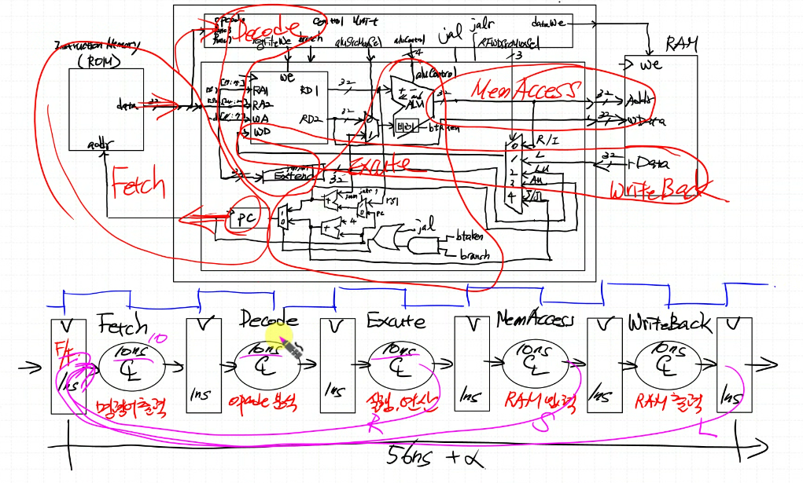
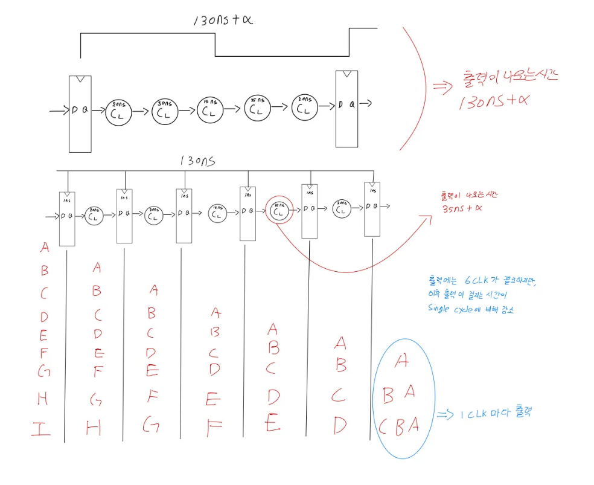
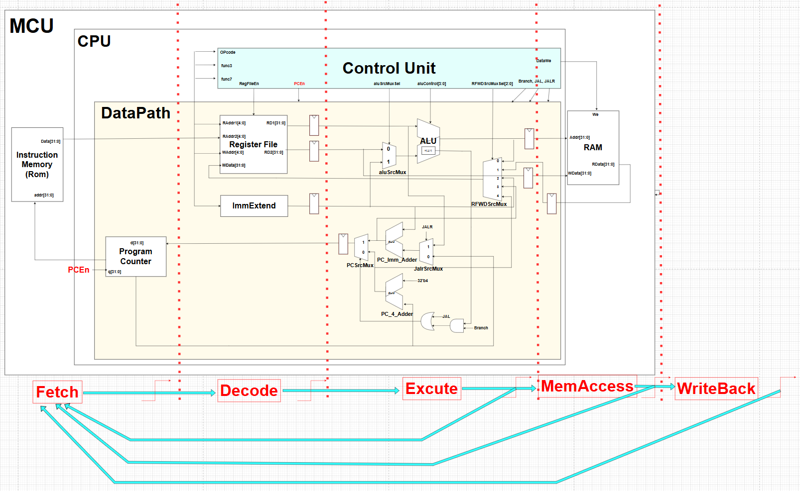
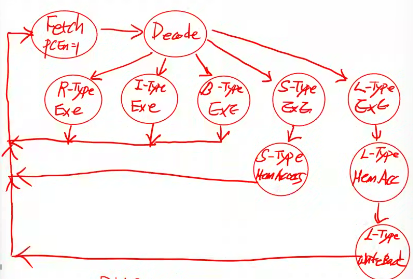

# Multi Cycle


클락마다 명령어가 나가면 PipeLine 그러나, 이는 모든 Cycle이 끝나야 나오기 때문에 Multi Cycle


## Block


## FSM


# Code

## CPU_RV32I.sv
```verilog
`timescale 1ns / 1ps

module CPU_RV32I (
    input  logic        clk,
    input  logic        reset,
    input  logic [31:0] instrCode,
    output logic [31:0] instrMemAddr,
    output logic        busWe,
    output logic [31:0] busAddr,
    output logic [31:0] busWData,
    input  logic [31:0] busRData
);
    logic       PCEn;
    logic       regFileWe;
    logic [3:0] aluControl;
    logic       aluSrcMuxSel;
    logic [2:0] RFWDSrcMuxSel;
    logic       branch;
    logic       jal;
    logic       jalr;

    ControlUnit U_ControlUnit (.*);
    DataPath U_DataPath (.*);
endmodule
```

## ControlUnit.sv
```verilog
`timescale 1ns / 1ps
`include "defines.sv"

module ControlUnit (
    input  logic        clk,
    input  logic        reset,
    input  logic [31:0] instrCode,
    output logic        PCEn,
    output logic        regFileWe,
    output logic [ 3:0] aluControl,
    output logic        aluSrcMuxSel,
    output logic        busWe,
    output logic [ 2:0] RFWDSrcMuxSel,
    output logic        branch,
    output logic        jal,
    output logic        jalr
);
    wire  [6:0] opcode = instrCode[6:0];
    wire  [3:0] operator = {instrCode[30], instrCode[14:12]};
    logic [9:0] signals;
    assign {PCEn, regFileWe, aluSrcMuxSel, busWe, RFWDSrcMuxSel, branch, jal, jalr} = signals;

    typedef enum {
        FETCH,
        DECODE,
        R_EXE,
        I_EXE,
        B_EXE,
        LU_EXE,
        AU_EXE,
        J_EXE,
        JL_EXE,
        S_EXE,
        S_MEM,
        L_EXE,
        L_MEM,
        L_WB
    } state_e;

    state_e state, next_state;

    always_ff @(posedge clk, posedge reset) begin
        if (reset) begin
            state <= FETCH;
        end else begin
            state <= next_state;
        end
    end

    always_comb begin
        next_state = state;
        case (state)

            FETCH: begin
                next_state = DECODE;
            end

            DECODE: begin
                case (opcode)
                    `OP_TYPE_R:  next_state = R_EXE;
                    `OP_TYPE_I:  next_state = I_EXE;
                    `OP_TYPE_B:  next_state = B_EXE;
                    `OP_TYPE_LU: next_state = LU_EXE;
                    `OP_TYPE_AU: next_state = AU_EXE;
                    `OP_TYPE_J:  next_state = J_EXE;
                    `OP_TYPE_JL: next_state = JL_EXE;
                    `OP_TYPE_S:  next_state = S_EXE;
                    `OP_TYPE_L:  next_state = L_EXE;
                endcase
            end

            R_EXE:  next_state = FETCH;
            I_EXE:  next_state = FETCH;
            B_EXE:  next_state = FETCH;
            LU_EXE: next_state = FETCH;
            AU_EXE: next_state = FETCH;
            J_EXE:  next_state = FETCH;
            JL_EXE: next_state = FETCH;
            S_EXE:  next_state = S_MEM;
            S_MEM:  next_state = FETCH;
            L_EXE:  next_state = L_MEM;
            L_MEM:  next_state = L_WB;
            L_WB:   next_state = FETCH;
        endcase
    end

    always_comb begin
        signals = 10'b0;
        aluControl = `ADD;
        case (state)
            //{PCEn, regFileWe, aluSrcMuxSel, busWe, RFWDSrcMuxSel(3), branch, jal, jalr} = signals;
            
            FETCH:  signals = 10'b1_0_0_0_000_0_0_0;
            DECODE: signals = 10'b0_0_0_0_000_0_0_0;

            R_EXE: begin
                signals = 10'b0_1_0_0_000_0_0_0;
                aluControl = operator;
            end

            I_EXE: begin
                signals = 10'b0_1_1_0_000_0_0_0;
                if (operator == 4'b1101) aluControl = operator;
                else aluControl = {1'b0, operator[2:0]};
            end

            B_EXE: begin
                signals = 10'b0_0_0_0_000_1_0_0;
                aluControl = operator;
            end

            LU_EXE: signals = 10'b0_1_0_0_010_0_0_0;
            AU_EXE: signals = 10'b0_1_0_0_011_0_0_0;
            J_EXE:  signals = 10'b0_1_0_0_100_0_1_0;
            JL_EXE: signals = 10'b0_1_0_0_100_0_1_1;

            S_EXE: signals = 10'b0_0_1_0_000_0_0_0;
            S_MEM: signals = 10'b0_0_1_1_000_0_0_0;

            L_EXE: signals = 10'b0_0_1_0_001_0_0_0;
            L_MEM: signals = 10'b0_0_1_0_001_0_0_0;
            L_WB:  signals = 10'b0_1_1_0_001_0_0_0;
        endcase
    end

    /*
    always_comb begin
        signals = 10'b0;
        case (opcode)
            //{PCEn, regFileWe, aluSrcMuxSel, busWe, RFWDSrcMuxSel(3), branch, jal, jalr} = signals;
            `OP_TYPE_R:  signals = 9'b1_0_0_000_0_0_0;
            `OP_TYPE_S:  signals = 9'b0_1_1_000_0_0_0;
            `OP_TYPE_L:  signals = 9'b1_1_0_001_0_0_0;
            `OP_TYPE_I:  signals = 9'b1_1_0_000_0_0_0;
            `OP_TYPE_B:  signals = 9'b0_0_0_000_1_0_0;
            `OP_TYPE_LU: signals = 9'b1_0_0_010_0_0_0;
            `OP_TYPE_AU: signals = 9'b1_0_0_011_0_0_0;
            `OP_TYPE_J:  signals = 9'b1_0_0_100_0_1_0;
            `OP_TYPE_JL: signals = 9'b1_0_0_100_0_1_1;
        endcase
    end

    always_comb begin
        aluControl = `ADD;
        case (opcode)
            `OP_TYPE_R: aluControl = operator;
            `OP_TYPE_B: aluControl = operator;
            `OP_TYPE_I: begin
                if (operator == 4'b1101) aluControl = operator;
                else aluControl = {1'b0, operator[2:0]};
            end
        endcase
    end
    */
endmodule
```

## DataPath.sv
```verilog
`timescale 1ns / 1ps
`include "defines.sv"

module DataPath (
    // global signals
    input  logic        clk,
    input  logic        reset,
    // instruction memory side port
    input  logic [31:0] instrCode,
    output logic [31:0] instrMemAddr,
    // control unit side port
    input  logic        PCEn,           //@
    input  logic        regFileWe,
    input  logic [ 3:0] aluControl,
    input  logic        aluSrcMuxSel,
    input  logic [ 2:0] RFWDSrcMuxSel,
    input  logic        branch,
    input  logic        jal,
    input  logic        jalr,
    // data memory side port
    output logic [31:0] busAddr,
    output logic [31:0] busWData,
    input  logic [31:0] busRData
);

    logic [31:0] aluResult, RFData1, RFData2;
    logic [31:0] PCSrcData, PCOutData, PC_Imm_AdderSrcMuxOut;
    logic [31:0] aluSrcMuxOut, immExt, RFWDSrcMuxOut;
    logic [31:0] PC_4_AdderResult, PC_Imm_AdderResult, PCSrcMuxOut;
    logic PCSrcMuxSel;
    logic btaken;

    //********** Multi Cycle Signals **********//
    // Decode Level
    logic [31:0] DecReg_RFData1, DecReg_RFData2, DecReg_immExt;

    // Excute Level
    logic [31:0] ExeReg_aluResult, ExeReg_RFData2, ExeReg_PCSrcMuxOut;

    // MemAccess Level
    logic [31:0] MemAccReg_busRData;
    //*****************************************//

    assign instrMemAddr = PCOutData;
    assign busAddr = ExeReg_aluResult;
    assign busWData = ExeReg_RFData2;

    // FF //////////////////////////////////

    RegisterFile U_RegFile (
        .clk(clk),
        .we (regFileWe),
        .RA1(instrCode[19:15]),
        .RA2(instrCode[24:20]),
        .WA (instrCode[11:7]),
        .WD (RFWDSrcMuxOut),
        .RD1(RFData1),
        .RD2(RFData2)
    );

    register U_DecReg_RFRD1 (
        .clk  (clk),
        .reset(reset),
        .d    (RFData1),
        .q    (DecReg_RFData1)  // -> ALU, PC_Imm_AdderSrcMux
    );

    register U_DecReg_RFRD2 (
        .clk  (clk),
        .reset(reset),
        .d    (RFData2),
        .q    (DecReg_RFData2)  // -> AluSrcMux
    );

    register U_ExeReg_RFRD2 (
        .clk  (clk),
        .reset(reset),
        .d    (DecReg_RFData2),
        .q    (ExeReg_RFData2)   // -> busWData
    );

    //////////////////////////////////////

    mux_2x1 U_AluSrcMux (
        .sel(aluSrcMuxSel),
        .x0(DecReg_RFData2),
        .x1(DecReg_immExt),
        .y(aluSrcMuxOut)  // -> ALU
    );


    // FF //////////////////////////////////

    alu U_ALU (
        .aluControl(aluControl),
        .a         (DecReg_RFData1),
        .b         (aluSrcMuxOut),
        .result    (aluResult),
        .btaken    (btaken)
    );

    register U_ExeReg_ALU (
        .clk  (clk),
        .reset(reset),
        .d    (RFData1),
        .q    (ExeReg_aluResult)  // -> busAddr
    );


    //////////////////////////////////////

    mux_5x1 U_RFWDSrcMux (
        .sel(RFWDSrcMuxSel),
        .x0 (aluResult),
        .x1 (MemAccReg_busRData),
        .x2 (DecReg_immExt),
        .x3 (PC_Imm_AdderResult),
        .x4 (PC_4_AdderResult),
        .y  (RFWDSrcMuxOut)
    );
    
    register U_MemAccReg_ReadData (
        .clk  (clk),
        .reset(reset),
        .d    (busRData),
        .q    (MemAccReg_busRData)  // -> 
    );

    // FF //////////////////////////////////

    immExtend U_ImmExtend (
        .instrCode(instrCode),
        .immExt   (immExt)
    );

    register U_DecReg_ImmExtend (
        .clk  (clk),
        .reset(reset),
        .d    (immExt),
        .q    (DecReg_immExt)  // -> AluSrcMux, PC_Imm_Adder, RFWDSrcMux
    );

    //////////////////////////////////////

    mux_2x1 U_PC_Imm_AdderSrcMux (
        .sel(jalr),
        .x0 (PCOutData),
        .x1 (DecReg_RFData1),
        .y  (PC_Imm_AdderSrcMuxOut)
    );

    adder U_PC_Imm_Adder (
        .a(DecReg_immExt),
        .b(PC_Imm_AdderSrcMuxOut),
        .y(PC_Imm_AdderResult)
    );

    adder U_PC_4_Adder (
        .a(32'd4),
        .b(PCOutData),
        .y(PC_4_AdderResult)
    );


    // FF //////////////////////////////////

    assign PCSrcMuxSel = jal | (btaken & branch);

    mux_2x1 U_PCSrcMux (
        .sel(PCSrcMuxSel),
        .x0 (PC_4_AdderResult),
        .x1 (PC_Imm_AdderResult),
        .y  (PCSrcMuxOut)
    );

    register U_ExeReg_PCSrcMux (
        .clk  (clk),
        .reset(reset),
        .d    (PCSrcMuxOut),
        .q    (ExeReg_PCSrcMuxOut)  // -> PC
    );

    registerEn U_PC (
        .clk  (clk),
        .reset(reset),
        .en   (PCEn),
        .d    (ExeReg_PCSrcMuxOut),
        .q    (PCOutData)
    );
    //////////////////////////////////////


endmodule

module alu (
    input  logic [ 3:0] aluControl,
    input  logic [31:0] a,
    input  logic [31:0] b,
    output logic [31:0] result,
    output logic        btaken
);

    always_comb begin
        result = 32'bx;
        case (aluControl)
            `ADD:  result = a + b;
            `SUB:  result = a - b;
            `SLL:  result = a << b;
            `SRL:  result = a >> b;
            `SRA:  result = $signed(a) >>> b;
            `SLT:  result = ($signed(a) < $signed(b)) ? 1 : 0;
            `SLTU: result = (a < b) ? 1 : 0;
            `XOR:  result = a ^ b;
            `OR:   result = a | b;
            `AND:  result = a & b;
        endcase
    end

    always_comb begin : branch
        btaken = 1'b0;
        case (aluControl[2:0])
            `BEQ:  btaken = (a == b);
            `BNE:  btaken = (a != b);
            `BLT:  btaken = ($signed(a) < $signed(b));
            `BGE:  btaken = ($signed(a) >= $signed(b));
            `BLTU: btaken = (a < b);
            `BGEU: btaken = (a >= b);
        endcase
    end
endmodule

module RegisterFile (
    input  logic        clk,
    input  logic        we,
    input  logic [ 4:0] RA1,
    input  logic [ 4:0] RA2,
    input  logic [ 4:0] WA,
    input  logic [31:0] WD,
    output logic [31:0] RD1,
    output logic [31:0] RD2
);
    logic [31:0] mem[0:2**5-1];

    
    initial begin  // for simulation test
        for (int i = 0; i < 32; i++) begin
            mem[i] = 10 + i;
        end
    end
    

    always_ff @(posedge clk) begin
        if (we) mem[WA] <= WD;
    end

    assign RD1 = (RA1 != 0) ? mem[RA1] : 32'b0;
    assign RD2 = (RA2 != 0) ? mem[RA2] : 32'b0;
endmodule

module registerEn (
    input  logic        clk,
    input  logic        reset,
    input  logic        en,
    input  logic [31:0] d,
    output logic [31:0] q
);
    always_ff @(posedge clk, posedge reset) begin
        if (reset) begin
            q <= 0;
        end else begin
            if (en) q <= d;
        end
    end
endmodule

module register (
    input  logic        clk,
    input  logic        reset,
    input  logic [31:0] d,
    output logic [31:0] q
);
    always_ff @(posedge clk, posedge reset) begin
        if (reset) begin
            q <= 0;
        end else begin
            q <= d;
        end
    end
endmodule

module adder (
    input  logic [31:0] a,
    input  logic [31:0] b,
    output logic [31:0] y
);
    assign y = a + b;
endmodule

module mux_2x1 (
    input  logic        sel,
    input  logic [31:0] x0,
    input  logic [31:0] x1,
    output logic [31:0] y
);
    always_comb begin
        y = 32'bx;
        case (sel)
            1'b0: y = x0;
            1'b1: y = x1;
        endcase
    end
endmodule

module mux_5x1 (
    input  logic [ 2:0] sel,
    input  logic [31:0] x0,
    input  logic [31:0] x1,
    input  logic [31:0] x2,
    input  logic [31:0] x3,
    input  logic [31:0] x4,
    output logic [31:0] y
);
    always_comb begin
        y = 32'bx;
        case (sel)
            3'b000: y = x0;
            3'b001: y = x1;
            3'b010: y = x2;
            3'b011: y = x3;
            3'b100: y = x4;
        endcase
    end
endmodule

module immExtend (
    input  logic [31:0] instrCode,
    output logic [31:0] immExt
);
    wire [6:0] opcode = instrCode[6:0];
    wire [2:0] func3 = instrCode[14:12];

    always_comb begin
        immExt = 32'bx;
        case (opcode)
            `OP_TYPE_R: immExt = 32'bx;  // R-Type
            `OP_TYPE_L: immExt = {{20{instrCode[31]}}, instrCode[31:20]};
            `OP_TYPE_S:
            immExt = {
                {20{instrCode[31]}}, instrCode[31:25], instrCode[11:7]
            };  // S-Type
            `OP_TYPE_I: begin
                case (func3)
                    3'b001:  immExt = {27'b0, instrCode[24:20]};  // SLLI
                    3'b101:  immExt = {27'b0, instrCode[24:20]};  // SRLI, SRAI
                    3'b011:  immExt = {20'b0, instrCode[31:20]};  // SLTIU
                    default: immExt = {{20{instrCode[31]}}, instrCode[31:20]};
                endcase
            end
            `OP_TYPE_B:
            immExt = {
                {20{instrCode[31]}},
                instrCode[7],
                instrCode[30:25],
                instrCode[11:8],
                1'b0
            };
            `OP_TYPE_LU: immExt = {instrCode[31:12], 12'b0};
            `OP_TYPE_AU: immExt = {instrCode[31:12], 12'b0};
            `OP_TYPE_J:
            immExt = {
                {12{instrCode[31]}},
                instrCode[19:12],
                instrCode[20],
                instrCode[30:21],
                1'b0
            };
            `OP_TYPE_JL: immExt = {{20{instrCode[31]}}, instrCode[31:20]};
        endcase
    end
endmodule
```