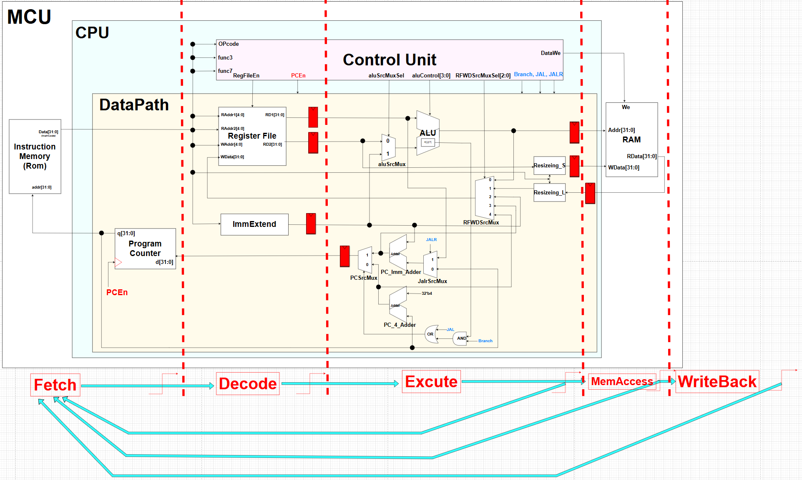

# Multi Cycle


클락마다 명령어가 나가면 PipeLine 그러나, 이는 모든 Cycle이 끝나야 나오기 때문에 Multi Cycle


## Block


## FSM


# Code

## MCU.sv
```verilog

```

## CPU_RV32I.sv
```verilog
`timescale 1ns / 1ps

module CPU_RV32I (
    input  logic        clk,
    input  logic        reset,
    input  logic [31:0] instrCode,
    output logic [31:0] instrMemAddr,
    output logic        busWe,
    output logic [31:0] busAddr,
    output logic [31:0] busWData,
    input  logic [31:0] busRData
);
    logic       PCEn;
    logic       regFileWe;
    logic [3:0] aluControl;
    logic       aluSrcMuxSel;
    logic [2:0] RFWDSrcMuxSel;
    logic       branch;
    logic       jal;
    logic       jalr;

    ControlUnit U_ControlUnit (.*);
    DataPath U_DataPath (.*);
endmodule
```

## ROM.sv
```verilog
`timescale 1ns / 1ps

module ROM (
    input  logic [31:0] addr,
    output logic [31:0] data
);
    logic [31:0] rom[0:2**8-1];

    initial begin
        //$readmemh("code.mem", rom);

        // // R Type
        // // rom[x] =  func7    rs2   rs1  fc3  rd   opcode             rd   rs1 rs2         
        // rom[0] = 32'b0000000_00001_00010_000_00100_0110011;  // add  x4,  x2, x1    23 = 12 + 11
        // rom[1] = 32'b0100000_00001_00010_000_00101_0110011;  // sub  x5,  x2, x1    1  = 12 - 11
        // rom[2] = 32'b0000000_00011_00010_001_00110_0110011;  // sll  x6,  x2, x3    98,304 = 12 << 13  -> 98,304(12를 bit로) << 13
        // rom[3] = 32'b0000000_00001_00010_101_00111_0110011;  // srl  x7,  x2, x1    0  = 12 >> 11 
        // rom[4] = 32'b0100000_00001_00010_101_01000_0110011;  // sra  x8,  x2, x1    0  = 12 >>> 11 
        // rom[5] = 32'b0000000_00001_00010_010_01001_0110011;  // slt  x9,  x2, x1    0  = (12 < 11) ? 1 : 0 
        // rom[6] = 32'b0000000_00001_00010_011_01010_0110011;  // sltu x10, x2, x1    0  = (12 < 11) ? 1 : 0
        // rom[7] = 32'b0000000_00001_00010_100_01011_0110011;  // xor  x11, x2, x1    0111(7)  = 1100 ^ 1011 
        // rom[8] = 32'b0000000_00001_00010_110_01100_0110011;  // or   x12, x2, x1    1111(15) = 1100 | 1011
        // rom[9] = 32'b0000000_00001_00010_111_01101_0110011;  // and  x13, x2, x1    1000(8)  = 1100 & 1011

        // // S Type
        // // rom[x] =  imm(7)   rs2   rs1   f3  imm(5) opcode           rs1  imm rs2
        // rom[10] = 32'b0000000_00110_00000_010_00100_0100011; // SW    x0   4   x6  =>  RAM[0+1] = 0x18000 = 98,304
        // rom[11] = 32'b0000000_00110_00000_000_01000_0100011; // SB    x0   8   x6  =>  RAM[0+2] = 0x00    = 0
        // rom[12] = 32'b0000000_00110_00000_001_01100_0100011; // SH    x0   12  x6  =>  RAM[0+3] = 0x8000  = 32,768

        // //L Type
        // // rom[x] =     imm(12)     rs1  f3   rd   opcode            rd   rs1 imm
        // rom[13] = 32'b000000000100_00000_010_11100_0000011;  // LW   x28  x0  4    => regFile[0+28] = 98,304    =>  0x0001_8000
        // rom[14] = 32'b000000001000_00000_000_11101_0000011;  // LB   x29  x0  8    => regFile[0+29] = 0         =>  0x0000_0000
        // rom[15] = 32'b000000001100_00000_001_11110_0000011;  // LH   x30  x0  12   => regFile[0+30] = -32,768   =>  0xffff_8000
        // rom[16] = 32'b000000001000_00000_100_11111_0000011;  // LBU  x31  x0  8    => regFile[0+29] = 0         =>  0x0000_0000
        // rom[17] = 32'b000000001100_00000_101_00000_0000011;  // LHU  x0   x0  12   => regFile[0+30] = 32,768    =>  0x0000_8000

        /*******************************************************************************************************/
        // S랑 L 테스트 위한 값 설정해보기
        // rom[x] =  func7    rs2   rs1  fc3  rd   opcode             rd   rs1 rs2         
        rom[0] = 32'b0000000_00001_00010_000_00100_0110011;  // add  x4,  x2, x1    23 = 12 + 11
        rom[1] = 32'b0100000_00001_00010_000_00101_0110011;  // sub  x5,  x2, x1    1  = 12 - 11
        rom[2] = 32'b0000000_00011_00010_001_00110_0110011;  // sll  x6,  x2, x3    98,304 = 12 << 13  -> 98,304(12를 bit로) << 13
        rom[3] = 32'b0000000_00001_00110_000_00110_0110011;  // add  x6,  x6, x1    23 = 12 + 11
        rom[4] = 32'b0100000_00001_00010_101_01000_0110011;  // sra  x8,  x2, x1    0  = 12 >>> 11 
        rom[5] = 32'b0000000_00001_00010_010_01001_0110011;  // slt  x9,  x2, x1    0  = (12 < 11) ? 1 : 0 
        rom[6] = 32'b0000000_00001_00010_011_01010_0110011;  // sltu x10, x2, x1    0  = (12 < 11) ? 1 : 0
        rom[7] = 32'b0000000_00001_00010_100_01011_0110011;  // xor  x11, x2, x1    0111(7)  = 1100 ^ 1011 
        rom[8] = 32'b0000000_00001_00010_110_01100_0110011;  // or   x12, x2, x1    1111(15) = 1100 | 1011
        rom[9] = 32'b0000000_00001_00010_111_01101_0110011;  // and  x13, x2, x1    1000(8)  = 1100 & 1011

        // S Type
        // rom[x] =  imm(7)   rs2   rs1   f3  imm(5) opcode           rs1  imm rs2
        rom[10] = 32'b0000000_00110_00000_010_00100_0100011; // SW    x0   4   x6  =>  RAM[0+1] = 0x0001_800b  = 98,315
        rom[11] = 32'b0000000_00110_00000_000_01000_0100011; // SB    x0   8   x6  =>  RAM[0+2] = 0x0000_000b  = 11
        rom[12] = 32'b0000000_00110_00000_001_01100_0100011; // SH    x0   12  x6  =>  RAM[0+3] = 0x0000_800b  = 32,779

        //L Type
        // rom[x] =     imm(12)     rs1  f3   rd   opcode            rd   rs1 imm
        rom[13] = 32'b000000000100_00000_010_11100_0000011;  // LW   x28  x0  4    => regFile[0+28] = 98,315    =>  0x0001_800b
        rom[14] = 32'b000000001000_00000_000_11101_0000011;  // LB   x29  x0  8    => regFile[0+29] = 11        =>  0x0000_000b
        rom[15] = 32'b000000001100_00000_001_11110_0000011;  // LH   x30  x0  12   => regFile[0+30] = -32,779   =>  0xffff_800b
        rom[16] = 32'b000000001000_00000_100_11111_0000011;  // LBU  x31  x0  8    => regFile[0+29] = 11        =>  0x0000_000b
        rom[17] = 32'b000000001100_00000_101_00000_0000011;  // LHU  x0   x0  12   => regFile[0+30] = 32,779    =>  0x0000_800b
        /*******************************************************************************************************/


        //I Type
        // rom[x] =   imm(12)       rs1  f3   rd   opcode             rd   rs1 imm           
        rom[18] = 32'b000000000111_00100_000_01110_0010011; // ADDI   x14  x4  7   =>   23 + 7 = 30 
        rom[19] = 32'b000000000010_00100_010_01111_0010011; // SLIT   x15  x4  2   =>   (23 < 2) ? 1: 0 = 0
        rom[20] = 32'b000000000011_00101_011_10000_0010011; // SLTIU  x16  x5  3   =>   (1 < 3) ? 1 :0 = 1
        rom[21] = 32'b000000000010_00001_100_10001_0010011; // XORI   x17  x1  2   =>   1011 ^ 0010 = 1001 = 9
        rom[22] = 32'b000000000101_00100_110_10010_0010011; // ORI    x18  x4  5   =>   10111 | 00101 = 10111 = 23
        rom[23] = 32'b000000000101_00100_111_10011_0010011; // ANDI   x19  x4  5   =>   10111 & 00101 = 00101 = 5
        //rom[x] =    imm(7)  shamt  rs1  f3   rd   opcode            rd   rs1 imm
        rom[24] = 32'b0000000_00010_00010_001_10101_0010011; // SLLI  x21  x2  2   =>   1100 <<  2 = 110000 = 48
        rom[25] = 32'b0000000_00010_00010_101_10110_0010011; // SRLI  x22  x2  2   =>   1100 >>  2 = 0011 = 3
        rom[26] = 32'b0100000_00010_00010_101_10111_0010011; // SRAI  x23  x2  2   =>   1100 >>> 2 = 0011 = 3     

        //B Type
        // 조건 만족한 경우
        // rom[x] =   imm(7)_ rs2 _ rs1 _f3 _imm5 _ opcode;           rs1  rs2 imm      PC  -> PC + 8  |   2씩 분기
        rom[27] = 32'b0000000_00001_00001_000_01000_1100011; // BEQ   x1   x1  8   =>   108 -> 116     |   rom[27] -> rom[29]
        rom[29] = 32'b0000000_00010_00001_001_01000_1100011; // BNE   x1   x2  8   =>   116 -> 124     |   rom[29] -> rom[31]
        rom[31] = 32'b0000000_00010_00001_100_01000_1100011; // BLT   x1   x2  8   =>   124 -> 132     |   rom[31] -> rom[33]
        rom[33] = 32'b0000000_00011_00100_101_01000_1100011; // BGE   x4   x3  8   =>   132 -> 140     |   rom[33] -> rom[35]
        rom[35] = 32'b0000000_00010_00001_110_01000_1100011; // BLTU  x1   x2  8   =>   140 -> 148     |   rom[35] -> rom[37]
        rom[37] = 32'b0000000_00011_00100_111_01000_1100011; // BGEU  x4   x3  8   =>   148 -> 156     |   rom[37] -> rom[39]
        // 조건 만족하지 않는 경우
        // rom[x] =   imm(7)_ rs2 _ rs1 _f3 _imm5 _ opcode;           rs1  rs2 imm      PC  -> PC + 4  |   정상 진행
        rom[39] = 32'b0000000_00010_00001_000_01000_1100011; // BEQ   x2   x1  8   =>   156 -> 160     |   rom[39] -> rom[40]
        rom[40] = 32'b0000000_00001_00001_001_01000_1100011; // BNE   x1   x1  8   =>   160 -> 164     |   rom[40] -> rom[41]
        rom[41] = 32'b0000000_00010_00010_100_01000_1100011; // BLT   x2   x2  8   =>   164 -> 168     |   rom[41] -> rom[42]
        rom[42] = 32'b0000000_00100_00011_101_01000_1100011; // BGE   x3   x4  8   =>   168 -> 172     |   rom[42] -> rom[43]
        rom[43] = 32'b0000000_00010_00010_110_01000_1100011; // BLTU  x2   x2  8   =>   172 -> 176     |   rom[43] -> rom[44]
        rom[44] = 32'b0000000_00100_00011_111_01000_1100011; // BGEU  x3   x4  8   =>   176 -> 180     |   rom[44] -> rom[45]

        //LU Type
        //rom[x]  = 32'b  imm(20)            rd    opcode             rd   imm
        rom[45] = 32'b00000000000000000101_11000_0110111;    // LUI   x24  5       =>  5 << 12 = 20480
        
        //AU Type
        //rom[x]  = 32'b  imm(20)            rd    opcode             rd   imm
        rom[46] = 32'b00000000000000000101_11001_0010111;    // AUIPC x25  5       =>  PC(184) + (5 << 12) = 20664 

        //J Type
        //rom[x]  = 32'b  imm(20)            rd    opcode             rd   imm
        rom[47] = 32'b00000000100000000000_11010_1101111;    // JAL   x26  8       =>  x26 = 188 + 4 = 192 / PC + 8  = 196    

        //JL Type
        //rom[x]  = 32'b  imm(12)    rs1  f3  rd   opcode             rd   rs1  imm
        rom[49] = 32'b000000001000_11111_000_11011_1100111;  // JALR  x27  x31   8  =>  x27 = 196 + 4 = 200 / PC = x31(0) + 8 = 8
    end

    assign data = rom[addr[31:2]];
endmodule
```

## RAM.sv
```verilog
`timescale 1ns / 1ps

module RAM (
    input  logic        clk,
    input  logic        we,
    input  logic [31:0] addr,
    input  logic [31:0] wData,
    input  logic [ 2:0] func3,
    output logic [31:0] rData
);
    logic [31:0] mem[0:2**4-1];  // 0x00 ~ 0x0f => 0x10 * 4 => 0x40

    logic [31:0] w_Data_com;

    always_ff @(posedge clk) begin
        if (we) mem[addr[31:2]] <= w_Data_com;
    end

    assign rData = mem[addr[31:2]];

    // -----------------------
    // Store (S-type)
    // -----------------------
    always_comb begin
        case (func3)
            3'b000: begin  // SB
                case (addr[1:0])
                    2'b00: w_Data_com = {mem[addr[31:2]][31:8], wData[7:0]};
                    2'b01:
                    w_Data_com = {
                        mem[addr[31:2]][31:16], wData[7:0], mem[addr[31:2]][7:0]
                    };
                    2'b10:
                    w_Data_com = {
                        mem[addr[31:2]][31:24],
                        wData[7:0],
                        mem[addr[31:2]][15:0]
                    };
                    2'b11: w_Data_com = {wData[7:0], mem[addr[31:2]][23:0]};
                    default: w_Data_com = mem[addr[31:2]];
                endcase
            end
            3'b001: begin  // SH
                case (addr[1])
                    1'b0: w_Data_com = {mem[addr[31:2]][31:16], wData[15:0]};
                    1'b1: w_Data_com = {wData[15:0], mem[addr[31:2]][15:0]};
                    default: w_Data_com = mem[addr[31:2]];
                endcase
            end
            3'b010:  w_Data_com = wData;  // SW
            default: w_Data_com = mem[addr[31:2]];
        endcase
    end

    // -----------------------
    // Load L(-Type)
    // -----------------------
    always_comb begin
        case (func3)
            3'b000: begin  // LB
                case (addr[1:0])
                    2'b00:
                    rData = {
                        {24{mem[addr[31:2]][7]}}, mem[addr[31:2]][7:0]
                    };  // byte0
                    2'b01:
                    rData = {
                        {24{mem[addr[31:2]][15]}}, mem[addr[31:2]][15:8]
                    };  // byte1
                    2'b10:
                    rData = {
                        {24{mem[addr[31:2]][23]}}, mem[addr[31:2]][23:16]
                    };  // byte2
                    2'b11:
                    rData = {
                        {24{mem[addr[31:2]][31]}}, mem[addr[31:2]][31:24]
                    };  // byte3
                    default: rData = 32'bx;
                endcase
            end
            3'b001: begin  // LH
                case (addr[1])
                    1'b0:
                    rData = {{16{mem[addr[31:2]][15]}}, mem[addr[31:2]][15:0]};
                    1'b1:
                    rData = {{16{mem[addr[31:2]][31]}}, mem[addr[31:2]][31:16]};
                    default: rData = 32'bx;
                endcase
            end
            3'b010: rData = mem[addr[31:2]];  // LW
            3'b100:  // LBU
            case (addr[1:0])
                2'b00:   rData = {{24{1'b0}}, mem[addr[31:2]][7:0]};  // byte0
                2'b01:   rData = {{24{1'b0}}, mem[addr[31:2]][15:8]};  // byte1
                2'b10:   rData = {{24{1'b0}}, mem[addr[31:2]][23:16]};  // byte2
                2'b11:   rData = {{24{1'b0}}, mem[addr[31:2]][31:24]};  // byte3
                default: rData = 32'bx;
            endcase
            3'b101: begin   // LHU
                case (addr[1])
                    1'b0: rData = {{16{1'b0}}, mem[addr[31:2]][15:0]};
                    1'b1: rData = {{16{1'b0}}, mem[addr[31:2]][31:16]};
                    default: rData = 32'bx;
                endcase
            end  
            default: rData = 32'bx;
        endcase
    end
endmodule
```


## ControlUnit.sv
```verilog
`timescale 1ns / 1ps
`include "defines.sv"

module ControlUnit (
    input  logic        clk,
    input  logic        reset,
    input  logic [31:0] instrCode,
    output logic        PCEn,
    output logic        regFileWe,
    output logic [ 3:0] aluControl,
    output logic        aluSrcMuxSel,
    output logic        busWe,
    output logic [ 2:0] RFWDSrcMuxSel,
    output logic        branch,
    output logic        jal,
    output logic        jalr
);
    wire  [6:0] opcode = instrCode[6:0];
    wire  [3:0] operator = {instrCode[30], instrCode[14:12]};
    logic [9:0] signals;
    assign {PCEn, regFileWe, aluSrcMuxSel, busWe, RFWDSrcMuxSel, branch, jal, jalr} = signals;

    typedef enum {
        FETCH,
        DECODE,
        R_EXE,
        I_EXE,
        B_EXE,
        LU_EXE,
        AU_EXE,
        J_EXE,
        JL_EXE,
        S_EXE,
        S_MEM,
        L_EXE,
        L_MEM,
        L_WB
    } state_e;

    state_e state, next_state;

    always_ff @(posedge clk, posedge reset) begin
        if (reset) begin
            state <= FETCH;
        end else begin
            state <= next_state;
        end
    end

    always_comb begin
        next_state = state;
        case (state)

            FETCH: begin
                next_state = DECODE;
            end

            DECODE: begin
                case (opcode)
                    `OP_TYPE_R:  next_state = R_EXE;
                    `OP_TYPE_I:  next_state = I_EXE;
                    `OP_TYPE_B:  next_state = B_EXE;
                    `OP_TYPE_LU: next_state = LU_EXE;
                    `OP_TYPE_AU: next_state = AU_EXE;
                    `OP_TYPE_J:  next_state = J_EXE;
                    `OP_TYPE_JL: next_state = JL_EXE;
                    `OP_TYPE_S:  next_state = S_EXE;
                    `OP_TYPE_L:  next_state = L_EXE;
                endcase
            end

            R_EXE:  next_state = FETCH;
            I_EXE:  next_state = FETCH;
            B_EXE:  next_state = FETCH;
            LU_EXE: next_state = FETCH;
            AU_EXE: next_state = FETCH;
            J_EXE:  next_state = FETCH;
            JL_EXE: next_state = FETCH;
            S_EXE:  next_state = S_MEM;
            S_MEM:  next_state = FETCH;
            L_EXE:  next_state = L_MEM;
            L_MEM:  next_state = L_WB;
            L_WB:   next_state = FETCH;
        endcase
    end

    always_comb begin
        signals = 10'b0;
        aluControl = `ADD;
        case (state)
            //{PCEn, regFileWe, aluSrcMuxSel, busWe, RFWDSrcMuxSel(3), branch, jal, jalr} = signals;
            
            FETCH:  signals = 10'b1_0_0_0_000_0_0_0;
            DECODE: signals = 10'b0_0_0_0_000_0_0_0;

            R_EXE: begin
                signals = 10'b0_1_0_0_000_0_0_0;
                aluControl = operator;
            end

            I_EXE: begin
                signals = 10'b0_1_1_0_000_0_0_0;
                if (operator == 4'b1101) aluControl = operator;
                else aluControl = {1'b0, operator[2:0]};
            end

            B_EXE: begin
                signals = 10'b0_0_0_0_000_1_0_0;
                aluControl = operator;
            end

            LU_EXE: signals = 10'b0_1_0_0_010_0_0_0;
            AU_EXE: signals = 10'b0_1_0_0_011_0_0_0;
            J_EXE:  signals = 10'b0_1_0_0_100_0_1_0;
            JL_EXE: signals = 10'b0_1_0_0_100_0_1_1;

            S_EXE: signals = 10'b0_0_1_0_000_0_0_0;
            S_MEM: signals = 10'b0_0_1_1_000_0_0_0;

            L_EXE: signals = 10'b0_0_1_0_001_0_0_0;
            L_MEM: signals = 10'b0_0_1_0_001_0_0_0;
            L_WB:  signals = 10'b0_1_1_0_001_0_0_0;
        endcase
    end

    /*
    always_comb begin
        signals = 10'b0;
        case (opcode)
            //{PCEn, regFileWe, aluSrcMuxSel, busWe, RFWDSrcMuxSel(3), branch, jal, jalr} = signals;
            `OP_TYPE_R:  signals = 9'b1_0_0_000_0_0_0;
            `OP_TYPE_S:  signals = 9'b0_1_1_000_0_0_0;
            `OP_TYPE_L:  signals = 9'b1_1_0_001_0_0_0;
            `OP_TYPE_I:  signals = 9'b1_1_0_000_0_0_0;
            `OP_TYPE_B:  signals = 9'b0_0_0_000_1_0_0;
            `OP_TYPE_LU: signals = 9'b1_0_0_010_0_0_0;
            `OP_TYPE_AU: signals = 9'b1_0_0_011_0_0_0;
            `OP_TYPE_J:  signals = 9'b1_0_0_100_0_1_0;
            `OP_TYPE_JL: signals = 9'b1_0_0_100_0_1_1;
        endcase
    end

    always_comb begin
        aluControl = `ADD;
        case (opcode)
            `OP_TYPE_R: aluControl = operator;
            `OP_TYPE_B: aluControl = operator;
            `OP_TYPE_I: begin
                if (operator == 4'b1101) aluControl = operator;
                else aluControl = {1'b0, operator[2:0]};
            end
        endcase
    end
    */
endmodule
```

## DataPath.sv
```verilog
`timescale 1ns / 1ps
`include "defines.sv"

module DataPath (
    // global signals
    input  logic        clk,
    input  logic        reset,
    // instruction memory side port
    input  logic [31:0] instrCode,
    output logic [31:0] instrMemAddr,
    // control unit side port
    input  logic        PCEn,           //@
    input  logic        regFileWe,
    input  logic [ 3:0] aluControl,
    input  logic        aluSrcMuxSel,
    input  logic [ 2:0] RFWDSrcMuxSel,
    input  logic        branch,
    input  logic        jal,
    input  logic        jalr,
    // data memory side port
    output logic [31:0] busAddr,
    output logic [31:0] busWData,
    input  logic [31:0] busRData
);

    logic [31:0] aluResult, RFData1, RFData2;
    logic [31:0] PCSrcData, PCOutData, PC_Imm_AdderSrcMuxOut;
    logic [31:0] aluSrcMuxOut, immExt, RFWDSrcMuxOut;
    logic [31:0] PC_4_AdderResult, PC_Imm_AdderResult, PCSrcMuxOut;
    logic PCSrcMuxSel;
    logic btaken;

    // //********** Data ReSizeing **********//
    // logic [31:0] Resize_Out_S, Resize_Out_L;

    //********** Multi Cycle Signals **********//
    // Decode Level
    logic [31:0] DecReg_RFData1, DecReg_RFData2, DecReg_immExt;

    // Excute Level
    logic [31:0] ExeReg_aluResult, ExeReg_RFData2, ExeReg_PCSrcMuxOut;

    // MemAccess Level
    logic [31:0] MemAccReg_busRData;
    //*****************************************//

    assign instrMemAddr = PCOutData;
    assign busAddr = ExeReg_aluResult;
    assign busWData = ExeReg_RFData2;

    // FF //////////////////////////////////

    RegisterFile U_RegFile (
        .clk(clk),
        .we (regFileWe),
        .RA1(instrCode[19:15]),
        .RA2(instrCode[24:20]),
        .WA (instrCode[11:7]),
        .WD (RFWDSrcMuxOut),
        .RD1(RFData1),
        .RD2(RFData2)
    );

    register U_DecReg_RFRD1 (
        .clk  (clk),
        .reset(reset),
        .d    (RFData1),
        .q    (DecReg_RFData1)  // -> ALU, PC_Imm_AdderSrcMux
    );

    register U_DecReg_RFRD2 (
        .clk  (clk),
        .reset(reset),
        .d    (RFData2),
        .q    (DecReg_RFData2)  // -> AluSrcMux
    );

    // data_resize_s Data_ReSize_S(
    //     .i_RegData(DecReg_RFData2),  // 레지스터에서 들어온 데이터
    //     .instrCode(instrCode),  // instrCode[14:12] (S-type funct3)
    //     .ram_w_data(Resize_Out_S)  // 메모리에 저장할 데이터
    // );

    register U_ExeReg_RFRD2 (
        .clk  (clk),
        .reset(reset),
        .d    (DecReg_RFData2),
        .q    (ExeReg_RFData2)   // -> busWData
    );

    //////////////////////////////////////

    mux_2x1 U_AluSrcMux (
        .sel(aluSrcMuxSel),
        .x0(DecReg_RFData2),
        .x1(DecReg_immExt),
        .y(aluSrcMuxOut)  // -> ALU
    );


    // FF //////////////////////////////////

    alu U_ALU (
        .aluControl(aluControl),
        .a         (DecReg_RFData1),
        .b         (aluSrcMuxOut),
        .result    (aluResult),
        .btaken    (btaken)
    );

    register U_ExeReg_ALU (
        .clk  (clk),
        .reset(reset),
        .d    (aluResult),
        .q    (ExeReg_aluResult)  // -> busAddr
    );


    //////////////////////////////////////

    mux_5x1 U_RFWDSrcMux (
        .sel(RFWDSrcMuxSel),
        .x0 (aluResult),
        .x1 (MemAccReg_busRData),
        .x2 (DecReg_immExt),
        .x3 (PC_Imm_AdderResult),
        .x4 (PC_4_AdderResult),
        .y  (RFWDSrcMuxOut)
    );

    register U_MemAccReg_ReadData (
        .clk  (clk),
        .reset(reset),
        .d    (busRData),
        .q    (MemAccReg_busRData)  // -> 
    );

    // data_resize_l Data_ReSize_L(
    //     .ram_r_data(MemAccReg_busRData),  // 메모리에서 읽은 데이터
    //     .instrCode(instrCode),       // instrCode[14:12] (I-type funct3)
    //     .o_RegData(Resize_Out_L)   // 레지스터에 쓸 데이터
    // );

    // FF //////////////////////////////////

    immExtend U_ImmExtend (
        .instrCode(instrCode),
        .immExt   (immExt)
    );

    register U_DecReg_ImmExtend (
        .clk  (clk),
        .reset(reset),
        .d    (immExt),
        .q    (DecReg_immExt)  // -> AluSrcMux, PC_Imm_Adder, RFWDSrcMux
    );

    //////////////////////////////////////

    mux_2x1 U_PC_Imm_AdderSrcMux (
        .sel(jalr),
        .x0 (PCOutData),
        .x1 (DecReg_RFData1),
        .y  (PC_Imm_AdderSrcMuxOut)
    );

    adder U_PC_Imm_Adder (
        .a(DecReg_immExt),
        .b(PC_Imm_AdderSrcMuxOut),
        .y(PC_Imm_AdderResult)
    );

    adder U_PC_4_Adder (
        .a(32'd4),
        .b(PCOutData),
        .y(PC_4_AdderResult)
    );


    // FF //////////////////////////////////

    assign PCSrcMuxSel = jal | (btaken & branch);

    mux_2x1 U_PCSrcMux (
        .sel(PCSrcMuxSel),
        .x0 (PC_4_AdderResult),
        .x1 (PC_Imm_AdderResult),
        .y  (PCSrcMuxOut)
    );

    register U_ExeReg_PCSrcMux (
        .clk  (clk),
        .reset(reset),
        .d    (PCSrcMuxOut),
        .q    (ExeReg_PCSrcMuxOut)  // -> PC
    );

    registerEn U_PC (
        .clk  (clk),
        .reset(reset),
        .en   (PCEn),
        .d    (ExeReg_PCSrcMuxOut),
        .q    (PCOutData)
    );
    //////////////////////////////////////

endmodule

////////////////////////////////////////////////////////////////////////////////////

module alu (
    input  logic [ 3:0] aluControl,
    input  logic [31:0] a,
    input  logic [31:0] b,
    output logic [31:0] result,
    output logic        btaken
);

    always_comb begin
        result = 32'bx;
        case (aluControl)
            `ADD:  result = a + b;
            `SUB:  result = a - b;
            `SLL:  result = a << b;
            `SRL:  result = a >> b;
            `SRA:  result = $signed(a) >>> b;
            `SLT:  result = ($signed(a) < $signed(b)) ? 1 : 0;
            `SLTU: result = (a < b) ? 1 : 0;
            `XOR:  result = a ^ b;
            `OR:   result = a | b;
            `AND:  result = a & b;
        endcase
    end

    always_comb begin : branch
        btaken = 1'b0;
        case (aluControl[2:0])
            `BEQ:  btaken = (a == b);
            `BNE:  btaken = (a != b);
            `BLT:  btaken = ($signed(a) < $signed(b));
            `BGE:  btaken = ($signed(a) >= $signed(b));
            `BLTU: btaken = (a < b);
            `BGEU: btaken = (a >= b);
        endcase
    end
endmodule

////////////////////////////////////////////////////////////////////////////////////

module RegisterFile (
    input  logic        clk,
    input  logic        we,
    input  logic [ 4:0] RA1,
    input  logic [ 4:0] RA2,
    input  logic [ 4:0] WA,
    input  logic [31:0] WD,
    output logic [31:0] RD1,
    output logic [31:0] RD2
);
    logic [31:0] mem[0:2**5-1];


    initial begin  // for simulation test
        for (int i = 0; i < 32; i++) begin
            mem[i] = 10 + i;
        end
    end


    always_ff @(posedge clk) begin
        if (we) mem[WA] <= WD;
    end

    assign RD1 = (RA1 != 0) ? mem[RA1] : 32'b0;
    assign RD2 = (RA2 != 0) ? mem[RA2] : 32'b0;
endmodule

////////////////////////////////////////////////////////////////////////////////////

module registerEn (
    input  logic        clk,
    input  logic        reset,
    input  logic        en,
    input  logic [31:0] d,
    output logic [31:0] q
);
    always_ff @(posedge clk, posedge reset) begin
        if (reset) begin
            q <= 0;
        end else begin
            if (en) q <= d;
        end
    end
endmodule

////////////////////////////////////////////////////////////////////////////////////

module register (
    input  logic        clk,
    input  logic        reset,
    input  logic [31:0] d,
    output logic [31:0] q
);
    always_ff @(posedge clk, posedge reset) begin
        if (reset) begin
            q <= 0;
        end else begin
            q <= d;
        end
    end
endmodule

////////////////////////////////////////////////////////////////////////////////////

module adder (
    input  logic [31:0] a,
    input  logic [31:0] b,
    output logic [31:0] y
);
    assign y = a + b;
endmodule

////////////////////////////////////////////////////////////////////////////////////

module mux_2x1 (
    input  logic        sel,
    input  logic [31:0] x0,
    input  logic [31:0] x1,
    output logic [31:0] y
);
    always_comb begin
        y = 32'bx;
        case (sel)
            1'b0: y = x0;
            1'b1: y = x1;
        endcase
    end
endmodule

////////////////////////////////////////////////////////////////////////////////////

module mux_5x1 (
    input  logic [ 2:0] sel,
    input  logic [31:0] x0,
    input  logic [31:0] x1,
    input  logic [31:0] x2,
    input  logic [31:0] x3,
    input  logic [31:0] x4,
    output logic [31:0] y
);
    always_comb begin
        y = 32'bx;
        case (sel)
            3'b000: y = x0;
            3'b001: y = x1;
            3'b010: y = x2;
            3'b011: y = x3;
            3'b100: y = x4;
        endcase
    end
endmodule

////////////////////////////////////////////////////////////////////////////////////

module immExtend (
    input  logic [31:0] instrCode,
    output logic [31:0] immExt
);
    wire [6:0] opcode = instrCode[6:0];
    wire [2:0] func3 = instrCode[14:12];

    always_comb begin
        immExt = 32'bx;
        case (opcode)
            `OP_TYPE_R: immExt = 32'bx;  // R-Type
            `OP_TYPE_L: immExt = {{20{instrCode[31]}}, instrCode[31:20]};
            `OP_TYPE_S:
            immExt = {
                {20{instrCode[31]}}, instrCode[31:25], instrCode[11:7]
            };  // S-Type
            `OP_TYPE_I: begin
                case (func3)
                    3'b001:  immExt = {27'b0, instrCode[24:20]};  // SLLI
                    3'b101:  immExt = {27'b0, instrCode[24:20]};  // SRLI, SRAI
                    3'b011:  immExt = {20'b0, instrCode[31:20]};  // SLTIU
                    default: immExt = {{20{instrCode[31]}}, instrCode[31:20]};
                endcase
            end
            `OP_TYPE_B:
            immExt = {
                {20{instrCode[31]}},
                instrCode[7],
                instrCode[30:25],
                instrCode[11:8],
                1'b0
            };
            `OP_TYPE_LU: immExt = {instrCode[31:12], 12'b0};
            `OP_TYPE_AU: immExt = {instrCode[31:12], 12'b0};
            `OP_TYPE_J:
            immExt = {
                {12{instrCode[31]}},
                instrCode[19:12],
                instrCode[20],
                instrCode[30:21],
                1'b0
            };
            `OP_TYPE_JL: immExt = {{20{instrCode[31]}}, instrCode[31:20]};
        endcase
    end
endmodule

////////////////////////////////////////////////////////////////////////////////////

module data_resize_s (
    input  logic [31:0] i_RegData,  // 레지스터에서 들어온 데이터
    input  logic [31:0] instrCode,  // instrCode[14:12] (S-type funct3)
    output logic [31:0] ram_w_data  // 메모리에 저장할 데이터
);
    wire [2:0] func3 = instrCode[14:12];

    always_comb begin
        case (func3)
            3'b000: ram_w_data = {{24{1'b0}}, i_RegData[7:0]};  // SB: store byte
            3'b001: ram_w_data = {{16{1'b0}}, i_RegData[15:0]};  // SH: store halfword
            3'b010: ram_w_data = i_RegData;  // SW: store word
            default: ram_w_data = i_RegData;
        endcase
    end
endmodule

module data_resize_l (
    input  logic [31:0] ram_r_data,  // 메모리에서 읽은 데이터
    input  logic [31:0] instrCode,       // instrCode[14:12] (I-type funct3)
    output logic [31:0] o_RegData    // 레지스터에 쓸 데이터
);
    wire [2:0] func3 = instrCode[14:12];

    always_comb begin
        case (func3)
            3'b000: o_RegData = $signed({{24{ram_r_data[7]}}, ram_r_data[7:0]});  // LB
            3'b001: o_RegData = $signed({{16{ram_r_data[15]}}, ram_r_data[15:0]});  // LH
            3'b010: o_RegData = ram_r_data;  // LW
            3'b100: o_RegData = {{24{1'b0}}, ram_r_data[7:0]};  // LBU
            3'b101: o_RegData = {{16{1'b0}}, ram_r_data[15:0]};  // LHU
            default: o_RegData = ram_r_data;
        endcase
    end
endmodule
```


## Simulation 결과
