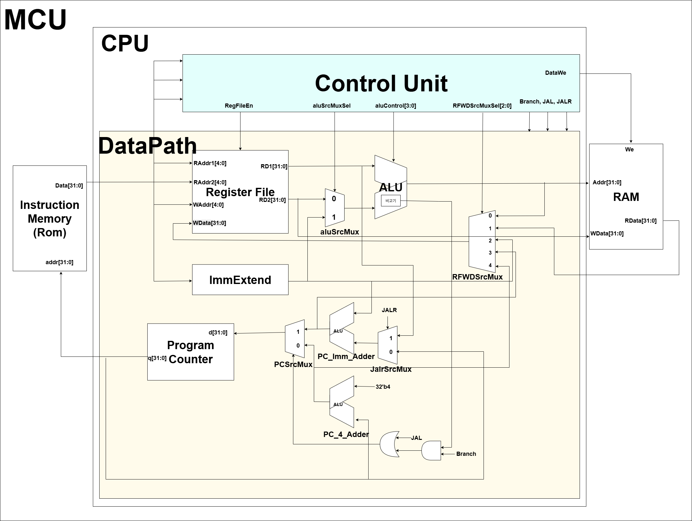
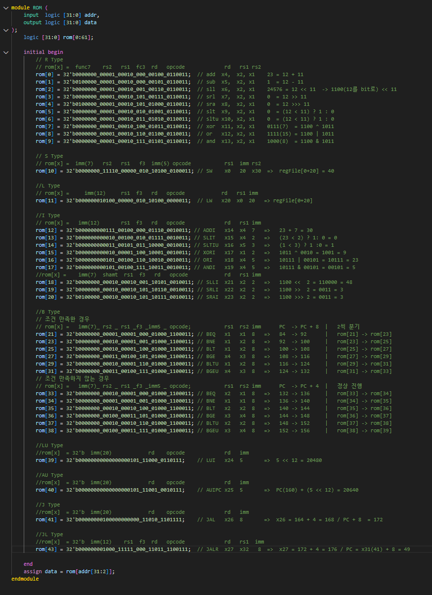
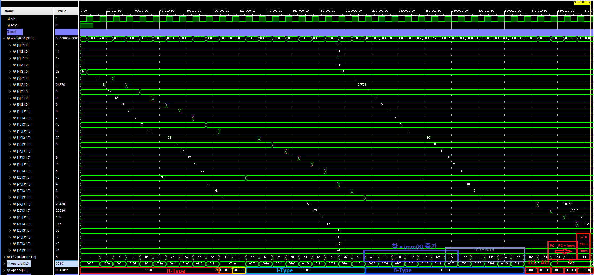
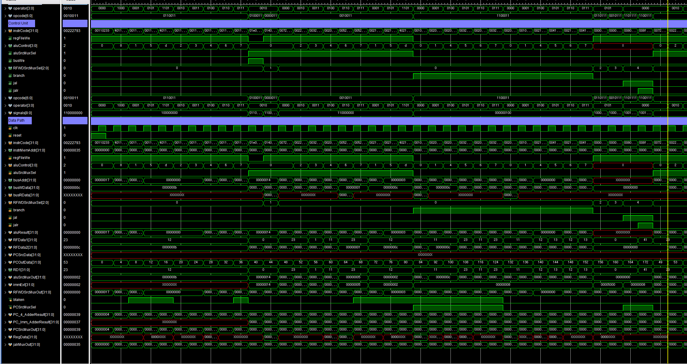

# Block Diagram


## Bit 위치가 섞인 이유


# Code

## MCU.sv
```verilog
`timescale 1ns / 1ps

module MCU (
    input logic clk,
    input logic reset
);
    logic [31:0] instrCode;
    logic [31:0] instrMemAddr;
    logic        busWe;
    logic [31:0] busAddr;
    logic [31:0] busWData;
    logic [31:0] busRData;

    ROM U_ROM (
        .addr(instrMemAddr),
        .data(instrCode)
    );

    CPU_RV32I U_RV32I (.*);

    RAM U_RAM (
        .clk  (clk),
        .we   (busWe),
        .addr (busAddr),
        .wData(busWData),
        .rData(busRData)
    );
endmodule
```


## CPU_RV32I.sv
```verilog
`timescale 1ns / 1ps

module CPU_RV32I (
    input  logic        clk,
    input  logic        reset,
    input  logic [31:0] instrCode,
    output logic [31:0] instrMemAddr,
    output logic        busWe,
    output logic [31:0] busAddr,
    output logic [31:0] busWData,
    input  logic [31:0] busRData
);

    logic       regFileWe;
    logic [3:0] aluControl;
    logic       aluSrcMuxSel;
    logic [2:0] RFWDSrcMuxSel;
    logic branch, jal, jalr;

    ControlUnit U_ControlUnit (.*);
    DataPath U_DataPath (.*);
endmodule
```


## RAM.sv
```verilog
`timescale 1ns / 1ps

module RAM (
    input  logic        clk,
    input  logic        we,
    input  logic [31:0] addr,
    input  logic [31:0] wData,
    output logic [31:0] rData
);
    logic [31:0] mem[0:9];

    always_ff @( posedge clk ) begin
        if (we) mem[addr[31:2]] <= wData;
    end

    assign rData = mem[addr[31:2]];
endmodule
```


## ROM.sv
```verilog
`timescale 1ns / 1ps

module ROM (
    input  logic [31:0] addr,
    output logic [31:0] data
);
    logic [31:0] rom[0:61];

    initial begin
        // R Type
        // rom[x] =  func7    rs2   rs1  fc3  rd   opcode             rd   rs1 rs2         
        rom[0] = 32'b0000000_00001_00010_000_00100_0110011;  // add  x4,  x2, x1    23 = 12 + 11
        rom[1] = 32'b0100000_00001_00010_000_00101_0110011;  // sub  x5,  x2, x1    1  = 12 - 11
        rom[2] = 32'b0000000_00001_00010_001_00110_0110011;  // sll  x6,  x2, x1    24576 = 12 << 11  -> 1100(12를 bit로) << 11
        rom[3] = 32'b0000000_00001_00010_101_00111_0110011;  // srl  x7,  x2, x1    0  = 12 >> 11 
        rom[4] = 32'b0100000_00001_00010_101_01000_0110011;  // sra  x8,  x2, x1    0  = 12 >>> 11 
        rom[5] = 32'b0000000_00001_00010_010_01001_0110011;  // slt  x9,  x2, x1    0  = (12 < 11) ? 1 : 0 
        rom[6] = 32'b0000000_00001_00010_011_01010_0110011;  // sltu x10, x2, x1    0  = (12 < 11) ? 1 : 0
        rom[7] = 32'b0000000_00001_00010_100_01011_0110011;  // xor  x11, x2, x1    0111(7)  = 1100 ^ 1011 
        rom[8] = 32'b0000000_00001_00010_110_01100_0110011;  // or   x12, x2, x1    1111(15) = 1100 | 1011
        rom[9] = 32'b0000000_00001_00010_111_01101_0110011;  // and  x13, x2, x1    1000(8)  = 1100 & 1011

        // S Type
        // rom[x] =  imm(7)   rs2   rs1   f3  imm(5) opcode           rs1  imm rs2
        rom[10] = 32'b0000000_11110_00000_010_10100_0100011; // SW    x0   20  x30  =>  regFile[0+20] = 40

        //L Type
        // rom[x] =     imm(12)     rs1  f3   rd   opcode            rd   rs1 imm
        rom[11] = 32'b000000010100_00000_010_10100_0000011;  // LW   x20  x0  20   => regFile[0+20]

        //I Type
        // rom[x] =   imm(12)       rs1  f3   rd   opcode             rd   rs1 imm           
        rom[12] = 32'b000000000111_00100_000_01110_0010011; // ADDI   x14  x4  7   =>   23 + 7 = 30 
        rom[13] = 32'b000000000010_00100_010_01111_0010011; // SLIT   x15  x4  2   =>   (23 < 2) ? 1: 0 = 0
        rom[14] = 32'b000000000011_00101_011_10000_0010011; // SLTIU  x16  x5  3   =>   (1 < 3) ? 1 :0 = 1
        rom[15] = 32'b000000000010_00001_100_10001_0010011; // XORI   x17  x1  2   =>   1011 ^ 0010 = 1001 = 9
        rom[16] = 32'b000000000101_00100_110_10010_0010011; // ORI    x18  x4  5   =>   10111 | 00101 = 10111 = 23
        rom[17] = 32'b000000000101_00100_111_10011_0010011; // ANDI   x19  x4  5   =>   10111 & 00101 = 00101 = 5
        //rom[x] =    imm(7)  shamt  rs1  f3   rd   opcode            rd   rs1 imm
        rom[18] = 32'b0000000_00010_00010_001_10101_0010011; // SLLI  x21  x2  2   =>   1100 <<  2 = 110000 = 48
        rom[19] = 32'b0000000_00010_00010_101_10110_0010011; // SRLI  x22  x2  2   =>   1100 >>  2 = 0011 = 3
        rom[20] = 32'b0100000_00010_00010_101_10111_0010011; // SRAI  x23  x2  2   =>   1100 >>> 2 = 0011 = 3     

        //B Type
        // 조건 만족한 경우
        // rom[x] =   imm(7)_ rs2 _ rs1 _f3 _imm5 _ opcode;           rs1  rs2 imm      PC  -> PC + 8  |   2씩 분기
        rom[21] = 32'b0000000_00001_00001_000_01000_1100011; // BEQ   x1   x1  8   =>   84  -> 92      |   rom[21] -> rom[23]
        rom[23] = 32'b0000000_00010_00001_001_01000_1100011; // BNE   x1   x2  8   =>   92  -> 100     |   rom[23] -> rom[25]
        rom[25] = 32'b0000000_00010_00001_100_01000_1100011; // BLT   x1   x2  8   =>   100 -> 108     |   rom[25] -> rom[27]
        rom[27] = 32'b0000000_00011_00100_101_01000_1100011; // BGE   x4   x3  8   =>   108 -> 116     |   rom[27] -> rom[29]
        rom[29] = 32'b0000000_00010_00001_110_01000_1100011; // BLTU  x1   x2  8   =>   116 -> 124     |   rom[29] -> rom[31]
        rom[31] = 32'b0000000_00011_00100_111_01000_1100011; // BGEU  x4   x3  8   =>   124 -> 132     |   rom[31] -> rom[33]
        // 조건 만족하지 않는 경우
        // rom[x] =   imm(7)_ rs2 _ rs1 _f3 _imm5 _ opcode;           rs1  rs2 imm      PC  -> PC + 4  |   정상 진행
        rom[33] = 32'b0000000_00010_00001_000_01000_1100011; // BEQ   x2   x1  8   =>   132 -> 136     |   rom[33] -> rom[34]
        rom[34] = 32'b0000000_00001_00001_001_01000_1100011; // BNE   x1   x1  8   =>   136 -> 140     |   rom[34] -> rom[35]
        rom[35] = 32'b0000000_00010_00010_100_01000_1100011; // BLT   x2   x2  8   =>   140 -> 144     |   rom[35] -> rom[36]
        rom[36] = 32'b0000000_00100_00011_101_01000_1100011; // BGE   x3   x4  8   =>   144 -> 148     |   rom[36] -> rom[37]
        rom[37] = 32'b0000000_00010_00010_110_01000_1100011; // BLTU  x2   x2  8   =>   148 -> 152     |   rom[37] -> rom[38]
        rom[38] = 32'b0000000_00100_00011_111_01000_1100011; // BGEU  x3   x4  8   =>   152 -> 156     |   rom[38] -> rom[39]

        //LU Type
        //rom[x]  = 32'b  imm(20)            rd    opcode             rd   imm
        rom[39] = 32'b00000000000000000101_11000_0110111;    // LUI   x24  5       =>  5 << 12 = 20480
        
        //AU Type
        //rom[x]  = 32'b  imm(20)            rd    opcode             rd   imm
        rom[40] = 32'b00000000000000000101_11001_0010111;    // AUIPC x25  5       =>  PC(160) + (5 << 12) = 20640 

        //J Type
        //rom[x]  = 32'b  imm(20)            rd    opcode             rd   imm
        rom[41] = 32'b00000000100000000000_11010_1101111;    // JAL   x26  8       =>  x26 = 164 + 4 = 168 / PC + 8  = 172    

        //JL Type
        //rom[x]  = 32'b  imm(12)    rs1  f3  rd   opcode             rd   rs1  imm
        rom[43] = 32'b000000001000_11111_000_11011_1100111;  // JALR  x27  x32   8  =>  x27 = 172 + 4 = 176 / PC = x31(41) + 8 = 49

    end
    assign data = rom[addr[31:2]];
endmodule
```


## ControlUnit.sv
```verilog
`timescale 1ns / 1ps
`include "Defines.sv"

module ControlUnit (
    input  logic [31:0] instrCode,
    output logic        regFileWe,
    output logic [ 3:0] aluControl,
    output logic        aluSrcMuxSel,
    output logic        busWe,
    output logic [ 2:0] RFWDSrcMuxSel,
    output logic        branch,
    output logic        jal,
    output logic        jalr
);
    wire  [6:0] opcode = instrCode[6:0];
    wire  [3:0] operator = {instrCode[30], instrCode[14:12]};
    logic [8:0] signals;
    assign {regFileWe, aluSrcMuxSel, busWe, RFWDSrcMuxSel, branch, jal, jalr} = signals;

    always_comb begin
        signals = 8'b0;
        case (opcode)
            //{regFileWe, aluSrcMuxSel, busWe, RFWDSrcMuxSel[2:0], branch, jal, jalr} = signals;
            `OP_TYPE_R:  signals = 9'b1_0_0_000_0_0_0;
            `OP_TYPE_S:  signals = 9'b0_1_1_000_0_0_0;
            `OP_TYPE_L:  signals = 9'b1_1_0_001_0_0_0;
            `OP_TYPE_I:  signals = 9'b1_1_0_000_0_0_0;
            `OP_TYPE_B:  signals = 9'b0_0_0_000_1_0_0;
            `OP_TYPE_LU: signals = 9'b1_0_0_010_0_0_0;
            `OP_TYPE_AU: signals = 9'b1_0_0_011_0_0_0;
            `OP_TYPE_J:  signals = 9'b1_0_0_100_0_1_0;
            `OP_TYPE_JL: signals = 9'b1_0_0_100_0_1_1;
        endcase
    end

    always_comb begin
        aluControl = 4'bx;
        case (opcode)
            `OP_TYPE_R:  aluControl = operator;
            `OP_TYPE_S:  aluControl = `ADD;
            `OP_TYPE_L:  aluControl = `ADD;
            `OP_TYPE_I: begin
                if (operator == 4'b1101) begin
                    aluControl = operator;
                end else begin
                    aluControl = {1'b0, operator[2:0]};
                end
            end
            `OP_TYPE_B:  aluControl = operator;
            `OP_TYPE_LU: aluControl = 4'bx;
            `OP_TYPE_AU: aluControl = 4'bx;
            `OP_TYPE_J:  aluControl = 4'bx;
            `OP_TYPE_JL: aluControl = 4'bx;
        endcase
    end
endmodule
```


## DataPath.sv
```verilog
`timescale 1ns / 1ps
`include "Defines.sv"

module DataPath (
    input  logic        clk,
    input  logic        reset,
    input  logic [31:0] instrCode,
    output logic [31:0] instrMemAddr,
    input  logic        regFileWe,
    input  logic [ 3:0] aluControl,
    input  logic        aluSrcMuxSel,
    output logic [31:0] busAddr,
    output logic [31:0] busWData,
    input  logic [31:0] busRData,
    input  logic [ 2:0] RFWDSrcMuxSel,
    input  logic        branch,
    input  logic        jal,
    input  logic        jalr
);

    logic [31:0] aluResult, RFData1, RFData2;
    logic [31:0] PCSrcData, PCOutData;
    logic [31:0] aluSrcMuxOut, immExt, RFWDSrcMuxOut;
    logic btaken, PCSrcMuxSel;
    logic [31:0] PC_4_AdderResult, PC_Imm_AdderResult, PCSrcMuxOut;
    logic [31:0] RegData;
    logic [31:0] jalrMuxOut;

    assign instrMemAddr = PCOutData;
    assign busAddr = aluResult;
    assign busWData = RFData2;

    data_size U_Data_Size (
        .instrCode (instrCode),
        .i_RegData (RFData2),
        .ram_r_data(busRData),
        .ram_w_data(busWData),
        .o_RegData (RegData)
    );

    RegisterFile U_RegFile (
        .clk(clk),
        .we (regFileWe),
        .RA1(instrCode[19:15]),
        .RA2(instrCode[24:20]),
        .WA (instrCode[11:7]),
        .WD (RFWDSrcMuxOut),
        .RD1(RFData1),
        .RD2(RFData2)
    );

    mux_2x1 U_AluSrcMux (
        .sel(aluSrcMuxSel),
        .x0 (RFData2),
        .x1 (immExt),
        .y  (aluSrcMuxOut)
    );

    mux_5x1 U_RFWDSrcMux (
        .sel(RFWDSrcMuxSel),
        .x0 (aluResult),
        .x1 (RegData),
        .x2 (immExt),
        .x3 (PC_Imm_AdderResult),
        .x4 (PC_4_AdderResult),
        .y  (RFWDSrcMuxOut)
    );

    alu U_ALU (
        .aluControl(aluControl),
        .a         (RFData1),
        .b         (aluSrcMuxOut),
        .result    (aluResult),
        .btaken    (btaken)
    );

    immExtend U_ImmExtend (
        .instrCode(instrCode),
        .immExt   (immExt)
    );

    mux_2x1 U_JalrSrcMux (
        .sel(jalr),
        .x0 (PCOutData),
        .x1 (RFData1),
        .y  (jalrMuxOut)
    );

    adder U_PC_Imm_Adder (
        .a(immExt),
        .b(jalrMuxOut),
        .y(PC_Imm_AdderResult)
    );

    adder U_PC_4_Adder (
        .a(32'd4),
        .b(PCOutData),
        .y(PC_4_AdderResult)
    );

    assign PCSrcMuxSel = jal | (btaken & branch);

    mux_2x1 U_PCSrcMux (
        .sel(PCSrcMuxSel),
        .x0 (PC_4_AdderResult),
        .x1 (PC_Imm_AdderResult),
        .y  (PCSrcMuxOut)
    );

    register U_PC (
        .clk  (clk),
        .reset(reset),
        .en   (1'b1),
        .d    (PCSrcMuxOut),
        .q    (PCOutData)
    );
endmodule

////////////////////////////////////////////////////////////////////////////////////////////////////////////////////////////////////////////

module alu (
    input  logic [ 3:0] aluControl,
    input  logic [31:0] a,
    input  logic [31:0] b,
    output logic [31:0] result,
    output logic        btaken
);
    always_comb begin
        result = 32'bx;
        case (aluControl)
            `ADD:  result = a + b;
            `SUB:  result = a - b;
            `SLL:  result = a << b;
            `SRL:  result = a >> b;
            `SRA:  result = $signed(a) >>> b;
            `SLT:  result = ($signed(a) < $signed(b)) ? 1 : 0;
            `SLTU: result = (a < b) ? 1 : 0;
            `XOR:  result = a ^ b;
            `OR:   result = a | b;
            `AND:  result = a & b;
        endcase
    end

    always_comb begin
        btaken = 1'b0;
        case (aluControl[2:0])
            `BEQ:  btaken = (a == b);
            `BNE:  btaken = (a != b);
            `BLT:  btaken = ($signed(a) < $signed(b));
            `BGE:  btaken = ($signed(a) >= $signed(b));
            `BLTU: btaken = (a < b);
            `BGEU: btaken = (a >= b);
        endcase
    end
endmodule

//////////////////////////////////////////////////////////////////////

module RegisterFile (
    input  logic        clk,
    input  logic        we,
    input  logic [ 4:0] RA1,
    input  logic [ 4:0] RA2,
    input  logic [ 4:0] WA,
    input  logic [31:0] WD,
    output logic [31:0] RD1,
    output logic [31:0] RD2
);
    logic [31:0] mem[0:2**5-1];

    initial begin  // for simulation test
        for (int i = 0; i < 32; i++) begin
            mem[i] = 10 + i;
        end
    end

    always_ff @(posedge clk) begin
        if (we) mem[WA] <= WD;
    end

    assign RD1 = (RA1 != 0) ? mem[RA1] : 32'b0;
    assign RD2 = (RA2 != 0) ? mem[RA2] : 32'b0;
endmodule

//////////////////////////////////////////////////////////////////////

module register (
    input  logic        clk,
    input  logic        reset,
    input  logic        en,
    input  logic [31:0] d,
    output logic [31:0] q
);
    always_ff @(posedge clk, posedge reset) begin
        if (reset) begin
            q <= 0;
        end else begin
            if (en) q <= d;
        end
    end
endmodule

//////////////////////////////////////////////////////////////////////

module adder (
    input  logic [31:0] a,
    input  logic [31:0] b,
    output logic [31:0] y
);
    assign y = a + b;
endmodule

//////////////////////////////////////////////////////////////////////

module mux_2x1 (
    input  logic        sel,
    input  logic [31:0] x0,
    input  logic [31:0] x1,
    output logic [31:0] y
);
    always_comb begin
        y = 32'bx;
        case (sel)
            1'b0: y = x0;
            1'b1: y = x1;
        endcase
    end
endmodule

module mux_5x1 (
    input  logic [ 2:0] sel,
    input  logic [31:0] x0,
    input  logic [31:0] x1,
    input  logic [31:0] x2,
    input  logic [31:0] x3,
    input  logic [31:0] x4,
    output logic [31:0] y
);
    always_comb begin
        case (sel)
            3'd0:    y = x0;
            3'd1:    y = x1;
            3'd2:    y = x2;
            3'd3:    y = x3;
            3'd4:    y = x4;
            default: y = 32'bx;
        endcase
    end
endmodule

//////////////////////////////////////////////////////////////////////

module immExtend (
    input  logic [31:0] instrCode,
    output logic [31:0] immExt
);
    wire [6:0] opcode = instrCode[6:0];
    wire [2:0] fun3 = instrCode[14:12];

    always_comb begin
        immExt = 32'bx;
        case (opcode)
            `OP_TYPE_R: immExt = 32'bx;  // R-Type
            `OP_TYPE_L: immExt = {{20{instrCode[31]}}, instrCode[31:20]};
            `OP_TYPE_S:
            immExt = {
                {20{instrCode[31]}}, instrCode[31:25], instrCode[11:7]
            };  // S-Type
            `OP_TYPE_I: begin
                case (fun3)
                    3'b001:  immExt = {27'b0, instrCode[24:20]};  // SLLI
                    3'b101:  immExt = {27'b0, instrCode[24:20]};  // SRLI, SRAI
                    3'b011:  immExt = {20'b0, instrCode[31:20]};  // SLTIU
                    default: immExt = {{20{instrCode[31]}}, instrCode[31:20]};
                endcase
            end
            `OP_TYPE_B:
            immExt = {
                {20{instrCode[31]}},
                instrCode[7],
                instrCode[30:25],
                instrCode[11:8],
                1'b0
            };
            `OP_TYPE_LU: immExt = {instrCode[31:12], 12'b0};
            `OP_TYPE_AU: immExt = {instrCode[31:12], 12'b0};
            `OP_TYPE_J:
            immExt = {
                {12{instrCode[31]}},
                instrCode[19:12],
                instrCode[20],
                instrCode[30:21],
                1'b0
            };
            `OP_TYPE_JL: immExt = {{20{instrCode[31]}}, instrCode[31:20]};
        endcase
    end
endmodule

//////////////////////////////////////////////////////////////////////

module data_size (
    input  logic [31:0] instrCode,
    input  logic [31:0] i_RegData,
    input  logic [31:0] ram_r_data,
    output logic [31:0] ram_w_data,
    output logic [31:0] o_RegData
);
    wire [2:0] func3 = instrCode[14:12];

    always_comb begin
        case (func3)
            3'b000:
            ram_w_data = {{24{i_RegData[7]}}, i_RegData[7:0]};  // (SB) Byte
            3'b001:
            ram_w_data = {{16{i_RegData[15]}}, i_RegData[15:0]};  // (SH) Half
            3'b010: ram_w_data = i_RegData;  // (SW) Word
            default: ram_w_data = i_RegData;
        endcase
    end

    always_comb begin
        case (func3)
            3'b000:
            o_RegData = $signed({{24{ram_r_data[7]}},
                                 ram_r_data[7:0]});  // LB (sign extend)
            3'b001:
            o_RegData = $signed({{16{ram_r_data[15]}},
                                 ram_r_data[15:0]});  // LH (sign extend)
            3'b010: o_RegData = ram_r_data;  // LH (sign extend)
            3'b100:
            o_RegData = {{24{1'b0}}, ram_r_data[7:0]};  // LBU (zero extend)
            3'b101:
            o_RegData = {{16{1'b0}}, ram_r_data[15:0]};  // LHU (zero extend)
            default: o_RegData = ram_r_data;
        endcase
    end
endmodule
```

## Defines.sv
```verilog
`define ADD  4'b0000
`define SUB  4'b1000
`define SLL  4'b0001
`define SRL  4'b0101
`define SRA  4'b1101
`define SLT  4'b0010
`define SLTU 4'b0011
`define XOR  4'b0100
`define OR   4'b0110
`define AND  4'b0111

`define OP_TYPE_R  7'b0110011
`define OP_TYPE_L  7'b0000011
`define OP_TYPE_I  7'b0010011
`define OP_TYPE_S  7'b0100011
`define OP_TYPE_B  7'b1100011
`define OP_TYPE_LU 7'b0110111
`define OP_TYPE_AU 7'b0010111
`define OP_TYPE_J  7'b1101111
`define OP_TYPE_JL 7'b1100111

`define BEQ  3'b000
`define BNE  3'b001
`define BLT  3'b100
`define BGE  3'b101
`define BLTU 3'b110
`define BGEU 3'b111
```


# 결과

Rom의 주석과 Sim을 비교
### Test_Rom


### Simulation


### Control Unit, Data Path



## rom 쓰는 법
Create memory file을 같은 경로에 넣는다.
후에 code에서 다음과 같이 Hexa 형식으로 읽어 rom에 저장할 수 있다.
