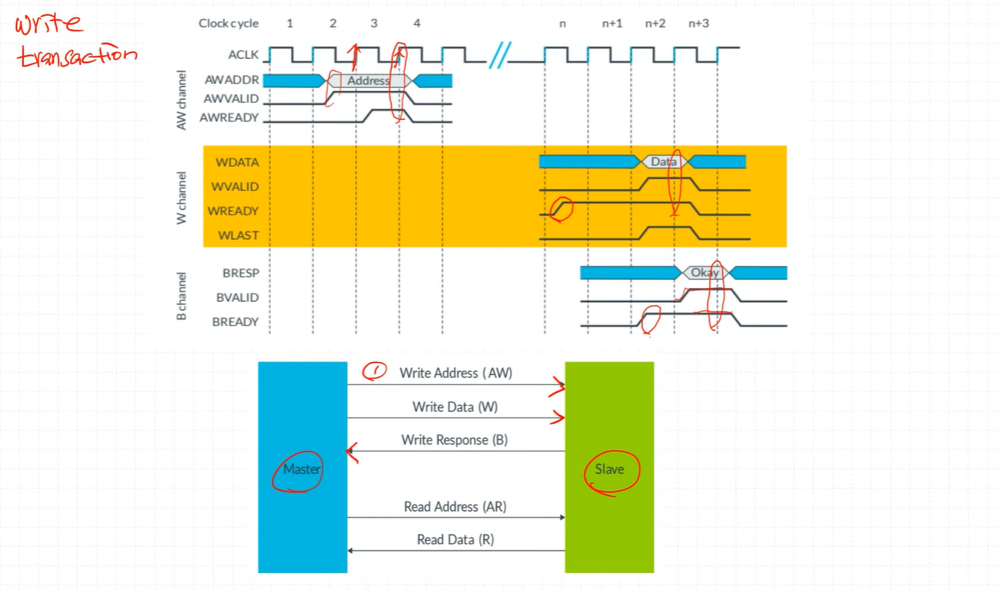

# AXI

## AXI 프로토콜 개요

- **마스터와 슬레이브**
  - Arm 프로세서는 **마스터(Master)** 의 예시
  - 메모리 컨트롤러는 **슬레이브(Slave)** 의 간단한 예시

- **AXI 프로토콜의 정의**
  - 마스터와 슬레이브 간 **포인트-투-포인트(point-to-point) 연결**의 신호와 타이밍을 정의
  - **버스(Bus) 규격**이 아닌 **인터페이스 규격**임
  - 따라서, 인터페이스 간의 신호와 타이밍만을 기술

- **인터커넥트 필요성**
  - 각 AXI 마스터 인터페이스는 하나의 AXI 슬레이브 인터페이스에 연결됨
  - 여러 개의 마스터와 슬레이브가 존재하는 경우, **인터커넥트 패브릭(Interconnect Fabric)** 이 필요
  - 이 인터커넥트는 마스터와 슬레이브 인터페이스를 구현하며, AXI 프로토콜도 그 안에서 구현됨

ex) Mater1이 Slave1과 통신할 때, Master2는 Slave3와 통신 가능

## AXI 인터페이스 채널

### 기본 개념
- AXI는 **마스터(Master)** 와 **슬레이브(Slave)** 간의 **포인트-투-포인트 프로토콜**을 정의함
- 각 AXI 인터페이스는 **5개의 주요 채널**을 사용하여 통신함

---

### Write 연산에 사용되는 채널
1. **Write Address (AW) 채널**  
   - 마스터 → 슬레이브 : 쓰기 주소 전달
2. **Write Data (W) 채널**  
   - 마스터 → 슬레이브 : 데이터 전달
3. **Write Response (B) 채널**  
   - 슬레이브 → 마스터 : 쓰기 완료 여부 및 응답 메시지 전달

---

### Read 연산에 사용되는 채널
1. **Read Address (AR) 채널**  
   - 마스터 → 슬레이브 : 읽을 주소 전달
2. **Read Data (R) 채널**  
   - 슬레이브 → 마스터 : 요청한 주소의 데이터 전달  
   - 필요 시 에러 메시지 반환  
     - 예: 잘못된 주소 접근, 데이터 손상, 보안 권한 부족 등

---

### 채널 특성
- 각 채널은 **단방향(Unidirectional)** 으로 동작  
  → 따라서, **Write Response 채널**이 별도로 필요  
  → Read는 별도의 응답 채널 없이 **Read Data 채널**에 응답 포함
- 읽기와 쓰기 모두 **주소 채널과 데이터 채널을 분리**하여 사용  
  → 인터페이스의 대역폭을 극대화할 수 있음
- 읽기 채널과 쓰기 채널 그룹 간에는 **타이밍 의존성이 없음**  
  → 읽기와 쓰기 연산이 **동시에** 진행될 수 있음

---

### 채널별 신호 접두어 (Prefix)
각 채널은 여러 개의 신호로 구성되며, 신호 이름은 채널에 따라 접두어가 붙음:

- **AW** : Write Address 채널 신호  
- **W** : Write Data 채널 신호  
- **B** : Write Response 채널 신호 (**Buffered**)
- **AR** : Read Address 채널 신호  
- **R** : Read Data 채널 신호

## 채널 핸드셰이크 (Channel Handshake)

### 기본 개념
- AXI4 프로토콜의 **5개 채널**은 모두 동일한 **핸드셰이크 메커니즘**을 사용
- 핸드셰이크는 **VALID** 와 **READY** 신호 기반으로 동작
  

Master에서 준 신호를 받으면 Slave가 신호 주는거
---

### 신호 흐름
- **VALID** : **소스(Source) → 목적지(Destination)**
- **READY** : **목적지(Destination) → 소스(Source)**

---

### 소스와 목적지의 역할
- 채널에 따라 마스터/슬레이브가 소스 또는 목적지가 됨  
  - 예:  
    - **Read Address 채널** → 마스터가 소스  
    - **Read Data 채널** → 마스터가 목적지

---

### VALID 신호
- 소스는 전송할 **유효한 정보가 준비됨**을 나타낼 때 VALID를 High로 설정
- 목적지가 데이터를 수신하기 전까지 VALID는 **High 상태를 유지**해야 함  
  → 이렇게 유지되는 신호를 **Sticky Signal** 이라고 부름

---

### READY 신호
- 목적지는 정보를 **수신할 준비가 되었을 때** READY를 High로 설정
- READY는 목적지에서 소스로 전송됨

---

### 클럭 동기화
- 이 메커니즘은 **비동기(asynchronous) 핸드셰이크가 아님**
- 핸드셰이크 완료는 반드시 **클럭의 상승 에지(rising edge)** 에서 이루어짐

## 전송(Transfer)과 트랜잭션(Transaction)의 차이

### 인터커넥트 설계 시 고려사항
- 마스터와 슬레이브의 **성능과 기능**을 파악해야 함
- 이를 통해 성능을 높이기 위해 필요한:
  - **버퍼링(Buffering)**
  - **트래킹(Tracking)**
  - **디코드 로직(Decode Logic)**
  등을 적절히 포함할 수 있음
- 표준 용어를 사용하면 **컴포넌트 간 상호작용** 이해가 쉬워짐

---

### Transfer (전송)

- **단일 정보 교환**을 의미
- 하나의 **VALID–READY 핸드셰이크**로 구성됨
- 즉, 클럭 에지에서 한 번의 데이터 주고받기가 **Transfer**

---

### Transaction (트랜잭션)

- 여러 개의 Transfer가 모여 하나의 Transaction을 형성
- 구성 요소:
  - **주소 전송(Address Transfer)**
  - **하나 이상의 데이터 전송(Data Transfers)**
  - (쓰기의 경우) **응답 전송(Response Transfer)**
- 즉, 버스트(Burst) 단위 전체 흐름이 **Transaction**

## 4.3 채널 전송 예시 (Channel Transfer Examples)

### 기본 개념
- VALID와 READY 신호의 조합에 따라 다양한 핸드셰이크 시퀀스가 가능
- AXI 프로토콜에서는 다음 규칙을 따름:
  - **소스(Source)** : READY가 High가 되기를 기다린 후 VALID를 올리면 안 됨
  - **목적지(Destination)** : VALID가 High가 된 후 READY를 올릴 수 있음
- 따라서 READY는 VALID보다 **먼저**, **나중**, **동시에** asserted 될 수 있음

---
### 예시 1

1. **클럭 사이클 2** : VALID High → 데이터가 유효함을 의미  
2. **클럭 사이클 3** : READY High  
3. **클럭 사이클 4의 상승 에지** : VALID와 READY 모두 High → 핸드셰이크 완료

---

### 예시 2 => 예상되는 값이 올 때 사용 / 1clk 줄임

1. **클럭 사이클 1** : READY High  
2. **클럭 사이클 3** : VALID High  
3. **클럭 사이클 4의 상승 에지** : VALID와 READY 모두 High → 핸드셰이크 완료

보냈으니까(Response가 올거라는 기대) 미리 Ready 신호가 올라간 상태 유지

---

### 예시 3 => 흔치 않은 상황

1. **클럭 사이클 3** : VALID와 READY가 동시에 High  
2. **클럭 사이클 4의 상승 에지** : VALID와 READY 모두 High → 핸드셰이크 완료

---

### 공통 규칙
- **정보 전송 시점** : 클럭 상승 에지에서 VALID와 READY가 모두 High일 때
- 읽기 및 쓰기 핸드셰이크 모두 동일한 규칙을 따라야 함

## Write

## Read

### ->> vs ->

- 화살표 두개 (->>) 의 경우 필수
- 화살표 한개 (->) 의 경우 옵션
  