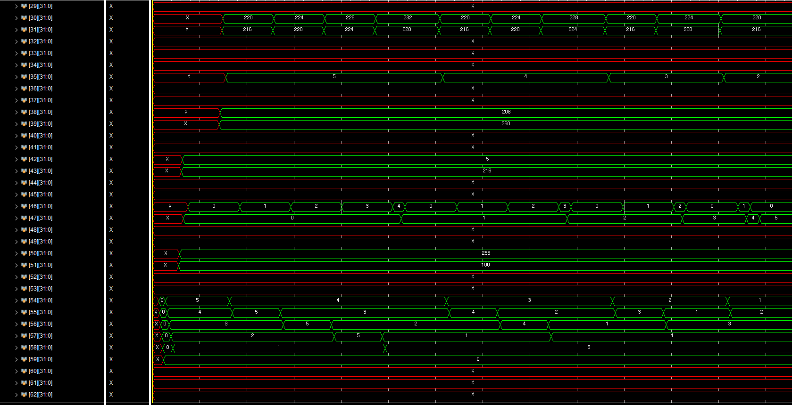
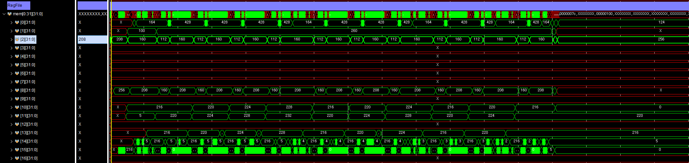

# Link

## C -> Assembly
https://godbolt.org/
## Assembly
https://riscvasm.lucasteske.dev/
## RISC-V 분석기(machine code)
https://luplab.gitlab.io/rvcodecjs/

첫 사이트에서 C언어 코드를 입력하면 어셈블리어로 자동으로 변경된다.
 

2번째 사이트에서 왼쪽에 어셈블리어를 입력하고 Build를 하게 되면.
아래와 같이 결과가 나온다.
 

3번째 부분의 코드를 보게 되면 머신코드가 어떤 부분 어셈블리어에서 변경되었는지 알 수 있다.

C -> 

Assembly -> 

machine code -> 


C 언어에서 Return은 JALR을 사용

## 주의점
해당 방식과 같이 sp 의 주소 또한 초기화 해 줘야한다.
```bash
		li		sp, 0x40   
main:
        addi    sp,sp,-32
        sw      ra,28(sp)
        sw      s0,24(sp)
        addi    s0,sp,32
        li      a5,10
        sw      a5,-20(s0)
        li      a5,20
        sw      a5,-24(s0)
        lw      a1,-24(s0)
        lw      a0,-20(s0)
        call    adder
        sw      a0,-28(s0)
        li      a5,0
        mv      a0,a5
        lw      ra,28(sp)
        lw      s0,24(sp)
        addi    sp,sp,32
        jr      ra
adder:
        addi    sp,sp,-32
        sw      ra,28(sp)
        sw      s0,24(sp)
        addi    s0,sp,32
        sw      a0,-20(s0)
        sw      a1,-24(s0)
        lw      a4,-20(s0)
        lw      a5,-24(s0)
        add     a5,a4,a5
        mv      a0,a5
        lw      ra,28(sp)
        lw      s0,24(sp)
        addi    sp,sp,32
        jr      ra
```

## 분석


# Home Work / RISC-V 어셈블리 코드 분석 및 C 코드 비교

## rom 쓰는 법
Create memory file을 같은 경로에 넣는다.
후에 code에서 다음과 같이 Hexa 형식으로 읽어 rom에 저장할 수 있다.


### C
```C
void sort(int *pData, int size);
void swap(int *pA, int *pB);

int main(){
    int arData[6] = {5, 4, 3, 2, 1};

    sort(arData, 5);

    return 0;
}

void sort(int *pData, int size){
    for (int i = 0; i < size; i++){
        for (int j = 0; j < size - i - 1; j++){
            if (pData[j] > pData[j + 1])
                swap(&pData[j], &pData[j+1]);  
        }
    }
}

void swap(int *pA, int *pB) {
    int temp;
    temp = *pA;
    *pA = *pB;
    *pB = temp;
}
```

### Assembly
```bash
        li	sp, 0x100
main:
        addi    sp,sp,-48
        sw      ra,44(sp)
        sw      s0,40(sp)
        addi    s0,sp,48
        sw      zero,-40(s0)
        sw      zero,-36(s0)
        sw      zero,-32(s0)
        sw      zero,-28(s0)
        sw      zero,-24(s0)
        sw      zero,-20(s0)
        li      a5,5
        sw      a5,-40(s0)
        li      a5,4
        sw      a5,-36(s0)
        li      a5,3
        sw      a5,-32(s0)
        li      a5,2
        sw      a5,-28(s0)
        li      a5,1
        sw      a5,-24(s0)
        addi    a5,s0,-40
        li      a1,5
        mv      a0,a5
        call    sort
        li      a5,0
        mv      a0,a5
        lw      ra,44(sp)
        lw      s0,40(sp)
        addi    sp,sp,48
        jr      ra
sort:
        addi    sp,sp,-48
        sw      ra,44(sp)
        sw      s0,40(sp)
        addi    s0,sp,48
        sw      a0,-36(s0)
        sw      a1,-40(s0)
        sw      zero,-20(s0)
        j       .L4
.L8:
        sw      zero,-24(s0)
        j       .L5
.L7:
        lw      a5,-24(s0)
        slli    a5,a5,2
        lw      a4,-36(s0)
        add     a5,a4,a5
        lw      a4,0(a5)
        lw      a5,-24(s0)
        addi    a5,a5,1
        slli    a5,a5,2
        lw      a3,-36(s0)
        add     a5,a3,a5
        lw      a5,0(a5)
        ble     a4,a5,.L6
        lw      a5,-24(s0)
        slli    a5,a5,2
        lw      a4,-36(s0)
        add     a3,a4,a5
        lw      a5,-24(s0)
        addi    a5,a5,1
        slli    a5,a5,2
        lw      a4,-36(s0)
        add     a5,a4,a5
        mv      a1,a5
        mv      a0,a3
        call    swap
.L6:
        lw      a5,-24(s0)
        addi    a5,a5,1
        sw      a5,-24(s0)
.L5:
        lw      a4,-40(s0)
        lw      a5,-20(s0)
        sub     a5,a4,a5
        addi    a5,a5,-1
        lw      a4,-24(s0)
        blt     a4,a5,.L7
        lw      a5,-20(s0)
        addi    a5,a5,1
        sw      a5,-20(s0)
.L4:
        lw      a4,-20(s0)
        lw      a5,-40(s0)
        blt     a4,a5,.L8
        nop
        nop
        lw      ra,44(sp)
        lw      s0,40(sp)
        addi    sp,sp,48
        jr      ra
swap:
        addi    sp,sp,-48
        sw      ra,44(sp)
        sw      s0,40(sp)
        addi    s0,sp,48
        sw      a0,-36(s0)
        sw      a1,-40(s0)
        lw      a5,-36(s0)
        lw      a5,0(a5)
        sw      a5,-20(s0)
        lw      a5,-40(s0)
        lw      a4,0(a5)
        lw      a5,-36(s0)
        sw      a4,0(a5)
        lw      a5,-40(s0)
        lw      a4,-20(s0)
        sw      a4,0(a5)
        nop
        lw      ra,44(sp)
        lw      s0,40(sp)
        addi    sp,sp,48
        jr      ra
```

### DisAssembly
```bash
0000000000000000 :
   0:	10000113          	li	sp,256

0000000000000004 
:
   4:	fd010113          	addi	sp,sp,-48
   8:	02112623          	sw	ra,44(sp)
   c:	02812423          	sw	s0,40(sp)
  10:	03010413          	addi	s0,sp,48
  14:	fc042c23          	sw	zero,-40(s0)
  18:	fc042e23          	sw	zero,-36(s0)
  1c:	fe042023          	sw	zero,-32(s0)
  20:	fe042223          	sw	zero,-28(s0)
  24:	fe042423          	sw	zero,-24(s0)
  28:	fe042623          	sw	zero,-20(s0)
  2c:	00500793          	li	a5,5
  30:	fcf42c23          	sw	a5,-40(s0)
  34:	00400793          	li	a5,4
  38:	fcf42e23          	sw	a5,-36(s0)
  3c:	00300793          	li	a5,3
  40:	fef42023          	sw	a5,-32(s0)
  44:	00200793          	li	a5,2
  48:	fef42223          	sw	a5,-28(s0)
  4c:	00100793          	li	a5,1
  50:	fef42423          	sw	a5,-24(s0)
  54:	fd840793          	addi	a5,s0,-40
  58:	00500593          	li	a1,5
  5c:	00078513          	mv	a0,a5
  60:	01c000ef          	jal	ra,7c 
  64:	00000793          	li	a5,0
  68:	00078513          	mv	a0,a5
  6c:	02c12083          	lw	ra,44(sp)
  70:	02812403          	lw	s0,40(sp)
  74:	03010113          	addi	sp,sp,48
  78:	00008067          	ret

000000000000007c :
  7c:	fd010113          	addi	sp,sp,-48
  80:	02112623          	sw	ra,44(sp)
  84:	02812423          	sw	s0,40(sp)
  88:	03010413          	addi	s0,sp,48
  8c:	fca42e23          	sw	a0,-36(s0)
  90:	fcb42c23          	sw	a1,-40(s0)
  94:	fe042623          	sw	zero,-20(s0)
  98:	09c0006f          	j	134 
  9c:	fe042423          	sw	zero,-24(s0)
  a0:	0700006f          	j	110 
  a4:	fe842783          	lw	a5,-24(s0)
  a8:	00279793          	slli	a5,a5,0x2
  ac:	fdc42703          	lw	a4,-36(s0)
  b0:	00f707b3          	add	a5,a4,a5
  b4:	0007a703          	lw	a4,0(a5)
  b8:	fe842783          	lw	a5,-24(s0)
  bc:	00178793          	addi	a5,a5,1
  c0:	00279793          	slli	a5,a5,0x2
  c4:	fdc42683          	lw	a3,-36(s0)
  c8:	00f687b3          	add	a5,a3,a5
  cc:	0007a783          	lw	a5,0(a5)
  d0:	02e7da63          	ble	a4,a5,104 
  d4:	fe842783          	lw	a5,-24(s0)
  d8:	00279793          	slli	a5,a5,0x2
  dc:	fdc42703          	lw	a4,-36(s0)
  e0:	00f706b3          	add	a3,a4,a5
  e4:	fe842783          	lw	a5,-24(s0)
  e8:	00178793          	addi	a5,a5,1
  ec:	00279793          	slli	a5,a5,0x2
  f0:	fdc42703          	lw	a4,-36(s0)
  f4:	00f707b3          	add	a5,a4,a5
  f8:	00078593          	mv	a1,a5
  fc:	00068513          	mv	a0,a3
 100:	058000ef          	jal	ra,158 
 104:	fe842783          	lw	a5,-24(s0)
 108:	00178793          	addi	a5,a5,1
 10c:	fef42423          	sw	a5,-24(s0)
 110:	fd842703          	lw	a4,-40(s0)
 114:	fec42783          	lw	a5,-20(s0)
 118:	40f707b3          	sub	a5,a4,a5
 11c:	fff78793          	addi	a5,a5,-1
 120:	fe842703          	lw	a4,-24(s0)
 124:	f8f740e3          	blt	a4,a5,a4 
 128:	fec42783          	lw	a5,-20(s0)
 12c:	00178793          	addi	a5,a5,1
 130:	fef42623          	sw	a5,-20(s0)
 134:	fec42703          	lw	a4,-20(s0)
 138:	fd842783          	lw	a5,-40(s0)
 13c:	f6f740e3          	blt	a4,a5,9c 
 140:	00000013          	nop
 144:	00000013          	nop
 148:	02c12083          	lw	ra,44(sp)
 14c:	02812403          	lw	s0,40(sp)
 150:	03010113          	addi	sp,sp,48
 154:	00008067          	ret

0000000000000158 :
 158:	fd010113          	addi	sp,sp,-48
 15c:	02112623          	sw	ra,44(sp)
 160:	02812423          	sw	s0,40(sp)
 164:	03010413          	addi	s0,sp,48
 168:	fca42e23          	sw	a0,-36(s0)
 16c:	fcb42c23          	sw	a1,-40(s0)
 170:	fdc42783          	lw	a5,-36(s0)
 174:	0007a783          	lw	a5,0(a5)
 178:	fef42623          	sw	a5,-20(s0)
 17c:	fd842783          	lw	a5,-40(s0)
 180:	0007a703          	lw	a4,0(a5)
 184:	fdc42783          	lw	a5,-36(s0)
 188:	00e7a023          	sw	a4,0(a5)
 18c:	fd842783          	lw	a5,-40(s0)
 190:	fec42703          	lw	a4,-20(s0)
 194:	00e7a023          	sw	a4,0(a5)
 198:	00000013          	nop
 19c:	02c12083          	lw	ra,44(sp)
 1a0:	02812403          	lw	s0,40(sp)
 1a4:	03010113          	addi	sp,sp,48
 1a8:	00008067          	ret
```

### 멸령어
| 명령어 | 내부 변환 | 역할 |
| --- | --- | --- |
| `ret` | `jalr zero, 0(ra)` | `ra` 값(복귀 주소)로 점프 |
| `mv` | `addi rd, rs, 0` | `rs` 값을 `rd`로 복사 |
| `li` | `addi rd, x0, imm` 또는 `lui + addi` | 즉시 값을 레지스터에 로드 |
| `j` | `jal zero, offset` | 절대 주소로 점프 (복귀 주소 저장 안 함) |

# 코드 분석 및 비교
- 스택 프레임이 초기화
- 배열이 {5,4,3,2,1} 값으로 초기화
- 중첩된 루프가 배열 요소를 반복하며 비교하고 교환합니다.
- 정렬 과정이 메모리 내에서 수행됩니다.
  
## Buble Sort
**버블 정렬(bubble sort) 알고리즘의 개념 요약**
서로 인접한 두 원소를 검사하여 정렬하는 알고리즘
인접한 2개의 레코드를 비교하여 크기가 순서대로 되어 있지 않으면 서로 교환한다.
선택 정렬과 기본 개념이 유사하다.

**버블 정렬(bubble sort) 알고리즘의 구체적인 개념**
버블 정렬은 첫 번째 자료와 두 번째 자료를, 두 번째 자료와 세 번째 자료를, 세 번째와 네 번째를, … 이런 식으로 (마지막-1)번째 자료와 마지막 자료를 비교하여 교환하면서 자료를 정렬한다.

1회전을 수행하고 나면 가장 큰 자료가 맨 뒤로 이동하므로 2회전에서는 맨 끝에 있는 자료는 정렬에서 제외되고, 2회전을 수행하고 나면 끝에서 두 번째 자료까지는 정렬에서 제외된다. 이렇게 정렬을 1회전 수행할 때마다 정렬에서 제외되는 데이터가 하나씩 늘어난다.

**버블 정렬(bubble sort) 알고리즘의 예제**


배열에 7, 4, 5, 1, 3이 저장되어 있다고 가정하고 자료를 오름차순으로 정렬해 보자.

1회전
첫 번째 자료 7을 두 번째 자료 4와 비교하여 교환하고, 두 번째의 7과 세 번째의 5를 비교하여 교환하고, 세 번째의 7과 네 번째의 1을 비교하여 교환하고, 네 번째의 7과 다섯 번째의 3을 비교하여 교환한다. 이 과정에서 자료를 네 번 비교한다. 그리고 가장 큰 자료가 맨 끝으로 이동하므로 다음 회전에서는 맨 끝에 있는 자료는 비교할 필요가 없다.

2회전
첫 번째의 4을 두 번째 5와 비교하여 교환하지 않고, 두 번째의 5와 세 번째의 1을 비교하여 교환하고, 세 번째의 5와 네 번째의 3을 비교하여 교환한다. 이 과정에서 자료를 세 번 비교한다. 비교한 자료 중 가장 큰 자료가 끝에서 두 번째에 놓인다.

3회전
첫 번째의 4를 두 번째 1과 비교하여 교환하고, 두 번째의 4와 세 번째의 3을 비교하여 교환한다. 이 과정에서 자료를 두 번 비교한다. 비교한 자료 중 가장 큰 자료가 끝에서 세 번째에 놓인다.

4회전
첫 번째의 1과 두 번째의 3을 비교하여 교환하지 않는다.

## Assembly
C 코드에서 실행되는 sort() 함수와 swap() 함수의 동작을 어셈블리 코드에서 확인할 수 있습니다.

## main
```bash
addi    sp,sp,-48
sw      ra,44(sp)
sw      s0,40(sp)
addi    s0,sp,48
```
[sp+44] = ra 저장

[sp+40] = s0 저장

s0 = sp + 48 → 프레임 포인터

### 로컬 변수 초기화
```bash
sw      zero,-40(s0)   # arr[0]=0
sw      zero,-36(s0)   # arr[1]=0
sw      zero,-32(s0)   # arr[2]=0
sw      zero,-28(s0)   # arr[3]=0
sw      zero,-24(s0)   # arr[4]=0
sw      zero,-20(s0)   # arr[5]=0
```
-40 ~ -20(s0)에 배열 원소 저장 공간

### 배열 값 설정
```bash
li a5,5; sw a5,-40(s0)   # arr[0]=5
li a5,4; sw a5,-36(s0)   # arr[1]=4
li a5,3; sw a5,-32(s0)   # arr[2]=3
li a5,2; sw a5,-28(s0)   # arr[3]=2
li a5,1; sw a5,-24(s0)   # arr[4]=1
```

### sort 호출
```bash
addi a5,s0,-40   # a5 = &arr[0]
li   a1,5        # 길이 = 5
mv   a0,a5       # a0 = &arr[0]
call sort
```

### 리턴 처리
```bash
li a5,0
mv a0,a5         # return 0
lw ra,44(sp)
lw s0,40(sp)
addi sp,sp,48
jr ra            # main 끝
```

## sort
```bash
addi sp,sp,-48
sw   ra,44(sp)
sw   s0,40(sp)
addi s0,sp,48
```

### 인자 저장
```bash
sw a0,-36(s0)   # 배열 포인터 저장
sw a1,-40(s0)   # 길이 저장
sw zero,-20(s0) # i=0
```

### 루프 구조 (bubble sort)

- Outer loop (i 루프): .L4
 
- Inner loop (j 루프): .L5 ~ .L7
 
- 비교: arr[j] > arr[j+1] → swap 호출

```bash
.L7:   # j 루프
  lw  a5,-24(s0)   # j
  ...
  lw  a4,0(a5)     # arr[j]
  ...
  lw  a5,0(a5)     # arr[j+1]
  ble a4,a5,.L6    # if arr[j] <= arr[j+1] skip
  call swap        # swap(&arr[j], &arr[j+1])
```

- i++ : .L6에서

- j++ : .L6에서

### sort Return
```bash
lw ra,44(sp)
lw s0,40(sp)
addi sp,sp,48
jr ra
```

## swap
```bash
addi sp,sp,-48
sw   ra,44(sp)
sw   s0,40(sp)
addi s0,sp,48
```

### 인자 저장
```bash
sw a0,-36(s0)   # 첫 번째 포인터
sw a1,-40(s0)   # 두 번째 포인터
```

### 스왑 과정
```bash
lw a5,-36(s0)   # ptr1
lw a5,0(a5)     # *ptr1
sw a5,-20(s0)   # temp = *ptr1

lw a5,-40(s0)   # ptr2
lw a4,0(a5)     # *ptr2
lw a5,-36(s0)
sw a4,0(a5)     # *ptr1 = *ptr2

lw a5,-40(s0)
lw a4,-20(s0)   # temp
sw a4,0(a5)     # *ptr2 = temp
```

### swap return
```bash
lw ra,44(sp)
lw s0,40(sp)
addi sp,sp,48
jr ra
```

## 분석
 
 


### Assembly
```bash
Li	sp, 0x40
main:
        addi    sp,sp,-48        # 스택 48바이트 확보 (지역변수/ra/s0 저장용)
        sw      ra,44(sp)        # 반환주소 ra 저장
        sw      s0,40(sp)        # 프레임 포인터 s0 저장
        addi    s0,sp,48         # s0 = sp+48 → 프레임 기준 레지스터 설정

        # 배열 초기화 (6칸 확보: -40 ~ -20)
        sw      zero,-40(s0)     # arr[0] = 0
        sw      zero,-36(s0)     # arr[1] = 0
        sw      zero,-32(s0)     # arr[2] = 0
        sw      zero,-28(s0)     # arr[3] = 0
        sw      zero,-24(s0)     # arr[4] = 0
        sw      zero,-20(s0)     # arr[5] = 0

        li      a5,5             # a5 = 5
        sw      a5,-40(s0)       # arr[0] = 5
        li      a5,4             # a5 = 4
        sw      a5,-36(s0)       # arr[1] = 4
        li      a5,3             # a5 = 3
        sw      a5,-32(s0)       # arr[2] = 3
        li      a5,2             # a5 = 2
        sw      a5,-28(s0)       # arr[3] = 2
        li      a5,1             # a5 = 1
        sw      a5,-24(s0)       # arr[4] = 1

        addi    a5,s0,-40        # a5 = &arr[0]
        li      a1,5             # a1 = 배열 길이 5
        mv      a0,a5            # a0 = &arr[0] (배열 포인터)
        call    sort             # sort(arr, 5) 호출

        li      a5,0             # return 0 준비
        mv      a0,a5            # a0 = 0

        # 스택 정리 및 복귀
        lw      ra,44(sp)        # 저장했던 ra 복원
        lw      s0,40(sp)        # 저장했던 s0 복원
        addi    sp,sp,48         # 스택 복구
        jr      ra               # main 종료 → OS로 복귀

# ------------------------------------------------------------

sort:
        addi    sp,sp,-48        # 스택 48바이트 확보
        sw      ra,44(sp)        # ra 저장
        sw      s0,40(sp)        # s0 저장
        addi    s0,sp,48         # s0 = sp+48 (프레임 기준)

        sw      a0,-36(s0)       # -36(s0) = 배열 시작주소
        sw      a1,-40(s0)       # -40(s0) = 배열 길이
        sw      zero,-20(s0)     # i = 0

        j       .L4              # i 루프 조건 검사로 점프

.L8:    sw      zero,-24(s0)     # j = 0 초기화
        j       .L5              # j 루프 조건 검사로 점프

.L7:    # arr[j]와 arr[j+1] 비교
        lw      a5,-24(s0)       # a5 = j
        slli    a5,a5,2          # a5 = j*4 (word offset)
        lw      a4,-36(s0)       # a4 = arr 시작주소
        add     a5,a4,a5         # a5 = &arr[j]
        lw      a4,0(a5)         # a4 = arr[j]

        lw      a5,-24(s0)       # a5 = j
        addi    a5,a5,1          # a5 = j+1
        slli    a5,a5,2          # a5 = (j+1)*4
        lw      a3,-36(s0)       # a3 = arr 시작주소
        add     a5,a3,a5         # a5 = &arr[j+1]
        lw      a5,0(a5)         # a5 = arr[j+1]

        ble     a4,a5,.L6        # if (arr[j] <= arr[j+1]) skip swap
‘

        # swap(arr[j], arr[j+1])
        lw      a5,-24(s0)       # a5 = j
        slli    a5,a5,2          # a5 = j*4
        lw      a4,-36(s0)       # a4 = arr base
        add     a3,a4,a5         # a3 = &arr[j]

        lw      a5,-24(s0)       # a5 = j
        addi    a5,a5,1          # a5 = j+1
        slli    a5,a5,2          # a5 = (j+1)*4
        lw      a4,-36(s0)       # a4 = arr base
        add     a5,a4,a5         # a5 = &arr[j+1]

        mv      a1,a5            # a1 = &arr[j+1]
        mv      a0,a3            # a0 = &arr[j]
        call    swap             # swap(&arr[j], &arr[j+1])

.L6:    lw      a5,-24(s0)       # a5 = j
        addi    a5,a5,1          # j++
        sw      a5,-24(s0)       # 저장

.L5:    # j 루프 조건 검사
        lw      a4,-40(s0)       # a4 = n
        lw      a5,-20(s0)       # a5 = i
        sub     a5,a4,a5         # n - i
        addi    a5,a5,-1         # n - i - 1
        lw      a4,-24(s0)       # a4 = j
        blt     a4,a5,.L7        # j < n-i-1 → 반복

        lw      a5,-20(s0)       # a5 = i
        addi    a5,a5,1          # i++
        sw      a5,-20(s0)       # 저장

.L4:    # i 루프 조건 검사
        lw      a4,-20(s0)       # a4 = i
        lw      a5,-40(s0)       # a5 = n
        blt     a4,a5,.L8        # i < n → 반복

        nop                      # padding
        nop

        # 함수 종료 (스택/레지스터 복구)
        lw      ra,44(sp)
        lw      s0,40(sp)
        addi    sp,sp,48
        jr      ra

# ------------------------------------------------------------

swap:
        addi    sp,sp,-48        # 스택 48바이트 확보
        sw      ra,44(sp)        # ra 저장
        sw      s0,40(sp)        # s0 저장
        addi    s0,sp,48         # s0 = sp+48

        sw      a0,-36(s0)       # -36(s0) = ptr1 (arr[j])
        sw      a1,-40(s0)       # -40(s0) = ptr2 (arr[j+1])

        lw      a5,-36(s0)       # a5 = ptr1
        lw      a5,0(a5)         # a5 = *ptr1
        sw      a5,-20(s0)       # temp = *ptr1

        lw      a5,-40(s0)       # a5 = ptr2
        lw      a4,0(a5)         # a4 = *ptr2
        lw      a5,-36(s0)       # a5 = ptr1
        sw      a4,0(a5)         # *ptr1 = *ptr2

        lw      a5,-40(s0)       # a5 = ptr2
        lw      a4,-20(s0)       # a4 = temp
        sw      a4,0(a5)         # *ptr2 = temp

        nop                      # padding

        # 함수 종료 (스택/레지스터 복구)
        lw      ra,44(sp)
        lw      s0,40(sp)
        addi    sp,sp,48
        jr      ra
```

### Disassembly
```bash
0:   04000113           li sp,64                # sp = 64 (초기 스택 세팅)
4:   fd010113           addi sp,sp,-48          # 스택 프레임 48바이트 확보
8:   02112623           sw ra,44(sp)            # return address 저장
c:   02812423           sw s0,40(sp)            # old frame pointer 저장
10:  03010413           addi s0,sp,48           # s0 = frame pointer

# 배열 초기화
14:  fc042c23           sw zero,-40(s0)         # arr[0] = 0
18:  fc042e23           sw zero,-36(s0)         # arr[1] = 0
1c:  fe042023           sw zero,-32(s0)         # arr[2] = 0
20:  fe042223           sw zero,-28(s0)         # arr[3] = 0
24:  fe042423           sw zero,-24(s0)         # arr[4] = 0
28:  fe042623           sw zero,-20(s0)         # arr[5] = 0

2c:  00500793           li a5,5
30:  fcf42c23           sw a5,-40(s0)           # arr[0] = 5
34:  00400793           li a5,4
38:  fcf42e23           sw a5,-36(s0)           # arr[1] = 4
3c:  00300793           li a5,3
40:  fef42023           sw a5,-32(s0)           # arr[2] = 3
44:  00200793           li a5,2
48:  fef42223           sw a5,-28(s0)           # arr[3] = 2
4c:  00100793           li a5,1
50:  fef42423           sw a5,-24(s0)           # arr[4] = 1

# sort 호출
54:  fd840793           addi a5,s0,-40          # a5 = 배열 시작 주소
58:  00500593           li a1,5                 # a1 = 5 (배열 길이)
5c:  00078513           mv a0,a5                # a0 = 배열 주소
60:  01c000ef           jal ra,7c               # call sort(a0, a1)

# return 0
64:  00000793           li a5,0
68:  00078513           mv a0,a5                # return value = 0
6c:  02c12083           lw ra,44(sp)            # 복구
70:  02812403           lw s0,40(sp)
74:  03010113           addi sp,sp,48
78:  00008067           ret
7c:  fd010113           addi sp,sp,-48
80:  02112623           sw ra,44(sp)
84:  02812423           sw s0,40(sp)
88:  03010413           addi s0,sp,48
8c:  fca42e23           sw a0,-36(s0)           # 배열 주소 저장
90:  fcb42c23           sw a1,-40(s0)           # 배열 크기 저장
94:  fe042623           sw zero,-20(s0)         # i = 0
98:  09c0006f           j 134                   # L4: 바깥 루프 조건 체크로 점프

# --- L8 (inner loop 초기화) ---
9c:  fe042423           sw zero,-24(s0)         # j = 0
a0:  0700006f           j 110                   # L5

# --- L7 (내부 루프) ---
a4:  fe842783           lw a5,-24(s0)           # j
a8:  00279793           slli a5,a5,0x2          # j * 4
ac:  fdc42703           lw a4,-36(s0)           # 배열 주소
b0:  00f707b3           add a5,a4,a5            # &arr[j]
b4:  0007a703           lw a4,0(a5)             # arr[j]
b8:  fe842783           lw a5,-24(s0)           # j
bc:  00178793           addi a5,a5,1            # j+1
c0:  00279793           slli a5,a5,0x2          # (j+1)*4
c4:  fdc42683           lw a3,-36(s0)           # base
c8:  00f687b3           add a5,a3,a5            # &arr[j+1]
cc:  0007a783           lw a5,0(a5)             # arr[j+1]
d0:  02e7da63           ble a4,a5,104           # if (arr[j] <= arr[j+1]) skip

# swap(arr[j], arr[j+1])
d4:  fe842783           lw a5,-24(s0)
d8:  00279793           slli a5,a5,0x2
dc:  fdc42703           lw a4,-36(s0)
e0:  00f706b3           add a3,a4,a5            # &arr[j]
e4:  fe842783           lw a5,-24(s0)
e8:  00178793           addi a5,a5,1
ec:  00279793           slli a5,a5,0x2
f0:  fdc42703           lw a4,-36(s0)
f4:  00f707b3           add a5,a4,a5            # &arr[j+1]
f8:  00078593           mv a1,a5
fc:  00068513           mv a0,a3
100: 058000ef           jal ra,158               # call swap(&arr[j], &arr[j+1])

# j++
104: fe842783           lw a5,-24(s0)
108: 00178793           addi a5,a5,1
10c: fef42423           sw a5,-24(s0)

# L5 조건
110: fd842703           lw a4,-40(s0)           # n
114: fec42783           lw a5,-20(s0)           # i
118: 40f707b3           sub a5,a4,a5            # n - i
11c: fff78793           addi a5,a5,-1
120: fe842703           lw a4,-24(s0)           # j
124: f8f740e3           blt a4,a5,a4            # j < n-i-1 -> L7
128: fec42783           lw a5,-20(s0)
12c: 00178793           addi a5,a5,1
130: fef42623           sw a5,-20(s0)           # i++

# L4 조건
134: fec42703           lw a4,-20(s0)           # i
138: fd842783           lw a5,-40(s0)           # n
13c: f6f740e3           blt a4,a5,9c            # if (i < n) -> L8

140: 00000013           nop
144: 00000013           nop
148: 02c12083           lw ra,44(sp)            # 복구
14c: 02812403           lw s0,40(sp)
150: 03010113           addi sp,sp,48
154: 00008067           ret

158: fd010113           addi sp,sp,-48
15c: 02112623           sw ra,44(sp)
160: 02812423           sw s0,40(sp)
164: 03010413           addi s0,sp,48
168: fca42e23           sw a0,-36(s0)           # arg0 (ptr1)
16c: fcb42c23           sw a1,-40(s0)           # arg1 (ptr2)

170: fdc42783           lw a5,-36(s0)           # ptr1
174: 0007a783           lw a5,0(a5)             # *ptr1
178: fef42623           sw a5,-20(s0)           # temp = *ptr1

17c: fd842783           lw a5,-40(s0)           # ptr2
180: 0007a703           lw a4,0(a5)             # *ptr2
184: fdc42783           lw a5,-36(s0)           # ptr1
188: 00e7a023           sw a4,0(a5)             # *ptr1 = *ptr2

18c: fd842783           lw a5,-40(s0)           # ptr2
190: fec42703           lw a4,-20(s0)           # temp
194: 00e7a023           sw a4,0(a5)             # *ptr2 = temp

198: 00000013           nop
19c: 02c12083           lw ra,44(sp)
1a0: 02812403           lw s0,40(sp)
1a4: 03010113           addi sp,sp,48
1a8: 00008067           ret
```

### simulation

**RAM**


**RegFile**
