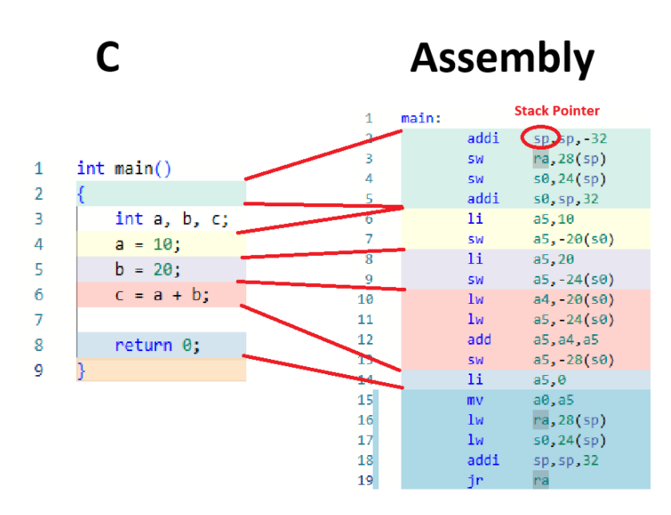
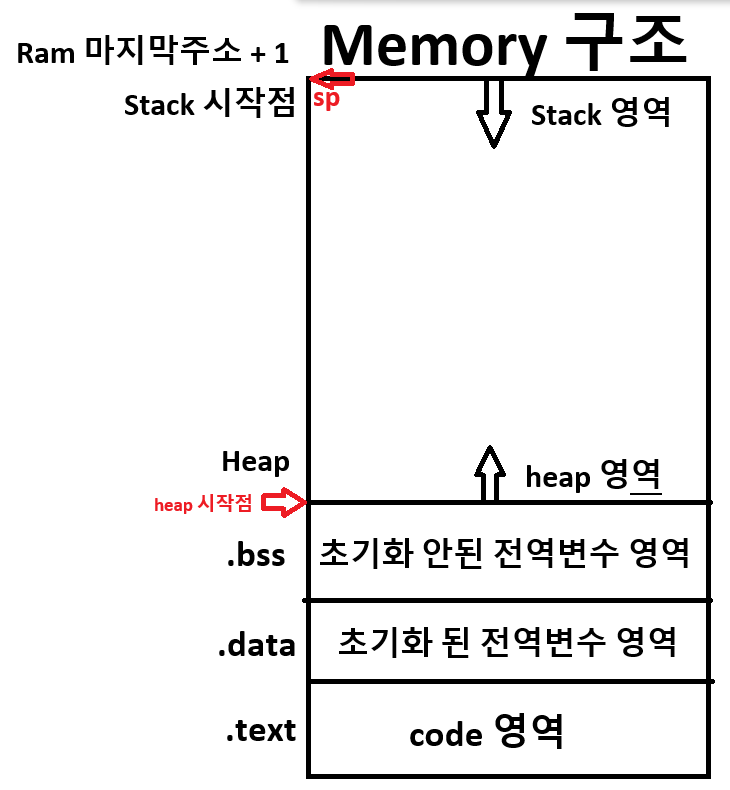
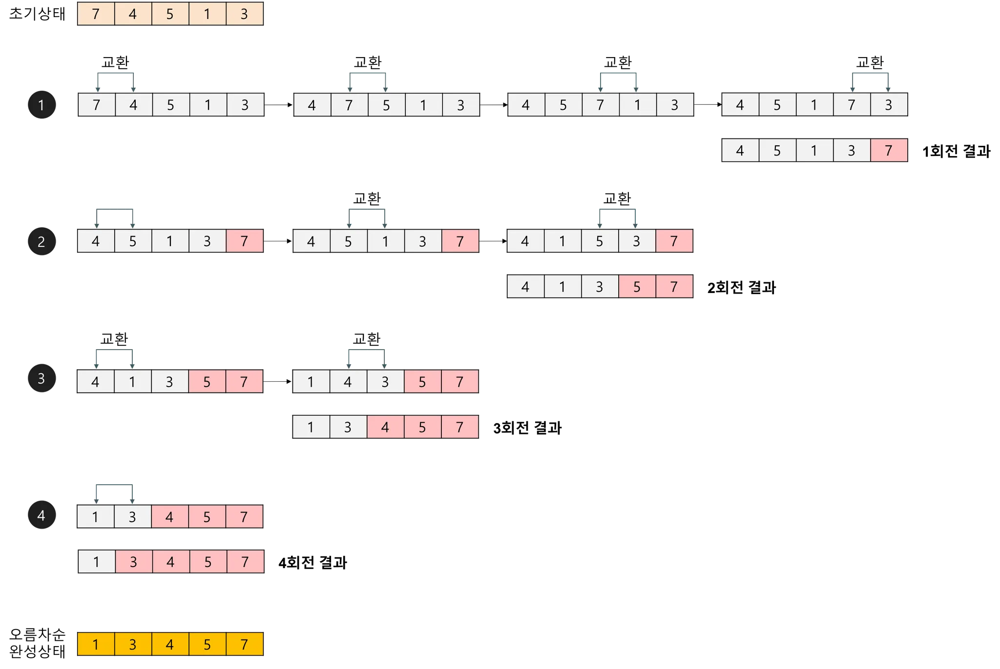

# Link

## C -> Assembly
https://godbolt.org/
## Assembly
https://riscvasm.lucasteske.dev/
## RISC-V 분석기(machine code)
https://luplab.gitlab.io/rvcodecjs/

첫 사이트에서 C언어 코드를 입력하면 어셈블리어로 자동으로 변경된다.
 

2번째 사이트에서 왼쪽에 어셈블리어를 입력하고 Build를 하게 되면.
아래와 같이 결과가 나온다.
 

3번째 부분의 코드를 보게 되면 머신코드가 어떤 부분 어셈블리어에서 변경되었는지 알 수 있다.

C -> 

Assembly -> 

machine code -> 


C 언어에서 Return은 JALR을 사용

## 주의점
해당 방식과 같이 sp 의 주소 또한 초기화 해 줘야한다.
```bash
		li		sp, 0x40   
main:
        addi    sp,sp,-32
        sw      ra,28(sp)
        sw      s0,24(sp)
        addi    s0,sp,32
        li      a5,10
        sw      a5,-20(s0)
        li      a5,20
        sw      a5,-24(s0)
        lw      a1,-24(s0)
        lw      a0,-20(s0)
        call    adder
        sw      a0,-28(s0)
        li      a5,0
        mv      a0,a5
        lw      ra,28(sp)
        lw      s0,24(sp)
        addi    sp,sp,32
        jr      ra
adder:
        addi    sp,sp,-32
        sw      ra,28(sp)
        sw      s0,24(sp)
        addi    s0,sp,32
        sw      a0,-20(s0)
        sw      a1,-24(s0)
        lw      a4,-20(s0)
        lw      a5,-24(s0)
        add     a5,a4,a5
        mv      a0,a5
        lw      ra,28(sp)
        lw      s0,24(sp)
        addi    sp,sp,32
        jr      ra
```

## 분석





# Home Work / RISC-V 어셈블리 코드 분석 및 C 코드 비교

## rom 쓰는 법
Create memory file을 같은 경로에 넣는다.
후에 code에서 다음과 같이 Hexa 형식으로 읽어 rom에 저장할 수 있다.


### C
```C
void sort(int *pData, int size);
void swap(int *pA, int *pB);

int main(){
    int arData[6] = {5, 4, 3, 2, 1};

    sort(arData, 5);

    return 0;
}

void sort(int *pData, int size){
    for (int i = 0; i < size; i++){
        for (int j = 0; j < size - i - 1; j++){
            if (pData[j] > pData[j + 1])
                swap(&pData[j], &pData[j+1]);  
        }
    }
}

void swap(int *pA, int *pB) {
    int temp;
    temp = *pA;
    *pA = *pB;
    *pB = temp;
}
```

### Assembly
```bash
main:
        addi    sp,sp,-48
        sw      ra,44(sp)
        sw      s0,40(sp)
        addi    s0,sp,48
        sw      zero,-40(s0)
        sw      zero,-36(s0)
        sw      zero,-32(s0)
        sw      zero,-28(s0)
        sw      zero,-24(s0)
        sw      zero,-20(s0)
        li      a5,5
        sw      a5,-40(s0)
        li      a5,4
        sw      a5,-36(s0)
        li      a5,3
        sw      a5,-32(s0)
        li      a5,2
        sw      a5,-28(s0)
        li      a5,1
        sw      a5,-24(s0)
        addi    a5,s0,-40
        li      a1,5
        mv      a0,a5
        call    sort
        li      a5,0
        mv      a0,a5
        lw      ra,44(sp)
        lw      s0,40(sp)
        addi    sp,sp,48
        jr      ra
sort:
        addi    sp,sp,-48
        sw      ra,44(sp)
        sw      s0,40(sp)
        addi    s0,sp,48
        sw      a0,-36(s0)
        sw      a1,-40(s0)
        sw      zero,-20(s0)
        j       .L4
.L8:
        sw      zero,-24(s0)
        j       .L5
.L7:
        lw      a5,-24(s0)
        slli    a5,a5,2
        lw      a4,-36(s0)
        add     a5,a4,a5
        lw      a4,0(a5)
        lw      a5,-24(s0)
        addi    a5,a5,1
        slli    a5,a5,2
        lw      a3,-36(s0)
        add     a5,a3,a5
        lw      a5,0(a5)
        ble     a4,a5,.L6
        lw      a5,-24(s0)
        slli    a5,a5,2
        lw      a4,-36(s0)
        add     a3,a4,a5
        lw      a5,-24(s0)
        addi    a5,a5,1
        slli    a5,a5,2
        lw      a4,-36(s0)
        add     a5,a4,a5
        mv      a1,a5
        mv      a0,a3
        call    swap
.L6:
        lw      a5,-24(s0)
        addi    a5,a5,1
        sw      a5,-24(s0)
.L5:
        lw      a4,-40(s0)
        lw      a5,-20(s0)
        sub     a5,a4,a5
        addi    a5,a5,-1
        lw      a4,-24(s0)
        blt     a4,a5,.L7
        lw      a5,-20(s0)
        addi    a5,a5,1
        sw      a5,-20(s0)
.L4:
        lw      a4,-20(s0)
        lw      a5,-40(s0)
        blt     a4,a5,.L8
        nop
        nop
        lw      ra,44(sp)
        lw      s0,40(sp)
        addi    sp,sp,48
        jr      ra
swap:
        addi    sp,sp,-48
        sw      ra,44(sp)
        sw      s0,40(sp)
        addi    s0,sp,48
        sw      a0,-36(s0)
        sw      a1,-40(s0)
        lw      a5,-36(s0)
        lw      a5,0(a5)
        sw      a5,-20(s0)
        lw      a5,-40(s0)
        lw      a4,0(a5)
        lw      a5,-36(s0)
        sw      a4,0(a5)
        lw      a5,-40(s0)
        lw      a4,-20(s0)
        sw      a4,0(a5)
        nop
        lw      ra,44(sp)
        lw      s0,40(sp)
        addi    sp,sp,48
        jr      ra
```

### DisAssembly
```bash

file.elf:     file format elf64-littleriscv


Disassembly of section .text:

0000000000000000 :
   0:	04000113          	li	sp,64

0000000000000004 
:
   4:	fd010113          	addi	sp,sp,-48
   8:	02112623          	sw	ra,44(sp)
   c:	02812423          	sw	s0,40(sp)
  10:	03010413          	addi	s0,sp,48
  14:	fc042c23          	sw	zero,-40(s0)
  18:	fc042e23          	sw	zero,-36(s0)
  1c:	fe042023          	sw	zero,-32(s0)
  20:	fe042223          	sw	zero,-28(s0)
  24:	fe042423          	sw	zero,-24(s0)
  28:	fe042623          	sw	zero,-20(s0)
  2c:	00500793          	li	a5,5
  30:	fcf42c23          	sw	a5,-40(s0)
  34:	00400793          	li	a5,4
  38:	fcf42e23          	sw	a5,-36(s0)
  3c:	00300793          	li	a5,3
  40:	fef42023          	sw	a5,-32(s0)
  44:	00200793          	li	a5,2
  48:	fef42223          	sw	a5,-28(s0)
  4c:	00100793          	li	a5,1
  50:	fef42423          	sw	a5,-24(s0)
  54:	fd840793          	addi	a5,s0,-40
  58:	00500593          	li	a1,5
  5c:	00078513          	mv	a0,a5
  60:	01c000ef          	jal	ra,7c 
  64:	00000793          	li	a5,0
  68:	00078513          	mv	a0,a5
  6c:	02c12083          	lw	ra,44(sp)
  70:	02812403          	lw	s0,40(sp)
  74:	03010113          	addi	sp,sp,48
  78:	00008067          	ret

000000000000007c :
  7c:	fd010113          	addi	sp,sp,-48
  80:	02112623          	sw	ra,44(sp)
  84:	02812423          	sw	s0,40(sp)
  88:	03010413          	addi	s0,sp,48
  8c:	fca42e23          	sw	a0,-36(s0)
  90:	fcb42c23          	sw	a1,-40(s0)
  94:	fe042623          	sw	zero,-20(s0)
  98:	09c0006f          	j	134 
  9c:	fe042423          	sw	zero,-24(s0)
  a0:	0700006f          	j	110 
  a4:	fe842783          	lw	a5,-24(s0)
  a8:	00279793          	slli	a5,a5,0x2
  ac:	fdc42703          	lw	a4,-36(s0)
  b0:	00f707b3          	add	a5,a4,a5
  b4:	0007a703          	lw	a4,0(a5)
  b8:	fe842783          	lw	a5,-24(s0)
  bc:	00178793          	addi	a5,a5,1
  c0:	00279793          	slli	a5,a5,0x2
  c4:	fdc42683          	lw	a3,-36(s0)
  c8:	00f687b3          	add	a5,a3,a5
  cc:	0007a783          	lw	a5,0(a5)
  d0:	02e7da63          	ble	a4,a5,104 
  d4:	fe842783          	lw	a5,-24(s0)
  d8:	00279793          	slli	a5,a5,0x2
  dc:	fdc42703          	lw	a4,-36(s0)
  e0:	00f706b3          	add	a3,a4,a5
  e4:	fe842783          	lw	a5,-24(s0)
  e8:	00178793          	addi	a5,a5,1
  ec:	00279793          	slli	a5,a5,0x2
  f0:	fdc42703          	lw	a4,-36(s0)
  f4:	00f707b3          	add	a5,a4,a5
  f8:	00078593          	mv	a1,a5
  fc:	00068513          	mv	a0,a3
 100:	058000ef          	jal	ra,158 
 104:	fe842783          	lw	a5,-24(s0)
 108:	00178793          	addi	a5,a5,1
 10c:	fef42423          	sw	a5,-24(s0)
 110:	fd842703          	lw	a4,-40(s0)
 114:	fec42783          	lw	a5,-20(s0)
 118:	40f707b3          	sub	a5,a4,a5
 11c:	fff78793          	addi	a5,a5,-1
 120:	fe842703          	lw	a4,-24(s0)
 124:	f8f740e3          	blt	a4,a5,a4 
 128:	fec42783          	lw	a5,-20(s0)
 12c:	00178793          	addi	a5,a5,1
 130:	fef42623          	sw	a5,-20(s0)
 134:	fec42703          	lw	a4,-20(s0)
 138:	fd842783          	lw	a5,-40(s0)
 13c:	f6f740e3          	blt	a4,a5,9c 
 140:	00000013          	nop
 144:	00000013          	nop
 148:	02c12083          	lw	ra,44(sp)
 14c:	02812403          	lw	s0,40(sp)
 150:	03010113          	addi	sp,sp,48
 154:	00008067          	ret

0000000000000158 :
 158:	fd010113          	addi	sp,sp,-48
 15c:	02112623          	sw	ra,44(sp)
 160:	02812423          	sw	s0,40(sp)
 164:	03010413          	addi	s0,sp,48
 168:	fca42e23          	sw	a0,-36(s0)
 16c:	fcb42c23          	sw	a1,-40(s0)
 170:	fdc42783          	lw	a5,-36(s0)
 174:	0007a783          	lw	a5,0(a5)
 178:	fef42623          	sw	a5,-20(s0)
 17c:	fd842783          	lw	a5,-40(s0)
 180:	0007a703          	lw	a4,0(a5)
 184:	fdc42783          	lw	a5,-36(s0)
 188:	00e7a023          	sw	a4,0(a5)
 18c:	fd842783          	lw	a5,-40(s0)
 190:	fec42703          	lw	a4,-20(s0)
 194:	00e7a023          	sw	a4,0(a5)
 198:	00000013          	nop
 19c:	02c12083          	lw	ra,44(sp)
 1a0:	02812403          	lw	s0,40(sp)
 1a4:	03010113          	addi	sp,sp,48
 1a8:	00008067          	ret

Disassembly of section .heap:

0000000000010000 <_sheap>:
	...

Disassembly of section .stack:

0000000000010200 <_estack>:
	...
```

## Buble Sort
**버블 정렬(bubble sort) 알고리즘의 개념 요약**
서로 인접한 두 원소를 검사하여 정렬하는 알고리즘
인접한 2개의 레코드를 비교하여 크기가 순서대로 되어 있지 않으면 서로 교환한다.
선택 정렬과 기본 개념이 유사하다.

**버블 정렬(bubble sort) 알고리즘의 구체적인 개념**
버블 정렬은 첫 번째 자료와 두 번째 자료를, 두 번째 자료와 세 번째 자료를, 세 번째와 네 번째를, … 이런 식으로 (마지막-1)번째 자료와 마지막 자료를 비교하여 교환하면서 자료를 정렬한다.

1회전을 수행하고 나면 가장 큰 자료가 맨 뒤로 이동하므로 2회전에서는 맨 끝에 있는 자료는 정렬에서 제외되고, 2회전을 수행하고 나면 끝에서 두 번째 자료까지는 정렬에서 제외된다. 이렇게 정렬을 1회전 수행할 때마다 정렬에서 제외되는 데이터가 하나씩 늘어난다.

**버블 정렬(bubble sort) 알고리즘의 예제**


배열에 7, 4, 5, 1, 3이 저장되어 있다고 가정하고 자료를 오름차순으로 정렬해 보자.

1회전
첫 번째 자료 7을 두 번째 자료 4와 비교하여 교환하고, 두 번째의 7과 세 번째의 5를 비교하여 교환하고, 세 번째의 7과 네 번째의 1을 비교하여 교환하고, 네 번째의 7과 다섯 번째의 3을 비교하여 교환한다. 이 과정에서 자료를 네 번 비교한다. 그리고 가장 큰 자료가 맨 끝으로 이동하므로 다음 회전에서는 맨 끝에 있는 자료는 비교할 필요가 없다.

2회전
첫 번째의 4을 두 번째 5와 비교하여 교환하지 않고, 두 번째의 5와 세 번째의 1을 비교하여 교환하고, 세 번째의 5와 네 번째의 3을 비교하여 교환한다. 이 과정에서 자료를 세 번 비교한다. 비교한 자료 중 가장 큰 자료가 끝에서 두 번째에 놓인다.

3회전
첫 번째의 4를 두 번째 1과 비교하여 교환하고, 두 번째의 4와 세 번째의 3을 비교하여 교환한다. 이 과정에서 자료를 두 번 비교한다. 비교한 자료 중 가장 큰 자료가 끝에서 세 번째에 놓인다.

4회전
첫 번째의 1과 두 번째의 3을 비교하여 교환하지 않는다.

### 멸령어
| 명령어 | 내부 변환 | 역할 |
| --- | --- | --- |
| `ret` | `jalr zero, 0(ra)` | `ra` 값(복귀 주소)로 점프 |
| `mv` | `addi rd, rs, 0` | `rs` 값을 `rd`로 복사 |
| `li` | `addi rd, x0, imm` 또는 `lui + addi` | 즉시 값을 레지스터에 로드 |
| `j` | `jal zero, offset` | 절대 주소로 점프 (복귀 주소 저장 안 함) |