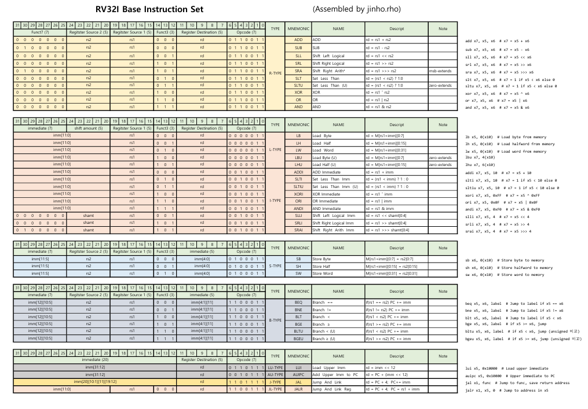
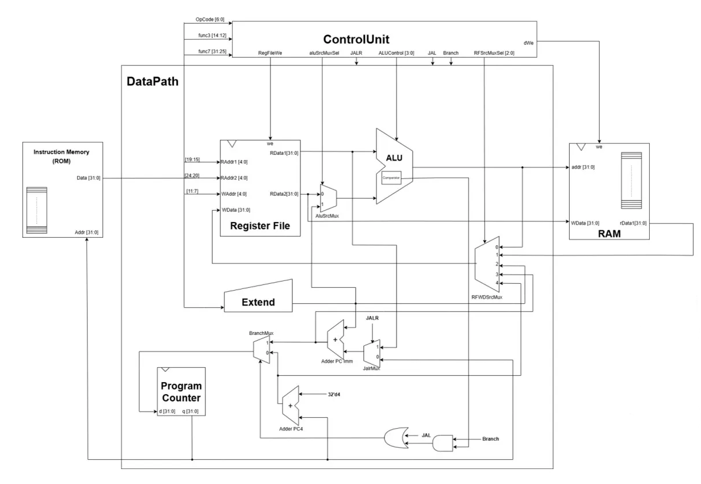
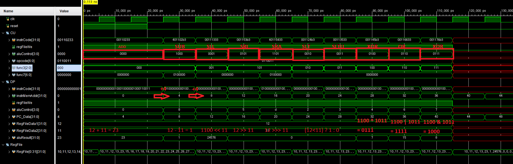
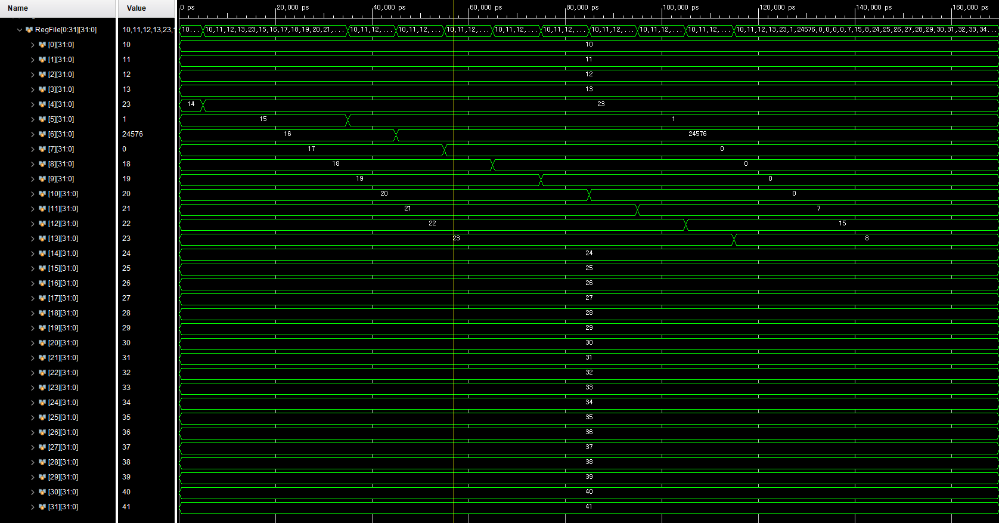

# RV32I Base Instruction Set


## Block Diagram


## Single-Cycle vs Multi-Cycle

**Single**: 모든명령어가 1clk에 동작
> 장점: 구조가 매우 심플
> 
> 단점: 느리다

**Multi**: 명령어 Type 별로 동작 clkock이 다르다.
>장점: Single보다 조금 빠르다
>
>단점: 구조가 조금 더 복잡하다.

## CPU 기본 모듈 <하버드 구조>
- Register File
- ALU
- ROM/Flash (Instruction Memory)
- RAM (Data Memory)
- PC (Program Counter)

# R-Type

## MCU.sv
```verilog
`timescale 1ns / 1ps

module MCU (
    input logic clk,
    input logic reset
);
    logic [31:0] instrCode;
    logic [31:0] instrMemAddr;

    CPU_RV32i U_RV32I (
        .clk(clk),
        .reset(reset),
        .instrCode(instrCode),
        .instrMemAddr(instrMemAddr)
    );

    rom U_ROM (
        .addr(instrMemAddr),
        .data(instrCode)
    );
endmodule
```

## CPU_RV32i.sv
```verilog
`timescale 1ns / 1ps

module CPU_RV32i (
    input logic clk,
    input logic reset,
    input logic [31:0] instrCode,
    output logic [31:0] instrMemAddr
);
    logic       regFileWe;
    logic [3:0] aluControl;

    ControlUnit U_CU (.*);
    DataPath U_DP (.*);

endmodule
```

## rom.sv
```verilog
`timescale 1ns / 1ps

module rom(
    input logic [31:0] addr,
    output logic [31:0] data
);
    logic [31:0] rom[0:61];

    initial begin
        //rom[x] = 32'b fucn7 _ rs2 _ rs1 _ func3 _ rd _ opcode; // r type
        rom[0] = 32'b0000000_00001_00010_000_00100_0110011;  // add  x4,  x2, x1    23 = 12 + 11
        rom[1] = 32'b0100000_00001_00010_000_00101_0110011;  // sub  x5,  x2, x1    1  = 12 - 11
        rom[2] = 32'b0000000_00001_00010_001_00110_0110011;  // sll  x6,  x2, x1    24576 = 12 << 11  -> 1100(12를 bit로) << 11
        rom[3] = 32'b0000000_00001_00010_101_00111_0110011;  // srl  x7,  x2, x1    0  = 12 >> 11 
        rom[4] = 32'b0100000_00001_00010_101_01000_0110011;  // sra  x8,  x2, x1    0  = 12 >>> 11 
        rom[5] = 32'b0000000_00001_00010_010_01001_0110011;  // slt  x9,  x2, x1    0  = (12 < 11) ? 1 : 0 
        rom[6] = 32'b0000000_00001_00010_011_01010_0110011;  // sltu x10, x2, x1    0  = (12 < 11) ? 1 : 0
        rom[7] = 32'b0000000_00001_00010_100_01011_0110011;  // xor  x11, x2, x1    0111(7)  = 1100 ^ 1011 
        rom[8] = 32'b0000000_00001_00010_110_01100_0110011;  // or   x12, x2, x1    1111(15) = 1100 | 1011
        rom[9] = 32'b0000000_00001_00010_111_01101_0110011;  // and  x13, x2, x1    1000(8)  = 1100 & 1011
    end

    assign data = rom[addr[31:2]]; // 계산하기 쉽게 하기 위해 >> 2^2을 해준 느낌 즉 4로 나누기
                                   // 4의 배수로 가기위해 하위 두비트 버림
endmodule
```

## ControlUnit.sv
```verilog
`timescale 1ns / 1ps

`include "Defines.sv"

module ControlUnit (
    input  logic [31:0] instrCode,
    output logic        regFileWe,
    output logic [ 3:0] aluControl
);
    wire [6:0] opcode = instrCode[6:0];
    wire [2:0] func3 = instrCode[14:12];
    wire [6:0] func7 = instrCode[31:25];

    always_comb begin
        case (opcode)
            `OP_TYPE_R:  regFileWe = 1'b1;
            `OP_TYPE_L:  regFileWe = 1'b1;
            `OP_TYPE_I:  regFileWe = 1'b1;
            `OP_TYPE_S:  regFileWe = 1'b1;
            `OP_TYPE_B:  regFileWe = 1'b1;
            `OP_TYPE_LU: regFileWe = 1'b1;
            `OP_TYPE_AU: regFileWe = 1'b1;
            `OP_TYPE_J:  regFileWe = 1'b1;
            `OP_TYPE_JL: regFileWe = 1'b1;
            default:     regFileWe = 1'b0;
        endcase
    end

    always_comb begin
        case (opcode)
            `OP_TYPE_R:  aluControl = {func7[5], func3};
            `OP_TYPE_L:  aluControl = {func7[5], func3};
            `OP_TYPE_I:  aluControl = {func7[5], func3};
            `OP_TYPE_S:  aluControl = {func7[5], func3};
            `OP_TYPE_B:  aluControl = {func7[5], func3};
            `OP_TYPE_LU: aluControl = {func7[5], func3};
            `OP_TYPE_AU: aluControl = {func7[5], func3};
            `OP_TYPE_J:  aluControl = {func7[5], func3};
            `OP_TYPE_JL: aluControl = {func7[5], func3};
            default:     aluControl = 3'bx;
        endcase
    end
endmodule
```

## DataPath
```verilog
`timescale 1ns / 1ps

`include "Defines.sv"

module DataPath (
    input  logic        clk,
    input  logic        reset,
    input  logic [31:0] instrCode,
    output logic [31:0] instrMemAddr,
    input  logic        regFileWe,
    input  logic [ 3:0] aluControl
);

    logic [31:0] PC_Data, RegFileData1, RegFileData2, aluResult;

    register U_PC (
        .clk(clk),
        .reset(reset),
        .d(PC_Data),
        .q(instrMemAddr)
    );

    adder U_Adder_PC (
        .a(instrMemAddr),
        .b(32'd4),
        .y(PC_Data)
    );

    RegisterFile U_RegFile (
        .clk(clk),
        .we(regFileWe),
        .RAddr1(instrCode[19:15]),
        .RAddr2(instrCode[24:20]),
        .WAddr(instrCode[11:7]),
        .WData(aluResult),
        .RData1(RegFileData1),
        .RData2(RegFileData2)
    );

    alu U_ALU (
        .aluControl(aluControl),
        .a(RegFileData1),
        .b(RegFileData2),
        .result(aluResult)
    );

endmodule


module alu (
    input  logic [ 3:0] aluControl,
    input  logic [31:0] a,
    input  logic [31:0] b,
    output logic [31:0] result
);
    always_comb begin
        case (aluControl)
            `ADD:    result = a + b;
            `SUB:    result = a - b;
            `SLL:    result = a << b[4:0];
            `SRL:    result = a >> b[4:0];
            `SRA:    result = $signed(a) >>> b[4:0];
            `SLT:    result = ($signed(a) < $signed(b)) ? 1 : 0;
            `SLTU:   result = (a < b) ? 1 : 0;
            `XOR:    result = a ^ b;
            `OR:     result = a | b;
            `AND:    result = a & b;
            default: result = 32'bx;
        endcase
    end
endmodule

module register (
    input logic clk,
    input logic reset,
    input logic [31:0] d,
    output logic [31:0] q
);
    always_ff @(posedge clk, posedge reset) begin
        if (reset) q <= 0;
        else q <= d;
    end
endmodule

module adder (
    input  logic [31:0] a,
    input  logic [31:0] b,
    output logic [31:0] y
);
    assign y = a + b;
endmodule

module RegisterFile (
    input  logic        clk,
    input  logic        we,
    input  logic [ 4:0] RAddr1,
    input  logic [ 4:0] RAddr2,
    input  logic [ 4:0] WAddr,
    input  logic [31:0] WData,
    output logic [31:0] RData1,
    output logic [31:0] RData2
);
    logic [31:0] RegFile[0:2**5-1];

    // sim test
    initial begin
        for (int i = 0; i < 32; i++) begin
            RegFile[i] = 10 + i;
        end
    end

    always_ff @(posedge clk) begin
        if (we) RegFile[WAddr] <= WData;
    end

    assign RData1 = (RAddr1 != 0) ? RegFile[RAddr1] : 0;
    assign RData2 = (RAddr2 != 0) ? RegFile[RAddr2] : 0;
endmodule
```

## Define.sv
```verilog
`define ADD 4'b0000
`define SUB 4'b1000
`define SLL 4'b0001
`define SRL 4'b0101
`define SRA 4'b1101
`define SLT 4'b0010
`define SLTU 4'b0011
`define XOR 4'b0100
`define OR 4'b0110
`define AND 4'b0111

`define OP_TYPE_R 7'b0110011
`define OP_TYPE_L 7'b0000011
`define OP_TYPE_I 7'b0010011
`define OP_TYPE_S 7'b0100011
`define OP_TYPE_B 7'b1100011
`define OP_TYPE_LU 7'b0110111
`define OP_TYPE_AU 7'b0010111
`define OP_TYPE_J 7'b1101111
`define OP_TYPE_JL 7'b1100111
```

## 결과 
```
add  x4,  x2, x1    23 = 12 + 11
sub  x5,  x2, x1    1  = 12 - 11
sll  x6,  x2, x1    24576 = 12 << 11  -> 1100(12를 bit로) << 11
srl  x7,  x2, x1    0  = 12 >> 11 
sra  x8,  x2, x1    0  = 12 >>> 11 
slt  x9,  x2, x1    0  = (12 < 11) ? 1 : 0 
sltu x10, x2, x1    0  = (12 < 11) ? 1 : 0
xor  x11, x2, x1    0111(7)  = 1100 ^ 1011 
or   x12, x2, x1    1111(15) = 1100 | 1011
and  x13, x2, x1    1000(8)  = 1100 & 1011
```
해당 표와 비교해 볼 수 있다.



