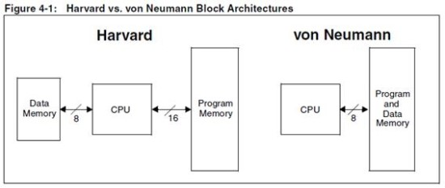

# RISC vs CISC 차이

## 1. 설계 철학

| 구분 | RISC (Reduced Instruction Set Computer) | CISC (Complex Instruction Set Computer) |
|------|----------------------------------------|-----------------------------------------|
| 핵심 아이디어 | 간단하고 빠른 명령어를 적게 제공 → 실행 속도 향상, 파이프라이닝 최적화 | 다양한 복잡한 명령어 제공 → 한 명령으로 많은 작업 수행 |
| 목표 | 하드웨어 단순화, 클럭당 실행 명령 수 향상 | 프로그램 코드 길이 단축, 소프트웨어 개발 단순화(과거 기준) |

---

## 2. 명령어 구조

| 구분 | RISC | CISC |
|------|------|------|
| 명령어 개수 | 적음 (수십 개 수준) | 많음 (수백 개 이상) |
| 명령어 길이 | 고정 길이 (예: 32비트) → 디코딩 단순 | 가변 길이 (1~15바이트 등) → 디코딩 복잡 |
| 실행 시간 | 대부분 1클럭 (load/store 제외) | 명령어마다 실행 클럭 수 다름 |
| 주소 지정 방식 | 소수 (Load/Store 중심) | 다양 (메모리 직접 연산 가능) |
| 메모리 접근 | Load/Store 방식 (메모리 접근은 별도 명령) | 명령어가 직접 메모리 접근 가능 |

---

## 3. 하드웨어와 소프트웨어 역할

- **RISC**
  - 하드웨어 단순
  - 명령어 단순 → 복잡한 기능은 소프트웨어(컴파일러)가 여러 명령으로 조합
  - 파이프라인 효율 높음
- **CISC**
  - 하드웨어 복잡
  - 명령어 자체가 여러 연산 포함
  - 어셈블리 코드가 짧아짐 (메모리 절약 장점)

---

## 4. 대표 예시

| RISC | CISC |
|------|------|
| ARM, MIPS, RISC-V, SPARC, PowerPC | x86, x86-64, VAX, Motorola 68000 |

---

## 5. 요약 비교표

| 특징 | RISC | CISC |
|------|------|------|
| 명령어 수 | 적음 | 많음 |
| 명령어 길이 | 고정 | 가변 |
| 실행 속도 | 빠름 (단순 연산 다수) | 느림 (복잡 연산 일부) |
| 파이프라인 효율 | 높음 | 낮음 |
| 하드웨어 복잡도 | 낮음 | 높음 |
| 소프트웨어 복잡도 | 높음 | 낮음(과거 기준) |

---

## 💡 정리

- **RISC**: "간단한 명령어 + 빠른 실행 + 파이프라인 최적화" → 현대 모바일·임베디드 CPU(ARM, RISC-V)에서 주로 사용
- **CISC**: "복잡한 명령어 + 코드 길이 절약" → 데스크톱·서버 CPU(x86)에서 강세
- 최신 x86 CPU는 내부적으로 RISC와 유사한 **마이크로-오퍼레이션(uOp) 변환** 구조 사용 → 두 구조의 경계가 흐려짐

# 폰 노이만 구조 vs 하버드 구조

## 1. 개념

| 구조 | 개념 |
|------|------|
| **폰 노이만 구조** | 프로그램 코드와 데이터를 **같은 메모리**에 저장, 하나의 버스를 통해 CPU와 메모리를 연결 |
| **하버드 구조** | 프로그램 코드와 데이터를 **서로 다른 메모리**에 저장, 각각 독립된 버스를 사용 |

---

## 2. 구조도

### 폰 노이만 & 하버드 구조

**폰 노이만 구조**

**하버드 구조**

## 3. 특징 비교

| 구분 | 폰 노이만 구조 | 하버드 구조 |
|------|---------------|-------------|
| 메모리 구성 | 코드와 데이터가 같은 메모리 | 코드와 데이터가 분리된 메모리 |
| 버스 구조 | 단일 버스 | 명령어 버스와 데이터 버스 분리 |
| 동시 접근 | 불가능 (한 번에 명령어 또는 데이터) | 가능 (명령어와 데이터 동시에 접근) |
| 하드웨어 복잡도 | 단순 | 복잡 |
| 속도 | 상대적으로 느림 (버스 병목, Von Neumann bottleneck) | 빠름 (병목 완화) |
| 예시 | 대부분의 범용 CPU(x86, ARM의 대부분) | DSP, 일부 마이크로컨트롤러(AVR, PIC 등) |

---

## 4. 정리

- **폰 노이만 구조**: 단순하고 구현이 쉬움 → 범용 컴퓨터, 서버, PC에서 주로 사용  
- **하버드 구조**: 명령어와 데이터를 동시에 가져올 수 있어 성능 우수 → 실시간 처리, 임베디드, DSP에서 활용  
- 현대 CPU는 **수정된 하버드 구조(Modified Harvard)**를 사용하여 캐시 단계에서 분리 후 통합

# 수업

## C언어로 0~9를 count 하는 processor
