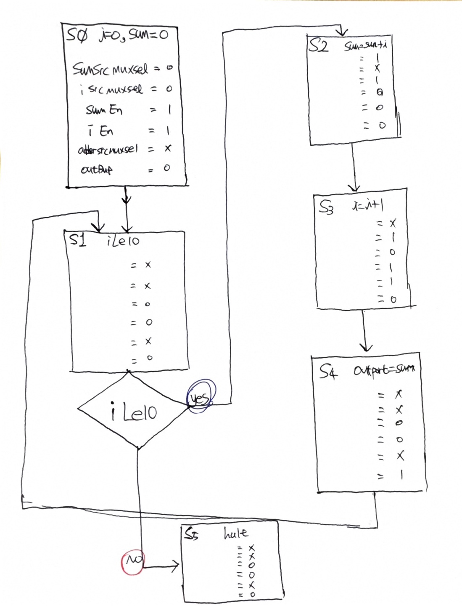

# 0~10까지 전부 더하기
```
i = 0;
sum = 0;
while(i<=10) {
    sum = sum + i;
    i = i + 1;
    outport = sum;
}
halt;
```
## DataPath


## Control Unit 위한 State 및 Signal


이때, **i = i + 1 (S3 state)** 에서 **OutBuf가 1**이면, **Outport=sum(S4)** 를 줄이고 동작에 이상 없게 할 수 있다.




## top_sum.sv
```verilog
module ControlUnit (
    input  logic       clk,
    input  logic       reset,
    input  logic       ILte10,
    input  logic [7:0] OutPort,
    output logic       SumSrcMuxSel,
    output logic       ISrcMuxSel,
    output logic       SumEn,
    output logic       IEn,
    output logic       AdderSrcMuxSel,
    output logic       OutPortEn
);
    typedef enum {
        S0,
        S1,
        S2,
        S3,
        S4,
        S5
    } state_e;

    state_e state, next_state;

    always_ff @(posedge clk, posedge reset) begin
        if (reset) begin
            state <= S0;
        end else begin
            state <= next_state;
        end
    end

    always_comb begin
        next_state     = state;
        SumSrcMuxSel   = 0;
        ISrcMuxSel     = 0;
        SumEn          = 0;
        IEn            = 0;
        AdderSrcMuxSel = 0;
        OutPortEn      = 0;
        case (state)
            S0: begin
                SumSrcMuxSel   = 0;
                ISrcMuxSel     = 0;
                SumEn          = 1;
                IEn            = 1;
                AdderSrcMuxSel = 0;
                OutPortEn      = 0;
                next_state     = S1;
            end
            S1: begin
                SumSrcMuxSel   = 0;
                ISrcMuxSel     = 0;
                SumEn          = 0;
                IEn            = 0;
                AdderSrcMuxSel = 0;
                OutPortEn      = 0;
                if (ILte10) begin
                    next_state = S2;
                end else begin
                    next_state = S5;
                end
            end
            S2: begin
                SumSrcMuxSel   = 1;
                ISrcMuxSel     = 1;
                SumEn          = 1;
                IEn            = 0;
                AdderSrcMuxSel = 0;
                OutPortEn      = 0;
                next_state     = S3;
            end
            S3: begin
                SumSrcMuxSel   = 1;
                ISrcMuxSel     = 1;
                SumEn          = 0;
                IEn            = 1;
                AdderSrcMuxSel = 1;
                OutPortEn      = 0;
                next_state     = S4;
            end
            S4: begin
                SumSrcMuxSel   = 1;
                ISrcMuxSel     = 1;
                SumEn          = 0;
                IEn            = 0;
                AdderSrcMuxSel = 0;
                OutPortEn      = 1;
                next_state     = S1;
            end
            S5: begin
                SumSrcMuxSel   = 1;
                ISrcMuxSel     = 1;
                SumEn          = 0;
                IEn            = 0;
                AdderSrcMuxSel = 0;
                OutPortEn      = 0;
                next_state     = S5;
            end
        endcase
    end
endmodule
```

## DedicatedProcessor_Sum.sv
```verilog
`timescale 1ns / 1ps

module DedicatedProcessor_Sum (
    input  logic       clk,
    input  logic       reset,
    output logic [7:0] OutPort
);
    logic SumSrcMuxSel;
    logic ISrcMuxSel;
    logic SumEn;
    logic IEn;
    logic AdderSrcMuxSel;
    logic OutPortEn;
    logic ILte10;

    DataPath U_DP (.*);

    ControlUnit U_CU (.*);

endmodule
```

## ControlUnit.sv
```verilog
module ControlUnit (
    input  logic       clk,
    input  logic       reset,
    input  logic       ILte10,
    input  logic [7:0] OutPort,
    output logic       SumSrcMuxSel,
    output logic       ISrcMuxSel,
    output logic       SumEn,
    output logic       IEn,
    output logic       AdderSrcMuxSel,
    output logic       OutPortEn
);
    typedef enum {
        S0,
        S1,
        S2,
        S3,
        S4,
        S5
    } state_e;

    state_e state, next_state;

    always_ff @(posedge clk, posedge reset) begin
        if (reset) begin
            state <= S0;
        end else begin
            state <= next_state;
        end
    end

    always_comb begin
        next_state     = state;
        SumSrcMuxSel   = 0;
        ISrcMuxSel     = 0;
        SumEn          = 0;
        IEn            = 0;
        AdderSrcMuxSel = 0;
        OutPortEn      = 0;
        case (state)
            S0: begin
                SumSrcMuxSel   = 0;
                ISrcMuxSel     = 0;
                SumEn          = 1;
                IEn            = 1;
                AdderSrcMuxSel = 0;
                OutPortEn      = 0;
                next_state     = S1;
            end
            S1: begin
                SumSrcMuxSel   = 0;
                ISrcMuxSel     = 0;
                SumEn          = 0;
                IEn            = 0;
                AdderSrcMuxSel = 0;
                OutPortEn      = 0;
                if (ILte10) begin
                    next_state = S2;
                end else begin
                    next_state = S5;
                end
            end
            S2: begin
                SumSrcMuxSel   = 1;
                ISrcMuxSel     = 1;
                SumEn          = 1;
                IEn            = 0;
                AdderSrcMuxSel = 0;
                OutPortEn      = 0;
                next_state     = S3;
            end
            S3: begin
                SumSrcMuxSel   = 1;
                ISrcMuxSel     = 1;
                SumEn          = 0;
                IEn            = 1;
                AdderSrcMuxSel = 1;
                OutPortEn      = 0;
                next_state     = S4;
            end
            S4: begin
                SumSrcMuxSel   = 1;
                ISrcMuxSel     = 1;
                SumEn          = 0;
                IEn            = 0;
                AdderSrcMuxSel = 0;
                OutPortEn      = 1;
                next_state     = S1;
            end
            S5: begin
                SumSrcMuxSel   = 1;
                ISrcMuxSel     = 1;
                SumEn          = 0;
                IEn            = 0;
                AdderSrcMuxSel = 0;
                OutPortEn      = 0;
                next_state     = S5;
            end
        endcase
    end
endmodule
```

## DataPath.sv
```verilog
`timescale 1ns / 1ps

module DataPath (
    input  logic       clk,
    input  logic       reset,
    input  logic       SumSrcMuxSel,
    input  logic       ISrcMuxSel,
    input  logic       SumEn,
    input  logic       IEn,
    input  logic       AdderSrcMuxSel,
    input  logic       OutPortEn,
    output logic       ILte10,
    output logic [7:0] OutPort
);

    logic [7:0] SumSrcMuxOut, SumRegOut;
    logic [7:0] ISrcMuxOut, IRegOut;
    logic [7:0] AdderResult, AdderSrcMuxOut;

    mux_2x1 U_SumSrcMux (
        .sel(SumSrcMuxSel),
        .x0 (0),
        .x1 (AdderResult),
        .y  (SumSrcMuxOut)
    );

    mux_2x1 U_ISrcMux (
        .sel(ISrcMuxSel),
        .x0 (0),
        .x1 (AdderResult),
        .y  (ISrcMuxOut)
    );

    register Sum_Reg (
        .clk  (clk),
        .reset(reset),
        .en   (SumEn),
        .d    (SumSrcMuxOut),
        .q    (SumRegOut)
    );

    register I_Reg (
        .clk  (clk),
        .reset(reset),
        .en   (IEn),
        .d    (ISrcMuxOut),
        .q    (IRegOut)
    );

    comparator I_Lte10 (
        .a  (IRegOut),
        .b  (10),
        .lte(ILte10)
    );

    mux_2x1 U_AdderSrcMux (
        .sel(AdderSrcMuxSel),
        .x0 (SumRegOut),
        .x1 (1),
        .y  (AdderSrcMuxOut)
    );

    adder U_Adder (
        .a  (AdderSrcMuxOut),
        .b  (IRegOut),
        .sum(AdderResult)
    );

    register U_OutPort (
        .clk  (clk),
        .reset(reset),
        .en   (OutPortEn),
        .d    (SumRegOut),
        .q    (OutPort)
    );

endmodule


/////////////////////////////////////////////////////////////////////////

module register (
    input  logic       clk,
    input  logic       reset,
    input  logic       en,
    input  logic [7:0] d,
    output logic [7:0] q
);
    always_ff @(posedge clk, posedge reset) begin
        if (reset) begin
            q <= 0;
        end else begin
            if (en) begin
                q <= d;
            end
        end
    end
endmodule


module mux_2x1 (
    input  logic       sel,
    input  logic [7:0] x0,
    input  logic [7:0] x1,
    output logic [7:0] y
);
    always_comb begin
        y = 8'b0;
        case (sel)
            1'b0: y = x0;
            1'b1: y = x1;
        endcase
    end
endmodule


module adder (
    input  logic [7:0] a,
    input  logic [7:0] b,
    output logic [7:0] sum
);
    assign sum = a + b;
endmodule


module comparator (
    input  logic [7:0] a,
    input  logic [7:0] b,
    output logic       lte
);
    assign lte = a <= b;
endmodule


// module OutBuf (
//     input  logic       en,
//     input  logic [7:0] x,
//     output logic [7:0] y
// );
//     assign y = en ? x : 8'bx;
// endmodule
```


# Home Work 1
**Register File** 을 만들어, 동작 기능


# Home Work 2
**ALU** 기능을 만들어 **ALUop 2bit** 를 통해 +, -, &, | 연산을 추가하기


## ASM


## 예측 결과 
```
# 반복별 요약(각 반복의 마지막 상태)

* 1회: R1=3,  R2=2,  R3=3,  R4=5   → `R4>R2` Yes
* 2회: R1=7,  R2=6,  R3=9,  R4=15  → Yes
* 3회: R1=15, R2=14, R3=21, R4=35  → Yes
* 4회: R1=31, R2=30, R3=45, R4=75  → Yes
* 5회: R1=63, R2=62, R3=93, R4=155 → Yes
* 6회: R1=127,R2=126,R3=189,R4=59  → **No ⇒ halt**

# 전체 계산 로그(각 단계 값)

**반복 1**

* start: (R1, R2, R3, R4) = (1, 0, 0, 0)
* R2 = R1+R1 → (1, 2, 0, 0)
* R3 = R2+R1 → (1, 2, 3, 0)
* R4 = R3−R1 → (1, 2, 3, 2)
* R1 = R1 | R2 → (3, 2, 3, 2)
* (첫 비교 `R4<R2`는 통과만)
* R4 = R4 & R3 → (3, 2, 3, 2)
* R4 = R2+R3 → (3, 2, 3, 5)
* 체크 `R4>R2` = 5>2 → **Yes**

**반복 2**

* start: (3, 2, 3, 5)
* R2=R1+R1 → (3, 6, 3, 5)
* R3=R2+R1 → (3, 6, 9, 5)
* R4=R3−R1 → (3, 6, 9, 6)
* R1=R1|R2 → (7, 6, 9, 6)
* R4=R4\&R3 → (7, 6, 9, 0x06&0x09=0x00? 아님 6&9=0) → (7, 6, 9, 0)
* R4=R2+R3 → (7, 6, 9, 15)
* 체크 15>6 → **Yes**

**반복 3**

* start: (7, 6, 9, 15)
* R2=14 → (7,14,9,15)
* R3=21 → (7,14,21,15)
* R4=14 → (7,14,21,14)
* R1=15 → (15,14,21,14)
* R4=14&21=4 → (15,14,21,4)
* R4=14+21=35 → (15,14,21,35)
* 체크 35>14 → **Yes**

**반복 4**

* start: (15,14,21,35)
* R2=30 → (15,30,21,35)
* R3=45 → (15,30,45,35)
* R4=30 → (15,30,45,30)
* R1=31 → (31,30,45,30)
* R4=30&45=12 → (31,30,45,12)
* R4=30+45=75 → (31,30,45,75)
* 체크 75>30 → **Yes**

**반복 5**

* start: (31,30,45,75)
* R2=62 → (31,62,45,75)
* R3=93 → (31,62,93,75)
* R4=62 → (31,62,93,62)
* R1=63 → (63,62,93,62)
* R4=62&93=28 → (63,62,93,28)
* R4=62+93=155 → (63,62,93,155)
* 체크 155>62 → **Yes**

**반복 6**

* start: (63,62,93,155)
* R2=126 → (63,126,93,155)
* R3=219 → **8비트 래핑 →** 219 (0xDB) → (63,126,219,155)
* R4=219−63=156 → (63,126,219,156)
* R1=127 → (127,126,219,156)
* R4=156&219=156&0xDB=0x98(=152) → (127,126,219,152)
* R4=126+219=345 → 8비트 래핑 → 345−256=89 → 실제 126+189

  * 정확히는 R3가 219가 아니라 189 (126+63=189) 따라서 R4=126+189=315 → 315−256 = 59
    → (127,126,189,59)
* 59>126 → No ⇒ halt

> Halt 되는 이유:
> 매 반복에서 `R4 = (R2 + R3) mod 256`이라, 값이 커지다가 6회차에 오버플로우가 나서 R4=59로 작아져 R4>R2가 거짓이 돼서 멈춤
```