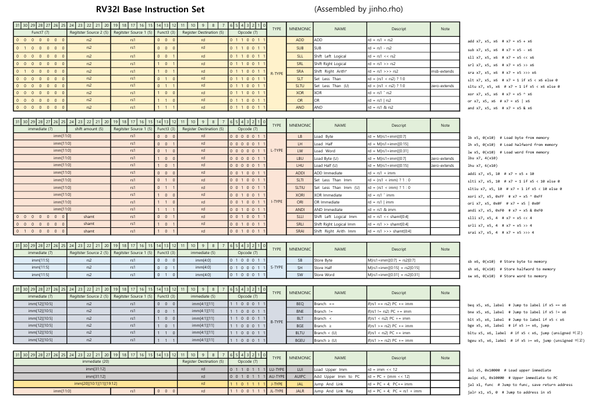

# RV32I Base Instruction Set

## Block Diagram

## Single-Cycle vs Multi-Cycle

**Single**: 모든명령어가 1clk에 동작
> 장점: 구조가 매우 심플
> 
> 단점: 느리다

**Multi**: 명령어 Type 별로 동작 clkock이 다르다.
>장점: Single보다 조금 빠르다
>
>단점: 구조가 조금 더 복잡하다.

## CPU 기본 모듈 <하버드 구조>
- Register File
- ALU
- ROM/Flash (Instruction Memory)
- RAM (Data Memory)
- PC (Program Counter)
