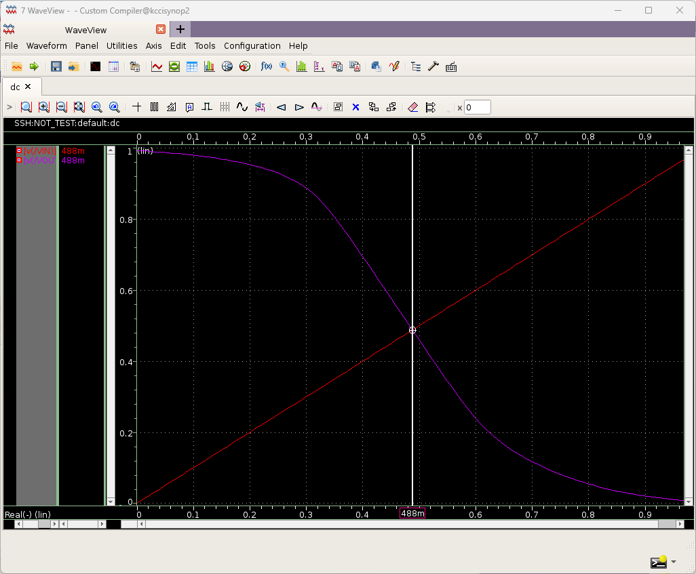

# 학습 내용 정리
---

**Synopsys Custom Compile**

"Tool의 기능 및 Inverter의 Schmatic 및 Simbol을 만들었으며, 시뮬레이션을 돌리기 위한 조건을 만들었습니다."
"이를 활용해 Un과 Up의 비율을 시뮬레이션의 파형 비교를 통해 이상적인 Width 값을 찾아냅니다."

---

"Simulation Flow:
tool prime wave -> setup ->  model file -> 경로찾기 -> FF 선택 -> simulation -> option -> primesim HSPICE -> variables -> copy to design -> vin = 0 -> setup -> analysis -> dc -> Design Variable -> start stop size 등 시간 설정 -> click to add -> Schmatic에서 vin vout 선택 -> save_state -> 이름설정 -> simulation -> netlist and run -> plot"

---
"Custom Compiler Open to MobaXterm"

"Libray 생성"
[text](post-01.md)  

"Tech PDK 32nm 설정"
 

"Inverter 만들기 (NOT)"
 
 

"Options 에서 Spacing 선택"
 
 
 

"인스턴스 추가"
 

"인버터 생성 후 Q를 통해 Value 수정"
 
 

"Shift+X를 통해 룰체크 + 세이브"

"Symbol 생성"
  
  
  

"Symbol 모양 수정" 
  
 
 
 

"아날로그 모듈에서 Vdc 설정"
  

"시뮬레이션 모듈 (Test) 설정"

 

"경로 설정 tool prime wave -> setup ->  model file -> 경로찾기 -> FF 선택"
 
 
 
 

"시뮬레이션 옵션 설정 simulation -> option -> primesim HSPICE"
 
 

"디자인 카피 및 in 설정 variables -> copy to design -> vin = 0 -> setup"
 
 

"Analyses 설정 analysis -> dc -> Design Variable -> start stop size 등 시간 설정 -> click to add -> Schmatic에서 vin vout 선택 -> save_state -> 이름설정 -> simulation -> netlist and run -> plot"
 
 
 
 

"시뮬레이션 결과"

---
"여기서부터는 스윙을 통해 시뮬레이션을 진행합니다.

"Variables 의 Design Parameterization 선택"

"ADD devices 선택 후 PMNOS를 선택"

"W를 WIDTH로 변수 설정한다."

"Tool의 Parametic Analyses를 선택 후 Add new sweep 설정"

"WIDTH를 선택"

"WIDTH의 값을 설정한다"

"IN OUT을 Schmatic에서 선택한다."

"1~2사이 결과 값을 보았을 때 1.1~1.2u 사이인 것을 확인"

"범위를 1.1~1.2u, 단위를 0.01u로 더 자세히 시뮬레이션"

"1.15~1.16u사이 1.16u에 더 가까운 것을 확인"