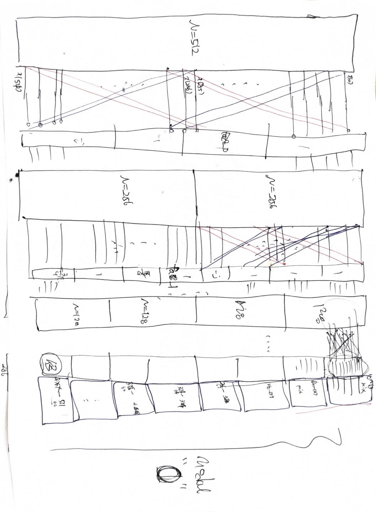
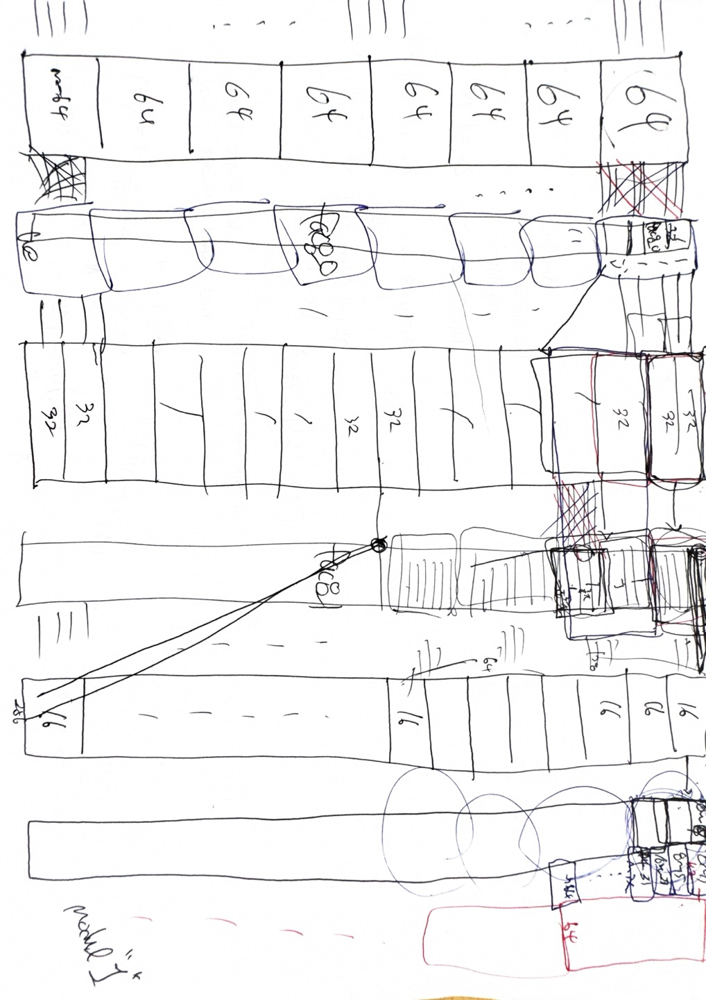
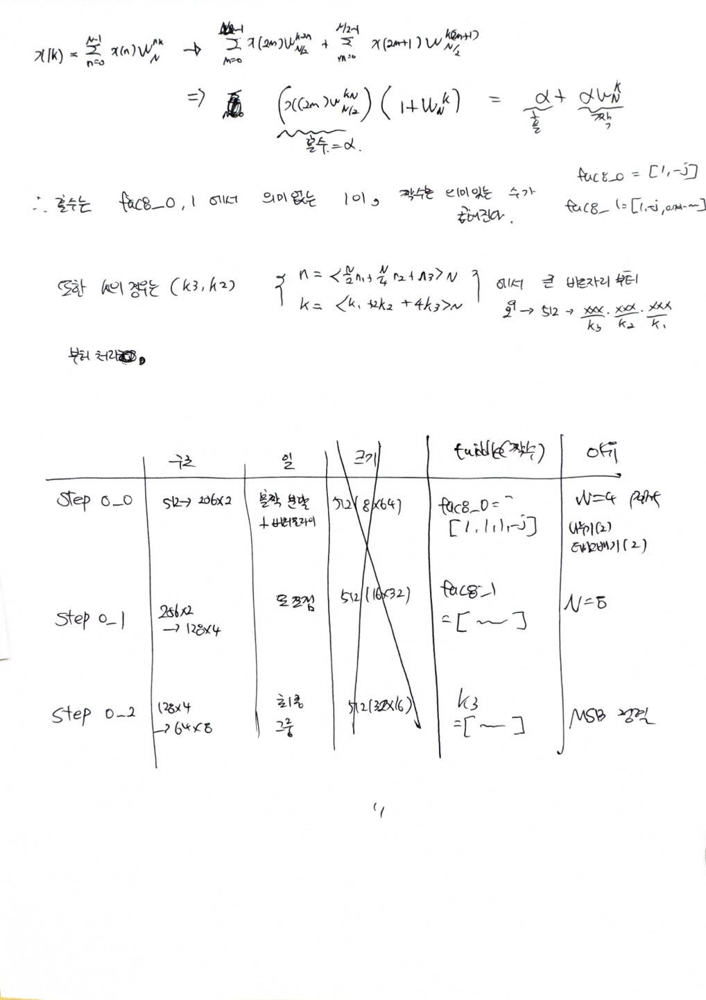

# Git
https://github.com/71105673/FFT_Project

# 주어진 MATLAB Code
## test_fft_float_stu.m
```matlab
% Test fft function (fft_float) 
% Added on 2025/07/02 by jihan 
 fft_mode = 1; % '0': ifft, '1': fft
 N = 512;

 [cos_float, cos_fixed] = cos_in_gen(fft_mode, N);

 [fft_out, module2_out] = fft_float(1, cos_float); % Floating-point fft (fft) : Cosine 
```
## fft_float.m
```matlab
% Added on 2025/07/01 by jihan 
function [fft_out, module2_out] = fft_float(fft_mode, fft_in)

 shift = 0;
 SIM_FIX = 0; % 0: float, 1: fixed

 if (fft_mode==1) % fft
	din = fft_in;
 else % ifft
	din = conj(fft_in);
 end

 fac8_0 = [1, 1, 1, -j];
 fac8_1 = [1, 1, 1, -j, 1, 0.7071-0.7071j, 1, -0.7071-0.7071j];

 %-----------------------------------------------------------------------------
 % Module 0
 %-----------------------------------------------------------------------------
 % step0_0
 bfly00_out0 = din(1:256) + din(257:512); % <4,6>
 bfly00_out1 = din(1:256) - din(257:512);

 bfly00_tmp = [bfly00_out0, bfly00_out1];

 for nn=1:512
	bfly00(nn) = bfly00_tmp(nn)*fac8_0(ceil(nn/128));
 end

 % step0_1
 for kk=1:2
  for nn=1:128
	bfly01_tmp((kk-1)*256+nn) = bfly00((kk-1)*256+nn) + bfly00((kk-1)*256+128+nn);
	bfly01_tmp((kk-1)*256+128+nn) = bfly00((kk-1)*256+nn) - bfly00((kk-1)*256+128+nn);
  end
 end


 for nn=1:512
	bfly01(nn) = bfly01_tmp(nn)*fac8_1(ceil(nn/64));
 end

 % step0_2
 for kk=1:4
  for nn=1:64
	bfly02_tmp((kk-1)*128+nn) = bfly01((kk-1)*128+nn) + bfly01((kk-1)*128+64+nn);
	bfly02_tmp((kk-1)*128+64+nn) = bfly01((kk-1)*128+nn) - bfly01((kk-1)*128+64+nn);
  end
 end

 % Data rearrangement
 K3 = [0, 4, 2, 6, 1, 5, 3, 7];

 for kk=1:8
  for nn=1:64
	twf_m0((kk-1)*64+nn) = exp(-j*2*pi*(nn-1)*(K3(kk))/512);
  end
 end

 for nn=1:512
	bfly02(nn) = bfly02_tmp(nn)*twf_m0(nn);
 end

 %-----------------------------------------------------------------------------
 % Module 1
 %-----------------------------------------------------------------------------
 % step1_0
 for kk=1:8
  for nn=1:32
	bfly10_tmp((kk-1)*64+nn) = bfly02((kk-1)*64+nn) + bfly02((kk-1)*64+32+nn);
	bfly10_tmp((kk-1)*64+32+nn) = bfly02((kk-1)*64+nn) - bfly02((kk-1)*64+32+nn);
  end
 end

 for kk=1:8
  for nn=1:64
	bfly10((kk-1)*64+nn) = bfly10_tmp((kk-1)*64+nn)*fac8_0(ceil(nn/16));
  end
 end

 % step1_1
 for kk=1:16
  for nn=1:16
	bfly11_tmp((kk-1)*32+nn) = bfly10((kk-1)*32+nn) + bfly10((kk-1)*32+16+nn);
	bfly11_tmp((kk-1)*32+16+nn) = bfly10((kk-1)*32+nn) - bfly10((kk-1)*32+16+nn);
  end
 end

 for kk=1:8
  for nn=1:64
	bfly11((kk-1)*64+nn) = bfly11_tmp((kk-1)*64+nn)*fac8_1(ceil(nn/8));
  end
 end

 % step1_2 (16)
 for kk=1:32
  for nn=1:8
	bfly12_tmp((kk-1)*16+nn) = bfly11((kk-1)*16+nn) + bfly11((kk-1)*16+8+nn);
	bfly12_tmp((kk-1)*16+8+nn) = bfly11((kk-1)*16+nn) - bfly11((kk-1)*16+8+nn);
  end
 end

 % Data rearrangement
 K2 = [0, 4, 2, 6, 1, 5, 3, 7];

 for kk=1:8
  for nn=1:8
	twf_m1((kk-1)*8+nn) = exp(-j*2*pi*(nn-1)*(K2(kk))/64);
  end
 end

 for kk=1:8
  for nn=1:64
	bfly12((kk-1)*64+nn) = bfly12_tmp((kk-1)*64+nn)*twf_m1(nn);
  end
 end

 %-----------------------------------------------------------------------------
 % Module 2
 %-----------------------------------------------------------------------------
 % step2_0
 for kk=1:64
  for nn=1:4
	bfly20_tmp((kk-1)*8+nn) = bfly12((kk-1)*8+nn) + bfly12((kk-1)*8+4+nn);
	bfly20_tmp((kk-1)*8+4+nn) = bfly12((kk-1)*8+nn) - bfly12((kk-1)*8+4+nn);
  end
 end

 for kk=1:64
  for nn=1:8
	bfly20((kk-1)*8+nn) = bfly20_tmp((kk-1)*8+nn)*fac8_0(ceil(nn/2));
  end
 end

 % step2_1
 for kk=1:128
  for nn=1:2
	bfly21_tmp((kk-1)*4+nn) = bfly20((kk-1)*4+nn) + bfly20((kk-1)*4+2+nn);
	bfly21_tmp((kk-1)*4+2+nn) = bfly20((kk-1)*4+nn) - bfly20((kk-1)*4+2+nn);
  end
 end

 for kk=1:64
  for nn=1:8
	bfly21((kk-1)*8+nn) = bfly21_tmp((kk-1)*8+nn)*fac8_1(nn);
  end
 end

 % step2_2
 for kk=1:256
	bfly22_tmp((kk-1)*2+1) = bfly21((kk-1)*2+1) + bfly21((kk-1)*2+2);
	bfly22_tmp((kk-1)*2+2) = bfly21((kk-1)*2+1) - bfly21((kk-1)*2+2);
 end

 bfly22 = bfly22_tmp;

 %-----------------------------------------------------------------------------
 % Index 
 %-----------------------------------------------------------------------------
 fp=fopen('reorder_index.txt','w');
 for jj=1:512
	%kk = bitget(jj-1,9)*(2^0) + bitget(jj-1,8)*(2^1) + bitget(jj-1,7)*(2^2) + bitget(jj-1,6)*(2^3) + bitget(jj-1,5)*(2^4) + bitget(jj-1,4)*(2^5) + bitget(jj-1,3)*(2^6) + bitget(jj-1,2)*(2^7) + bitget(jj-1,1)*(2^8);
	kk = bitget(jj-1,9)*1 + bitget(jj-1,8)*2 + bitget(jj-1,7)*4 + bitget(jj-1,6)*8 + bitget(jj-1,5)*16 + bitget(jj-1,4)*32 + bitget(jj-1,3)*64 + bitget(jj-1,2)*128 + bitget(jj-1,1)*256;
	dout(kk+1) = bfly22(jj); % With reorder
	fprintf(fp, 'jj=%d, kk=%d, dout(%d)=%f+j%f\n',jj, kk,(kk+1),real(dout(kk+1)),imag(dout(kk+1)));
 end
 fclose(fp);

 if (fft_mode==1) % fft
	fft_out = dout;
	module2_out = bfly22;
 else % ifft
	fft_out = conj(dout)/512; 
	module2_out = conj(bfly22)/512;

 end

end
```

## cos_in_gen.m
```matlab
% Added on 2024/01/12 by jihan 
function [data_float, data_fixed] = cos_in_gen(fft_mode, num)
 N = num;

 for i=1:N
	data_float_re(i) = cos(2.0*pi*(i-1)/N);
	data_float_im(i) = 0.0;
	data_float(i) = data_float_re(i) + j*data_float_im(i);
 end

 for i=1:N
  if (data_float_re(i)==1.0)
   if (fft_mode==1) % FFT
	%data_fixed_re(i) = 127; % <2.7>
	data_fixed_re(i) = 63; % <3.6> % Modified on 2025/07/02 by jihan
   else % IFFT
	data_fixed_re(i) = 255; % <1.8>
	%data_fixed_re(i) = 127; % <2.7> % Modified on 2025/07/02 by jihan
   end
  else	
   if (fft_mode==1) % FFT
	%data_fixed_re(i) = round(data_float_re(i)*128); % <2.7>
	data_fixed_re(i) = round(data_float_re(i)*64); % <3.6> % Modified on 2025/07/02 by jihan
   else % IFFT
	data_fixed_re(i) = round(data_float_re(i)*256); % <1.8>
	%data_fixed_re(i) = round(data_float_re(i)*128); % <2.7> % Modified on 2025/07/02 by jihan
   end
  end

  if (data_float_im(i)==1.0)
   if (fft_mode==1) % FFT
	%data_fixed_im(i) = 127; % <2.7>
	data_fixed_im(i) = 63; % <3.6> % Modified on 2025/07/02 by jihan
   else % IFFT
	data_fixed_im(i) = 255; % <1.8>
	%data_fixed_im(i) = 127; % <2.7> % Modified on 2025/07/02 by jihan
   end
  else	
   if (fft_mode==1) % FFT
	%data_fixed_im(i) = round(data_float_im(i)*128); % <2.7>
	data_fixed_im(i) = round(data_float_im(i)*64); % <3.6> % Modified on 2025/07/02 by jihan
   else % IFFT
	data_fixed_im(i) = round(data_float_im(i)*256); % <1.8>
	%data_fixed_im(i) = 127; % <2.7> % Modified on 2025/07/02 by jihan
   end
  end

	data_fixed(i) = data_fixed_re(i) + j*data_fixed_im(i);
 end

end
```

# MATLAB 그래프 확인
```matlab
% 파일 열기
fid = fopen('bfly00_tmp.txt', 'r');

% 'bfly00_tmp(index)=%f+j%f' 형식으로 파싱
data = textscan(fid, 'bfly00_tmp(%d)=%f+j%f');

% 파일 닫기
fclose(fid);

% 실수/허수 부분 추출
real_part = data{2};
imag_part = data{3};

% 복소수 벡터로 결합
fft_stage = complex(real_part, imag_part);

% 시각화
N = length(fft_stage);

figure;
plot(0:N-1, abs(fft_stage));
title('FFT Magnitude Spectrum');
xlabel('Frequency Bin');
ylabel('|FFT Output|');
grid on;
```


# Flow

## Module0 
| Step     | 역할                           | 입력 크기 | 출력 크기 | Twiddle Factor 적용             | 비고                  |
| -------- | ---------------------------- | ----- | ----- | ----------------------------- | ------------------- |
| step0\_0 | 512 → 256×2로 홀짝 분할 (radix-4) | 512   | 512   | `fac8_0(ceil(nn/128))` (길이 4) | N=4 FFT, MSB 초기 정렬용 |
| step0\_1 | 256×2 → 128×4 구조로 재조합        | 512   | 512   | `fac8_1(ceil(nn/64))` (길이 8)  | N=8 FFT 중간 구조 설계    |
| step0\_2 | 128×4 → 64×8, 마지막 그룹화        | 512   | 512   | `twf_m0(nn)` (K3 기반 위상 곱)     | **K3 = Bit Reverse** 적용  |
                                


## Module1
| Step     | 역할                     | 입력 크기       | 출력 크기       | Twiddle Factor 적용            | 비고                 |
| -------- | ---------------------- | ----------- | ----------- | ---------------------------- | ------------------ |
| step1\_0 | 64점 그룹 → 32점 butterfly | 512 = 8×64  | 512 = 8×64  | `fac8_0(ceil(nn/16))` (길이 4) |                    |
| step1\_1 | 32점 그룹 → 16점 butterfly | 512 = 16×32 | 512 = 16×32 | `fac8_1(ceil(nn/8))` (길이 8)  |                    |
| step1\_2 | 16점 그룹 → 8점 butterfly  | 512 = 32×16 | 512 = 32×16 | `twf_m1(nn)` (K2 기반 위상 곱)    | **K2 = Bit Reverse** 적용 |


## Module2
| Step     | 역할                   | 입력 크기       | 출력 크기       | Twiddle Factor 적용           | 비고        |
| -------- | -------------------- | ----------- | ----------- | --------------------------- | --------- |
| step2\_0 | 8점 그룹 → 4점 butterfly | 512 = 64×8  | 512 = 64×8  | `fac8_0(ceil(nn/2))` (길이 4) |           |
| step2\_1 | 4점 그룹 → 2점 butterfly | 512 = 128×4 | 512 = 128×4 | `fac8_1(nn)` (길이 8, 고정값 적용) |           |
| step2\_2 | 2점 butterfly (최종 단계) | 512 = 256×2 | 512         | 없음                          | 최종 결과 완성됨 |


## Twiddle Factor 참고
| 이름      | 길이  | 적용되는 위치                      | 설명                    |
| ------- | --- | ---------------------------- | --------------------- |
| fac8\_0 | 4   | step0\_0, step1\_0, step2\_0 | N=4 FFT 기준 twiddle 상수 |
| fac8\_1 | 8   | step0\_1, step1\_1, step2\_1 | N=8 FFT 기준 twiddle 상수 |
| twf\_m0 | 512 | step0\_2                     | MSB 기준 `K3` 정렬용 위상 곱  |
| twf\_m1 | 64  | step1\_2                     | MSB 기준 `K2` 정렬용 위상 곱  |


## Flow Design 수기

  

## 추가 과정
### 짝수, 홀수 분리 및 의미


 


따라서 홀수는 1을 곱하여 의미 없는 값, 짝수에 위상 변화가 적용

### K
 
 
### 적용 요약
| 단계    | 사용하는 3비트   | 의미        | 재배열 인덱스 (K)                     |
| ----- | ---------- | --------- | ------------------------------- |
| Step0 | bit8\~bit6 | 가장 상위 3비트 | `K3 = [0, 4, 2, 6, 1, 5, 3, 7]` |
| Step1 | bit5\~bit3 | 중간 3비트    | `K2 = [0, 4, 2, 6, 1, 5, 3, 7]` |
| Step2 | bit2\~bit0 | 가장 하위 3비트 | `K1 = [0, 4, 2, 6, 1, 5, 3, 7]` |


### 3비트 bit-reversal 표 (공통 기준)
| 원래 인덱스 (k) | 3비트 이진 | Bit-Reverse | 10진수 (K 값) |
| ---------- | ------ | ----------- | ---------- |
| 0          | `000`  | `000`       | 0          |
| 1          | `001`  | `100`       | 4          |
| 2          | `010`  | `010`       | 2          |
| 3          | `011`  | `110`       | 6          |
| 4          | `100`  | `001`       | 1          |
| 5          | `101`  | `101`       | 5          |
| 6          | `110`  | `011`       | 3          |
| 7          | `111`  | `111`       | 7          |


## RTL 구조


## matlab SQNR 결과
