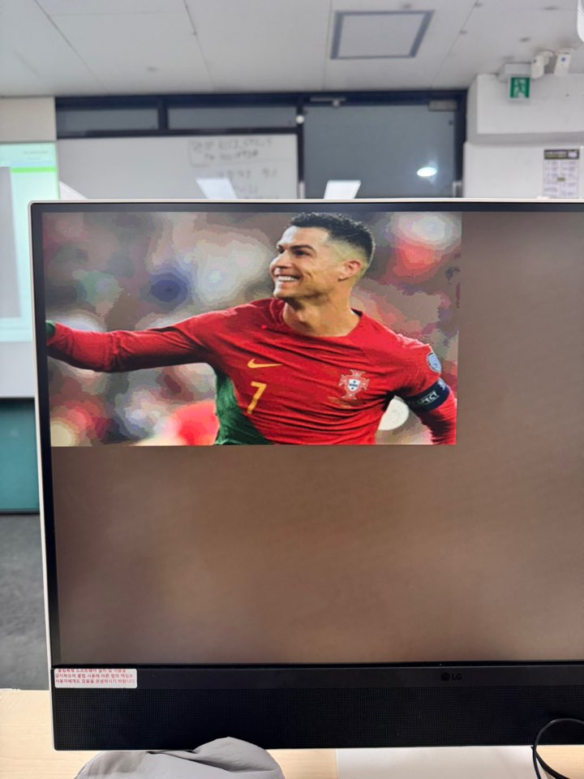
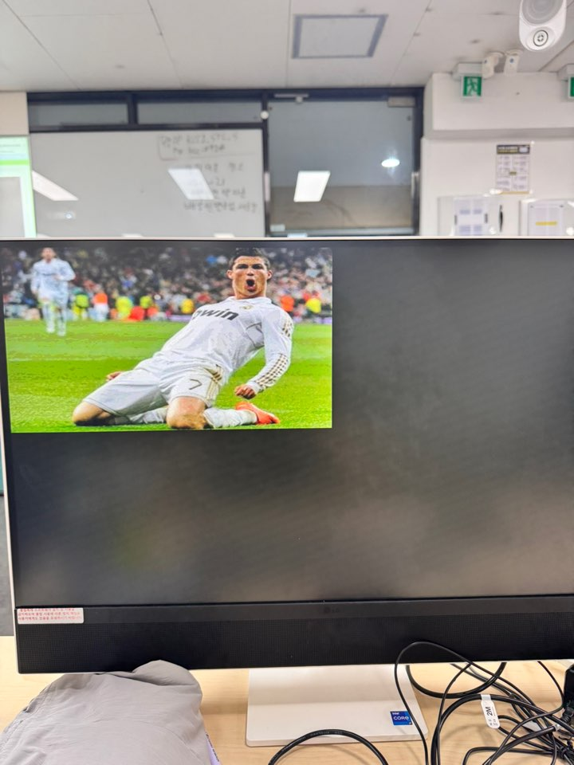
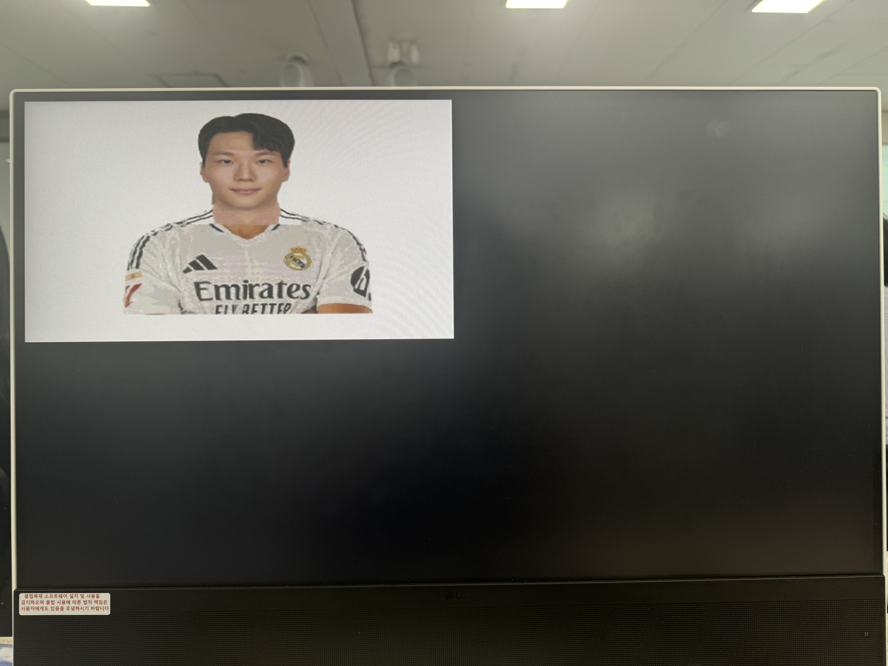

## Mux를 이용한 모드 전환 기능 Block


<video controls src="../../../assets/img/VGA/day-2/KakaoTalk_20250909_095155426.mp4" title="Title"></video>

## Code

### VGA_Color_Bar.sv
```verilog
`timescale 1ns / 1ps


module VGA_Color_Bar(
    input logic DE,
    input logic [9:0] x_pixel,
    input logic [9:0] y_pixel,

    output logic [3:0] red_port2,
    output logic [3:0] green_port2,
    output logic [3:0] blue_port2
);

    logic [3:0] red_port;
    logic [3:0] green_port;
    logic [3:0] blue_port;

    assign red_port2   = DE ? red_port : 4'b0;
    assign blue_port2  = DE ? blue_port : 4'b0;
    assign green_port2 = DE ? green_port : 4'b0;

    always_comb begin
            // 첫번째 줄
            if(y_pixel < 320) begin
                if(x_pixel < 91) begin  // White
                    red_port = 4'b1111;
                    green_port = 4'b1111;
                    blue_port = 4'b1111;
                end else if (x_pixel < 182) begin // Yellow
                    red_port = 4'b1111;
                    green_port = 4'b1111;
                    blue_port = 4'b0000;
                end else if (x_pixel < 273) begin //Cyan
                    red_port = 4'b0000;
                    green_port = 4'b1111;
                    blue_port = 4'b1111;
                end else if (x_pixel < 364) begin // Green
                    red_port = 4'b0000;
                    green_port = 4'b1111; 
                    blue_port = 4'b0000;
                end else if (x_pixel < 455) begin // Magenta
                    red_port = 4'b1111;
                    green_port = 4'b0000;
                    blue_port = 4'b1111;
                end else if (x_pixel < 546) begin  // Red
                    red_port = 4'b1111;
                    green_port = 0;
                    blue_port = 0;
                end else if (x_pixel <= 639) begin // Blue
                    red_port = 0;
                    green_port = 0;
                    blue_port = 4'b1111;
                end
            // 두번째 줄 
            end else if(y_pixel < 375) begin
                if(x_pixel < 91) begin      // Blue
                    red_port = 0;
                    green_port = 0;
                    blue_port = 4'b1111;
                end else if (x_pixel < 182) begin // Black
                    red_port = 0;
                    green_port = 0;
                    blue_port = 0;
                end else if (x_pixel < 273) begin // Magenta
                    red_port = 4'b1111;
                    green_port = 0;
                    blue_port = 4'b1111;
                end else if (x_pixel < 364) begin // Black
                    red_port = 0;
                    green_port = 0;
                    blue_port = 0;
                end else if (x_pixel < 455) begin //Cyan
                    red_port = 0;
                    green_port = 4'b1111;
                    blue_port = 4'b1111;
                end else if (x_pixel < 546) begin //Black
                    red_port = 0;
                    green_port = 0;
                    blue_port = 0;
                end else if (x_pixel <= 639) begin // White
                    red_port = 4'b1111;
                    green_port = 4'b1111;
                    blue_port = 4'b1111;
                end
            // 세번째 줄
            end else if(y_pixel <= 479) begin
                if(x_pixel < 100) begin // Navy
                    red_port = 4'b0000;
                    green_port = 4'b0000;
                    blue_port = 4'b1000;
                end else if (x_pixel < 200) begin // White
                    red_port = 4'b1111;
                    green_port = 4'b1111;
                    blue_port = 4'b1111;
                end else if (x_pixel < 300) begin // Purple
                    red_port = 4'b0101;
                    green_port = 4'b0000;
                    blue_port = 4'b0101;
                end else if (x_pixel < 400) begin // Black
                    red_port = 0;
                    green_port = 0;
                    blue_port = 0;
                // 3분할 시작
                end else if (x_pixel < 448) begin // Black
                    red_port = 0;
                    green_port = 0;
                    blue_port = 0;
                end else if (x_pixel < 496) begin // Charcol
                    red_port = 4'b0101;
                    green_port = 4'b0101;
                    blue_port = 4'b0101;
                end else if (x_pixel < 546) begin // Gray
                    red_port = 4'b1000;
                    green_port = 4'b1000;
                    blue_port = 4'b1000;
                // 3분할 종료
                end else if (x_pixel <= 639) begin //black
                    red_port = 0;
                    green_port = 0;
                    blue_port = 0;
                end
            end
        end
endmodule
```
### VGA_Decoder.sv
```verilog
`timescale 1ns / 1ps


module VGA_Decoder (
    input  logic       clk,
    input  logic       reset,
    output logic       h_sync,
    output logic       v_sync,
    output logic [9:0] x_pixel,
    output logic [9:0] y_pixel,
    output logic       DE
);

    logic pclk;
    logic [9:0] v_counter;
    logic [9:0] h_counter;

    Pixel_clk_gen U_P_CLK (.*);

    pixel_counter U_P_COUNTER (.*);

    vga_decoder U_VGA_Decoder (.*);

endmodule

module Pixel_clk_gen (
    input  logic clk,
    input  logic reset,
    output logic pclk
);
    logic [1:0] p_counter;

    always_ff @(posedge clk, posedge reset) begin
        if (reset) begin
            p_counter <= 0;
        end else begin
            if (p_counter == 3) begin
                p_counter <= 0;
                pclk <= 1'b1;
            end else begin
                p_counter <= p_counter + 1;
                pclk <= 1'b0;
            end
        end
    end
endmodule

module pixel_counter (
    input  logic       pclk,
    input  logic       reset,
    output logic [9:0] v_counter,
    output logic [9:0] h_counter
);
    localparam H_MAX = 800, V_MAX = 525;  // VGA Spec

    always_ff @(negedge pclk, posedge reset) begin
        if (reset) begin
            h_counter <= 0;
        end else begin
            if (h_counter == H_MAX - 1) begin
                h_counter <= 0;
            end else begin
                h_counter <= h_counter + 1;
            end
        end
    end

    always_ff @(negedge pclk, posedge reset) begin
        if (reset) begin
            v_counter <= 0;
        end else begin
            if (h_counter == H_MAX - 1) begin           // 1개의 Horizontal line이 끝나면
                if (v_counter == V_MAX - 1) begin       // Vertical line을 동작해라
                    v_counter <= 0;
                end else begin
                    v_counter <= v_counter + 1;
                end
            end
        end
    end

endmodule

module vga_decoder (
    input  logic [9:0] h_counter,
    input  logic [9:0] v_counter,
    output logic       h_sync,
    output logic       v_sync,
    output logic [9:0] x_pixel,
    output logic [9:0] y_pixel,
    output logic       DE
);

    localparam H_Visible_area = 640;
    localparam H_Front_porch = 16;
    localparam H_Sync_pulse = 96;
    localparam H_Back_porch = 48;
    localparam H_Whole_line = 800;

    localparam V_Visible_area = 480;
    localparam V_Front_porch = 10;
    localparam V_Sync_pulse = 2;
    localparam V_Back_porch = 33;
    localparam V_Whole_frame = 525;

    assign h_sync = !(h_counter >= (H_Visible_area + H_Front_porch) && (h_counter < (H_Visible_area + H_Front_porch + H_Sync_pulse)));
    assign v_sync = !(v_counter >= (V_Visible_area + V_Front_porch) && (v_counter < (V_Visible_area + V_Front_porch + V_Sync_pulse)));
    assign DE = (h_counter < H_Visible_area) && (v_counter < V_Visible_area);
    assign x_pixel = h_counter;
    assign y_pixel = v_counter;
endmodule
```
### VGA_Display_Switch.sv
```verilog
`timescale 1ns / 1ps


module VGA_Display_Switch (
    input  logic       clk,
    input  logic       reset,
    input  logic       sw_mode,
    input  logic [3:0] sw_red,
    input  logic [3:0] sw_green,
    input  logic [3:0] sw_blue,
    output logic       h_sync,
    output logic       v_sync,
    output logic [3:0] r_port,
    output logic [3:0] g_port,
    output logic [3:0] b_port
);

    logic DE;

    logic [3:0] sw_r, sw_g, sw_b;
    logic [3:0] bar_r, bar_g, bar_b;

    logic [9:0] x_pixel, y_pixel;


    VGA_Decoder U_VGA_DEC (
        .*,
        .x_pixel(x_pixel),
        .y_pixel(y_pixel)
    );

    VGA_RGB_Switch U_VGA_RGB_SW (
        .*,
        .r_port(sw_r),
        .g_port(sw_g),
        .b_port(sw_b)
    );

    VGA_Color_Bar U_VGA_ColorBar (
        .DE         (DE),
        .x_pixel    (x_pixel),
        .y_pixel    (y_pixel),
        .red_port2  (bar_r),
        .green_port2(bar_g),
        .blue_port2 (bar_b)
    );

    mux_2x1 U_MUX (
        .sel  (sw_mode),
        .rgb_a({sw_r, sw_g, sw_b}),
        .rgb_b({bar_r, bar_g, bar_b}),
        .rgb  ({r_port, g_port, b_port})
    );


endmodule

module mux_2x1 (
    input  logic        sel,
    input  logic [11:0] rgb_a,
    input  logic [11:0] rgb_b,
    output logic [11:0] rgb
);
    always_comb begin
        case (sel)
            1'b0: rgb = rgb_a;
            1'b1: rgb = rgb_b;
        endcase
    end
endmodule
```
### VGA_RGB_Switch.sv
```verilog
`timescale 1ns / 1ps


module VGA_RGB_Switch (
    input  logic [3:0] sw_red,
    input  logic [3:0] sw_green,
    input  logic [3:0] sw_blue,
    input  logic       DE,
    output logic [3:0] r_port,
    output logic [3:0] g_port,
    output logic [3:0] b_port
);

    assign r_port = DE ? sw_red : 4'b0;
    assign g_port = DE ? sw_green : 4'b0;
    assign b_port = DE ? sw_blue : 4'b0;
    
endmodule
```

# ROM 에서 이미지 띄우기

자연정보 Green을 강조


## Pixel 위치 정보


## Code
## VGA_Display_ImgROM.sv
```verilog
`timescale 1ns / 1ps

module VGA_Display_ImgROM (
    input  logic       clk,
    input  logic       reset,
    output logic       h_sync,
    output logic       v_sync,
    output logic [3:0] r_port,
    output logic [3:0] g_port,
    output logic [3:0] b_port
);
    logic DE;
    logic [9:0] x_pixel;
    logic [9:0] y_pixel;
    logic [16:0] addr;
    logic [15:0] data;

    VGA_Decoder U_VGA_DEC (
        .*,
        .x_pixel(x_pixel),
        .y_pixel(y_pixel)
    );

    ImgReader U_IMG_READER (
        .DE    (DE),
        .x     (x_pixel),
        .y     (y_pixel),
        .addr  (addr),
        .data  (data),
        .r_port(r_port),
        .g_port(g_port),
        .b_port(b_port)
    );

    ImgROM U_ImgROM (
        .addr(addr),
        .data(data)
    );
endmodule

module mux_2x1 (
    input  logic        sel,
    input  logic [11:0] rgb_a,
    input  logic [11:0] rgb_b,
    output logic [11:0] rgb
);
    always_comb begin
        case (sel)
            1'b0: rgb = rgb_a;
            1'b1: rgb = rgb_b;
        endcase
    end
endmodule
```


### ImgReader.sv
```verilog
`timescale 1ns / 1ps

module ImgReader (
    input  logic        DE,
    input  logic [ 9:0] x,
    input  logic [ 9:0] y,
    output logic [16:0] addr,
    input  logic [15:0] data,
    output logic [ 3:0] r_port,
    output logic [ 3:0] g_port,
    output logic [ 3:0] b_port
);
    logic img_show;
    assign img_show = (DE && (x < 320) && (y < 240));
    assign addr = img_show ? (320 * y + x) : 17'bz;
    assign r_port = DE ? data[15:12] : 4'b0;
    assign g_port = DE ? data[10:7] : 4'b0;
    assign b_port = DE ? data[4:1] : 4'b0;
endmodule
```

### ImgROM.sv
```verilog
`timescale 1ns / 1ps

module ImgROM (
    input  logic [$clog2(320*240):0] addr,  //qvga
    output logic [             15:0] data
);
    logic [15:0] mem[0:320*240 -1];

    initial begin
        $readmemh("Lenna.mem", mem);
    end

    assign data = mem[addr];
endmodule
```


### 이미지 변환 과정
알씨에서 자르기로 4:3 비율


크기 조정으로 320 X 240에 QVGA로 변경


도구 이용해 형식 변경하여 C 코드 생성 후 16진수만 이용


### 16진수 .mem 파일 만드는 법
- 만들어진 C 파일 기준으로 하단의 16진수 복사 후 xxx.mem 만들기

- 모두바꾸기로 0x -> 빈칸 / ,은 스페이스로 변경

### 결과





LUT 사용량 과다 


비동기 회로로 -> LUT 생성
clk 공기화 -> BRAM 생성

### ImgROM.sv
```verilog
`timescale 1ns / 1ps

module ImgROM (
    input  logic                     clk,
    input  logic [$clog2(320*240):0] addr,  //qvga
    output logic [             15:0] data
);
    logic [15:0] mem[0:320*240 -1];

    initial begin
        $readmemh("ronaldo2.mem", mem);
    end

    always_ff @(posedge clk) begin
        data <= mem[addr];
    end

    //assign data = mem[addr];
endmodule
```


### VGA_Decoder.sv
해당 코드에서 pclk 아웃풋으로 뺴주기 -> ROM clk 쓰기 위해
```verilog
module VGA_Decoder (
    input  logic       clk,
    input  logic       reset,
    output logic       pclk,
    output logic       h_sync,
    output logic       v_sync,
    output logic [9:0] x_pixel,
    output logic [9:0] y_pixel,
    output logic       DE
);
    logic [9:0] v_counter;
    logic [9:0] h_counter;

    Pixel_clk_gen U_P_CLK (.*);
    pixel_counter U_P_COUNTER (.*);
    vga_decoder U_VGA_Decoder (.*);

endmodule
```

### VGA_Display_ImgROM
해당 코드에서 탑 모듈연결 시 ROM은 pclk을 이용
```verilog
module VGA_Display_ImgROM (
    input  logic       clk,
    input  logic       reset,
    output logic       h_sync,
    output logic       v_sync,
    output logic [3:0] r_port,
    output logic [3:0] g_port,
    output logic [3:0] b_port
);
    logic pclk;
    logic DE;
    logic [9:0] x_pixel;
    logic [9:0] y_pixel;
    logic [16:0] addr;
    logic [15:0] data;

    VGA_Decoder U_VGA_DEC (
        .*,
        .x_pixel(x_pixel),
        .y_pixel(y_pixel)
    );

    ImgReader U_IMG_READER (
        .DE    (DE),
        .x     (x_pixel),
        .y     (y_pixel),
        .addr  (addr),
        .data  (data),
        .r_port(r_port),
        .g_port(g_port),
        .b_port(b_port)
    );

    ImgROM U_ImgROM (
        .clk (pclk),
        .addr(addr),
        .data(data)
    );
endmodule
```


## 결과

LUT -> BRAM으로 전환된 것읋 확인 가능하다.
