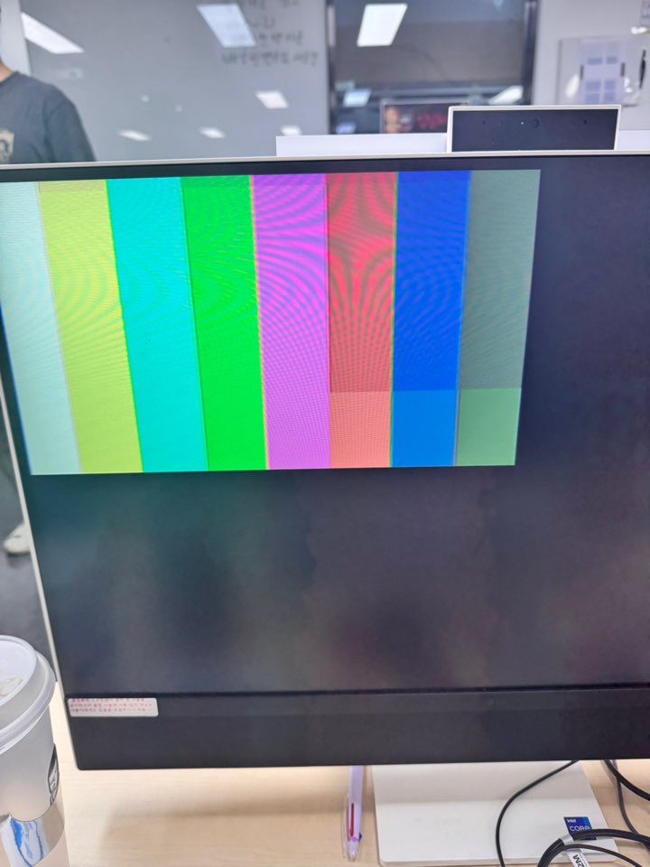

## Camera 연결 위한 구조도


### 타이밍


- positive Edge에서 유효한 8bit Data가 나온다.
- v sync가 hige가 되는 타이밍이 준비
- 프레임을 받고 여유 시간 내에 프레임에 대한 영상 처리를 진행.

### Block Diagram


좌, 우측의 CLK가 다른 CDC 구조이다.


추가로 해당 구조에서 Read 동작시에도 Enable 신호를 넣어준다


### RTL


## STM CUBEIDE
해당 방식으로 project를 생성
 
clk을 설정해준다.

pa5번에 LED 설정 -> output으로 설정 


UART 설정


PB8, 9번을 각각 설정 후, IC21을 설정하여 포트 잡기


clk configuration 설정


코드 자동생성 -> 톱니바퀴


C 코드 main 내부에 해당코드 삽입


컴파일
 

버튼을 통해 다운로드 및 업데이트
  

## Toggle 결과
<video controls src="../../../assets/img/VGA/day-3/toggle.mp4" title="Title"></video>


제공해준 파일을 넣는다.


헤더를 추가한다. (메인에)


헤더에 103RB 버전에 맞도록 수정한다.


컴파일 한 결과


## XDC 설정
순서 잘 맞춰서 넣기


Pclk 에러로 인한 Port 변경

 


main코드를 수정하여 캠을 킨다.


## Gray Filter

Gray Scale Filter 모듈 및 Mux 모듈을 불러 SW15를 통해 Gray Filter를 사용한다.

### VGA_Camera_Display.sv
```verilog
`timescale 1ns / 1ps

module VGA_Camera_Display (
    input  logic       clk,
    input  logic       reset,
    input  logic       sw_gray,
    // ov7670 side
    output logic       ov7670_xclk,
    input  logic       ov7670_pclk,
    input  logic       ov7670_href,
    input  logic       ov7670_vsync,
    input  logic [7:0] ov7670_data,
    // external port
    output logic       h_sync,
    output logic       v_sync,
    output logic [3:0] r_port,
    output logic [3:0] g_port,
    output logic [3:0] b_port
);
    logic        ov7670_we;
    logic [16:0] ov7670_wAddr;
    logic [15:0] ov7670_wData;

    logic        vga_pclk;
    logic [ 9:0] vga_x_pixel;
    logic [ 9:0] vga_y_pixel;
    logic        vga_DE;

    logic        vga_den;
    logic [16:0] vga_rAddr;
    logic [15:0] vga_rData;

    logic [3:0] vga_r, gray_r;
    logic [3:0] vga_g, gray_g;
    logic [3:0] vga_b, gray_b;

    assign ov7670_xclk = vga_pclk;

    VGA_Decoder U_VGA_Decoder (
        .clk    (clk),
        .pclk   (vga_pclk),
        .reset  (reset),
        .h_sync (h_sync),
        .v_sync (v_sync),
        .x_pixel(vga_x_pixel),
        .y_pixel(vga_y_pixel),
        .DE     (vga_DE)
    );

    OV7670_MemController U_OV7670 (
        .clk        (ov7670_pclk),
        .reset      (reset),
        .href       (ov7670_href),
        .vsync      (ov7670_vsync),
        .ov7670_data(ov7670_data),
        .we         (ov7670_we),
        .wAddr      (ov7670_wAddr),
        .wData      (ov7670_wData)
    );

    frame_buffer U_Frame_Buffer (
        .wclk (ov7670_pclk),
        .we   (ov7670_we),     // write enable
        .wAddr(ov7670_wAddr),
        .wData(ov7670_wData),
        .rclk (vga_pclk),
        .oe   (vga_den),       // read output enable
        .rAddr(vga_rAddr),
        .rData(vga_rData)
    );

    VGA_Memcontroller U_VGA_MemController (
        .DE     (vga_DE),
        .x_pixel(vga_x_pixel),
        .y_pixel(vga_y_pixel),
        .den    (vga_den),
        .rAddr  (vga_rAddr),
        .rData  (vga_rData),
        .r_port (vga_r),
        .g_port (vga_g),
        .b_port (vga_b)
    );

    GrayScale_Filter U_GrayScale_Filter (
        .i_r(vga_r),
        .i_g(vga_g),
        .i_b(vga_b),
        .o_r(gray_r),
        .o_g(gray_g),
        .o_b(gray_b)
    );

    Mux_2x1 U_Mux_2x1 (
        .sel        (sw_gray),
        .in_vga_rgb ({vga_r, vga_g, vga_b}),
        .in_gray_rgb({gray_r, gray_g, gray_b}),
        .out_rgb    ({r_port, g_port, b_port})
    );
endmodule
```

### VGA_Decoder.sv
```verilog
`timescale 1ns / 1ps

module VGA_Decoder (
    input  logic       clk,
    output logic       pclk,
    input  logic       reset,
    output logic       h_sync,
    output logic       v_sync,
    output logic [9:0] x_pixel,
    output logic [9:0] y_pixel,
    output logic       DE
);
    logic [9:0] v_counter;
    logic [9:0] h_counter;

    Pixel_clk_gen U_P_CLK (.*);
    pixel_counter U_P_COUNTER (.*);
    vga_decoder U_VGA_Decoder (.*);
endmodule

/////////////////////////////////////////////////////////////////////

module Pixel_clk_gen (
    input  logic clk,
    input  logic reset,
    output logic pclk
);

    logic [1:0] p_counter;

    always_ff @(posedge clk, posedge reset) begin
        if (reset) begin
            p_counter <= 0;
        end else begin
            if (p_counter == 3) begin
                p_counter <= 0;
                pclk <= 1'b1;
            end else begin
                p_counter <= p_counter + 1;
                pclk <= 1'b0;
            end
        end
    end
endmodule

/////////////////////////////////////////////////////////////////////

module pixel_counter (
    input  logic       pclk,
    input  logic       reset,
    output logic [9:0] v_counter,
    output logic [9:0] h_counter
);
    localparam H_MAX = 800, V_MAX = 525;  // VGA Spec

    always_ff @(negedge pclk, posedge reset) begin
        if (reset) begin
            h_counter <= 0;
        end else begin
            if (h_counter == (H_MAX - 1)) begin
                h_counter <= 0;
            end else begin
                h_counter <= h_counter + 1;
            end
        end
    end

    always_ff @(negedge pclk, posedge reset) begin
        if (reset) begin
            v_counter <= 0;
        end else begin
            if (h_counter == (H_MAX - 1)) begin
                if (v_counter == (V_MAX - 1)) begin
                    v_counter <= 0;
                end else begin
                    v_counter <= v_counter + 1;
                end
            end
        end
    end
endmodule

/////////////////////////////////////////////////////////////////////

module vga_decoder (
    input  logic [9:0] h_counter,
    input  logic [9:0] v_counter,
    output logic       h_sync,
    output logic       v_sync,
    output logic [9:0] x_pixel,
    output logic [9:0] y_pixel,
    output logic       DE
);

    localparam H_Visible_area = 640;
    localparam H_Front_porch = 16;
    localparam H_Sync_pulse = 96;
    localparam H_Back_porch = 48;
    localparam H_Whole_Line = 800;

    localparam V_Visible_area = 480;
    localparam V_Front_porch = 10;
    localparam V_Sync_pulse = 2;
    localparam V_Back_porch = 33;
    localparam V_Whole_frame = 525;

    assign h_sync = !((h_counter >= (H_Visible_area+H_Front_porch)) && (h_counter < (H_Visible_area + H_Front_porch + H_Sync_pulse)));
    assign v_sync = !((v_counter >= (V_Visible_area+V_Front_porch)) && (v_counter < (V_Visible_area + V_Front_porch + V_Sync_pulse)));
    assign DE = ((h_counter < H_Visible_area) && (v_counter < V_Visible_area));
    assign x_pixel = h_counter;
    assign y_pixel = v_counter;

endmodule
```

### OV7670_MemController.sv
```verilog
`timescale 1ns / 1ps

module OV7670_MemController (
    input  logic        clk,
    input  logic        reset,
    // ov7670 side
    input  logic        href,
    input  logic        vsync,
    input  logic [ 7:0] ov7670_data,
    // memory side
    output logic        we,
    output logic [16:0] wAddr,
    output logic [15:0] wData
);
    logic [15:0] pixel_data;
    logic [ 9:0] h_counter;  // 320 * 2 = 640 (320 pixel)
    logic [ 7:0] v_counter;  // 240 line

    assign wAddr = v_counter * 320 + h_counter[9:1];
    assign wData = pixel_data;

    always_ff @(posedge clk, posedge reset) begin
        if (reset) begin
            h_counter  <= 0;
            pixel_data <= 0;
            we         <= 1'b0;
        end else begin
            if (href) begin
                h_counter <= h_counter + 1;
                if (h_counter[0] == 0) begin
                    pixel_data[15:8] <= ov7670_data;
                    we <= 1'b0;
                end else begin
                    pixel_data[7:0] <= ov7670_data;
                    we <= 1'b1;
                end
            end else begin
                h_counter <= 0;
                we <= 1'b0;
            end
        end
    end

    always_ff @(posedge clk, posedge reset) begin
        if (reset) begin
            v_counter <= 0;
        end else begin
            if (vsync) begin
                v_counter <= 0;
            end else begin
                if (h_counter == (320 * 2 - 1)) begin
                    v_counter <= v_counter + 1;
                end
            end
        end
    end
endmodule
```

### frame_buffer.sv
```verilog
`timescale 1ns / 1ps

module frame_buffer (
    // write side
    input  logic        wclk,
    input  logic        we,     // write enable
    input  logic [16:0] wAddr,
    input  logic [15:0] wData,
    // read side
    input  logic        rclk,
    input  logic        oe,     // read output enable
    input  logic [16:0] rAddr,
    output logic [15:0] rData
);
    logic [15:0] mem[0:(320*240 -1)];

    // write side
    always_ff @(posedge wclk) begin
        if (we) begin
            mem[wAddr] <= wData;
        end
    end

    // read side
    always_ff @(posedge rclk) begin
        if (oe) begin
            rData <= mem[rAddr];
        end
    end
endmodule
```

### VGA_Memcontroller.sv
```verilog
`timescale 1ns / 1ps

module VGA_Memcontroller (
    // VGA side
    input  logic        DE,
    input  logic [ 9:0] x_pixel,
    input  logic [ 9:0] y_pixel,
    // frame buffer
    output logic        den,
    output logic [16:0] rAddr,
    input  logic [15:0] rData,
    // export side
    output logic [ 3:0] r_port,
    output logic [ 3:0] g_port,
    output logic [ 3:0] b_port
);
    assign den = DE && (x_pixel < 320) && (y_pixel < 240);  // QVGA Area
    assign rAddr = den ? (y_pixel * 320 + x_pixel) : 17'bz;
    assign {r_port, g_port, b_port} = den ? {rData[15:12], rData[10:7], rData[4:1]} : 12'b0;
endmodule
```

### GrayScale_Filter.sv
```verilog
`timescale 1ns / 1ps

module GrayScale_Filter (
    input  logic [3:0] i_r,
    input  logic [3:0] i_g,
    input  logic [3:0] i_b,
    output logic [3:0] o_r,
    output logic [3:0] o_g,
    output logic [3:0] o_b
);
    logic [11:0] gray;

    assign gray = ((77 * i_r) + (154 * i_g) + (25 * i_b));
    assign {o_r, o_g, o_b} = {gray[11:8], gray[11:8], gray[11:8]};  // 상위 4bit만
endmodule
```

### Mux_2x1.sv
```verilog
`timescale 1ns / 1ps

module Mux_2x1 (
    input logic sel,
    input logic [11:0] in_vga_rgb,
    input logic [11:0] in_gray_rgb,
    output logic [11:0] out_rgb
);
   assign out_rgb = sel ? in_gray_rgb : in_vga_rgb;
endmodule
```

## 결과


Cam
<video controls src="../../../assets/img/VGA/day-3/Cam.mp4" title="Title"></video>


Gray Cam
<video controls src="../../../assets/img/VGA/day-3/gray_Cam.mp4" title="Title"></video>